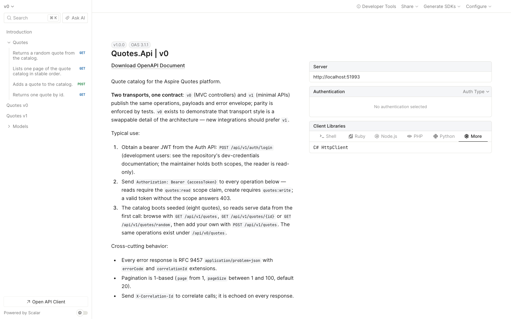

# Aspire Quotes

**Microservice seed** for teams starting .NET services on Aspire: Clean Architecture layers, a shared platform kit (`ServiceDefaults`), and a small quotes domain so the shape stays readable.

Stack: **.NET 10**, **Aspire 13**, **React + TypeScript (Vite)**, **Podman**.

## Intention

This repository is a **cloneable service base**. Copy Auth/Quotes structure and reuse `ServiceDefaults`; fill in business rules for the next service.

Quotes and login stay deliberately small. The deliverable is the shape teams inherit:

- Clean Architecture (`Api` / `Application` / `Domain` / `Infrastructure`)
- Shared platform defaults (auth, correlation, ProblemDetails, OpenAPI/Scalar, telemetry)
- Stable HTTP and error contracts other teams can depend on
- Domain modeling (entities, value objects, ports) visible while the sample is still small

Hardcoded users are **local scaffolding** so the foundation runs offline; they are not the model for production identity. The quotes catalog is real storage: a PostgreSQL container orchestrated by the AppHost, with the schema expressed in code and migrated automatically at boot ([docs/data-storage.md](docs/data-storage.md)).

### What success looks like

Someone cloning this for a new service should be able to:

1. Copy the `Api` / `Application` / `Domain` / `Infrastructure` layout.
2. Reuse `ServiceDefaults` for auth, correlation, ProblemDetails, OpenAPI/Scalar, and telemetry.
3. Put business rules in Domain, use cases in Application, adapters in Infrastructure.
4. Ship a thin Minimal API that mostly maps request → use case → response.

The quotes catalog is the **example**; the base is the **deliverable**.

### Goals

- **Clear separations** — Domain and Application stay free of HTTP, auth headers, and status codes; Infrastructure owns adapters; Api owns transport, mapping, and OpenAPI.
- **Shared platform** — Cross-cutting concerns live in `ServiceDefaults` so they are not reimplemented per endpoint or per service.
- **Low per-endpoint cost** — Auth, error shaping, metrics, and API docs come from conventions; a new endpoint mostly maps a route, calls a use case, and maps the result.
- **Contracts as product** — Api DTOs and OpenAPI are the public surface. Prefer org-wide error shapes and security metadata over ad-hoc response types.
- **Cloneable service shape** — Auth and Quotes show the same layering so the next microservice copies structure, not policy invention.

### Layering (dependency rule)

| Tier | Owns | Must not own |
|------|------|--------------|
| **Platform** (`ServiceDefaults`) | Auth integration patterns, correlation, OpenAPI conventions, telemetry, resilience | Business rules |
| **Service host** (`*.Api`) | Composition root, endpoints, transport DTOs, mapping to/from Application | Persistence details, remote client internals |
| **Application** | Use cases, ports | `HttpContext`, bearer parsing, OpenAPI, status codes |
| **Domain** | Entities and domain ports | HTTP, DI containers, infrastructure SDKs |
| **Infrastructure** | Repositories, HTTP clients, external systems | Endpoint contracts, Swagger UI concerns |

### Domain terms

| Term | Meaning | In this project |
|------|---------|-----------------|
| **Entity** | Domain object with identity and invariants | [`Quotes.Domain.Quote`](src/Quotes/Quotes.Domain/Quote.cs) — created via `Quote.Create`, composes value objects and owns the `AuthorEqualsText` rule |
| **Value object** | No identity; equality by value | [`QuoteText`](src/Quotes/Quotes.Domain/QuoteText.cs), [`QuoteAuthor`](src/Quotes/Quotes.Domain/QuoteAuthor.cs), [`QuoteFingerprint`](src/Quotes/Quotes.Domain/QuoteFingerprint.cs) |
| **Aggregate** | Consistency boundary around a root entity | `Quote` is the aggregate root; repositories load/save the root (`IQuoteRepository`) |
| **Persistence model** | Storage shape, mapping, DB concerns | [`QuoteRecord`](src/Quotes/Quotes.Infrastructure/Persistence/QuoteRecord.cs) in Infrastructure — never put EF attributes on Domain `Quote` |

**Rule of thumb:** Domain speaks `Quote`; Infrastructure maps `Quote` ↔ `QuoteRecord` at the repository boundary. Api DTOs are transport only.

Transport vs domain validation: DTOs keep shallow guards (`[Required]`, `[MaxLength]`); the domain owns catalog invariants.

### Conventions in place

1. Authentication at the host/platform — Quotes uses JwtBearer + `RequireAuthorization`; writes need `quotes:write` (see `JwtAuthExtensions.WriteQuotesPolicy`).
2. Thin Minimal API endpoints; Application outcomes are `ErrorOr` results mapped once to RFC 9457 ProblemDetails (`ErrorOrHttpExtensions.ToProblem`) with `errorCode` and `correlationId`. Expected failures are not exceptions. Branching on a result uses the ErrorOr combinators — `Switch`/`SwitchFirst` for side effects (decorators), `Match`/`MatchFirst` for mapping to a value (outcome tags, endpoint `IResult`s) — instead of `if (result.IsError)`/`else` chains.
3. OpenAPI conventions in the platform (Bearer scheme, standard ProblemDetails shapes for 401/403/404/409/500). Operations are documented with XML `///` comments (`<summary>`/`<remarks>`/`<param>`/`<response>`/`<example>`) that the built-in generator flows into the documents, plus per-host narratives (`OpenApiDocs`); see [docs/api.md](docs/api.md).
4. Composition root at the API host: layers register themselves (`AddQuotesApplication`, `AddQuotesInfrastructure`); Program.cs composes them. Api references Application + Infrastructure, never Domain directly.
5. Transport input validation: request DTOs use Data Annotations; each host calls `AddValidation()` so binding validates before handlers run.
6. Branch and commit hygiene: pushed branches use `feature/ hotfix/ chore/ docs/ ci/ fix/` prefixes, commit subjects and PR titles are conventional commits — enforced by the `conventions` CI gate (see [docs/contributing.md](docs/contributing.md)).

## What it does today

A screenshot tour of every surface below — app screens, the Aspire dashboard and its dependency graph, Scalar, SonarQube — lives in [docs/ui-tour.md](docs/ui-tour.md).

1. **Auth API** issues a JWT for hardcoded local users — the maintainer holds `quotes:read` + `quotes:write`, the reader holds `quotes:read` only (users and passwords live in [docs/dev-credentials.md](docs/dev-credentials.md)) — and can validate tokens via `/api/v1/auth/validate` (optional introspection). Login and validate are rate-limited (fixed window per client IP, 429 as ProblemDetails), and the scaffolding credential store refuses to register in Production.
2. **Quotes API** serves the catalog from PostgreSQL (container in the AppHost; schema migrated + seeded at boot) after JwtBearer validates the bearer token: `GET /api/v1/quotes/random`, `GET /api/v1/quotes/{id}`, `GET /api/v1/quotes?page=&pageSize=` (the ratified offset-pagination pattern), and `POST /api/v1/quotes` (requires `quotes:write`; rejects invalid and near-duplicate quotes — the latter by a unique fingerprint index). The same four operations are also served at `/api/v0/quotes/...` by MVC controllers — one core, two transport styles, held to byte-level response parity by tests. See [docs/architecture.md](docs/architecture.md#api-versions-and-transport-styles).
3. **React SPA** logs in, stores token + `X-Correlation-Id`, then fetches quotes through the Vite proxy: a random quote, the paginated catalog (`/quotes`), and publishing a new quote (`/publish`, maintainer scope only). Its API types are generated from the frozen OpenAPI document, and its components have Storybook stories smoke-built in CI.
4. **Aspire AppHost** starts everything, wires service discovery, exports OpenTelemetry to the dashboard, and publishes a **YARP** gateway (no Traefik).

```text
UI (Vite) -> Auth / Quotes
Quotes validates JWT locally (JwtBearer); Auth /validate remains for introspection
OTEL metrics/logs/traces -> Aspire dashboard
```

## Solution layout

Each `src/` row links to a component document describing that project's layers, DDD concepts and call flows. For the whole picture — deployment topology, component diagram, request lifecycle — see [docs/system-design.md](docs/system-design.md).

| Path | Role |
|------|------|
| [`src/AppHost/`](src/AppHost/README.md) | Aspire orchestration (`AspireQuotesPoc.AppHost`) |
| [`src/ServiceDefaults/`](src/ServiceDefaults/README.md) | Platform kit: Serilog, OTEL, OpenAPI/Scalar helpers, JwtBearer + scope policies, ErrorOr→ProblemDetails, correlation |
| [`src/Auth/`](src/Auth/README.md) | Auth service — Domain / Application / Infrastructure / Api |
| [`src/Quotes/`](src/Quotes/README.md) | Quotes service — Domain / Application / Infrastructure / Api |
| [`frontend/`](frontend/README.md) | React + TS Vite SPA — a **git submodule pinned by commit** ([net-examples-frontend](https://github.com/josnelihurt/net-examples-frontend)); clone with `--recurse-submodules`, move the pin via PR |
| `docs/` | Docsify + combined Scalar reference |
| `contracts/` | Pointer to Docsify OpenAPI docs ([api-contracts.md](contracts/api-contracts.md)) |
| `tests/` | xUnit unit/API tests (OpenCover for Sonar) + `tests/Bdd` Reqnroll specs against the running stack |
| `scripts/` | Env, start, docs, publish, test, bdd, e2e, verify-docs, audit-deps, check-image-tags, update-contracts, Sonar, bundle |

## How to run

```bash
./scripts/start.sh
```

Uses `scripts/env.sh` (`ASPIRE_CONTAINER_RUNTIME=podman`, `ASPNETCORE_ENVIRONMENT=Development`). Open the Aspire dashboard URL from the console, then the `web` endpoint.

Documentation:

```bash
./scripts/serve-docs.sh
```

API specs (Reqnroll against the running Aspire stack — YARP gateway included; needs Podman):

```bash
./scripts/bdd.sh
```

SPA end-to-end (Playwright BDD in Chromium; boots the APIs and Vite itself):

```bash
./scripts/e2e.sh
```

Safe to run from several worktrees at once — container names and ports are namespaced
per checkout; see [docs/testing.md](docs/testing.md#concurrent-worktrees) for the
scheme and the remaining machine-global exceptions.

Scalar guidance / combined docs page:

```bash
./scripts/open-scalar.sh
```

Publish Docker Compose artifacts (Podman-compatible):

```bash
./scripts/publish.sh
```

Unit tests (.NET + Coverlet OpenCover):

```bash
./scripts/test.sh
```

C# lint — warning-level style rules incl. unused usings (IDE0005); `--fix` rewrites:

```bash
./scripts/lint.sh
```

The SPA's own suites (Vitest, mocked Playwright e2e, Storybook) live in
[net-examples-frontend](https://github.com/josnelihurt/net-examples-frontend) and run
in its CI. What runs from this checkout is the full-stack e2e — real APIs, real
catalog, the SPA from the submodule:

```bash
./scripts/e2e.sh
```

Local SonarQube (Podman) + scan:

```bash
./scripts/sonar-up.sh
SONAR_ADMIN_PASSWORD='...' ./scripts/sonar-quality-profile.sh  # once: adds S1128 (unused usings)
./scripts/sonar-scan.sh
```

Export a full git bundle to `~/repo.bundle`:

```bash
./scripts/export-bundle.sh
```

More detail in Docsify: [Testing](docs/testing.md), [SonarQube](docs/sonar.md), [ServiceDefaults as a NuGet building block](docs/servicedefaults-nuget-extraction.md), [Documentation process](docs/documentation-process.md), [Panel Review](docs/panel-review.md), [Dependency refresh](docs/dependency-refresh.md).

## OpenAPI / Scalar

[Scalar](https://github.com/scalar/scalar) is the interactive API client (manual testing). It is **not** required for automated checks.

With services running:

- `/openapi/v1.json`, `/openapi/v0.json` — OpenAPI document per API version (Quotes; Auth serves `v1` only)
- `/scalar` — Scalar UI per API
- Docs combined: `http://localhost:3001/scalar/index.html` (the explicit `index.html` matters — `docsify-cli` answers the bare `/scalar/` path with its SPA shell)
- Aspire dashboard (run mode): **Scalar** links on `auth-api` / `quotes-api` (per-service UI) and on `docs` (combined Auth+Quotes reference)

Static YAML: `docs/openapi/auth.openapi.yaml`, `docs/openapi/quotes-v0.openapi.yaml`, `docs/openapi/quotes-v1.openapi.yaml`. Refresh with `./scripts/update-contracts.sh` (Podman/Docker via [`Dockerfile.build`](Dockerfile.build)) after Api/DTO changes — see [docs/api.md](docs/api.md) (stub: [contracts/api-contracts.md](contracts/api-contracts.md)).



## Observability

- **Serilog** → console + OTLP (Aspire structured logs), enriched with `CorrelationId`
- **Traces** → ASP.NET + HttpClient instrumentation
- **Metrics** (meter `AspireQuotesPoc`): `auth.login.count` (`outcome=success|failure`), `auth.validate.count` (`outcome=success|failure`), `quotes.random.count` (`outcome=success|not_found`), `quotes.getbyid.count` (`outcome=success|not_found`), `quotes.list.count` (`outcome=success|invalid`), `quotes.create.count` (`outcome=success|invalid|conflict|error`)

See [docs/observability.md](docs/observability.md).

## Libraries

- OpenAPI + Scalar.AspNetCore
- Data Annotations + `AddValidation()` (transport guards on request DTOs)
- ErrorOr (ratified error/result standard for Domain and Application)
- Serilog
- Microsoft.AspNetCore.Authentication.JwtBearer (host auth + scope policies)
- OpenTelemetry (ASP.NET, HttpClient, runtime + custom meters)
- ProblemDetails / health checks
- Reqnroll + Aspire.Hosting.Testing (`tests/Bdd` specs against the real stack)
- Playwright + playwright-bdd (browser journeys in the [frontend submodule](https://github.com/josnelihurt/net-examples-frontend); full-stack runs from this repo, mocked runs in its own)

## Credentials and secrets

All non-Production credentials — the two local users, the development signing key, and the ephemeral keys automation uses — live in exactly one place: [docs/dev-credentials.md](docs/dev-credentials.md). The CI `secrets-hygiene` job fails the build when a credential literal shows up anywhere outside that document, the code that implements it, and the tests that authenticate with it.

For standalone `dotnet run` in Development, put the documented development key in user-secrets (Aspire `run` injects the shared `jwt-signing-key` parameter automatically):

```bash
dotnet user-secrets set "Jwt:SigningKey" "<dev key from docs/dev-credentials.md>" --project src/Auth/Auth.Api
dotnet user-secrets set "Jwt:SigningKey" "<dev key from docs/dev-credentials.md>" --project src/Quotes/Quotes.Api
```

Production startup fails if the key is missing, shorter than 32 bytes, or equal to the public development key (`JwtAuthExtensions`). The hermetic OpenAPI export (`Dockerfile.build`) generates a random build-time key.

## Branches and commits

Hard rules, enforced in CI and by the branch ruleset on `main` — the full
reference (regexes, examples, local hooks, how enforcement works) lives in
[docs/contributing.md](docs/contributing.md):

- **Branch names** — `feature/`, `hotfix/`, `chore/`, `docs/`, `ci/` or `fix/`
  followed by a kebab-case name; local-only `backup/…` snapshots are exempt.
- **Commit messages** — conventional commits (`feat`, `fix`, `docs`, `style`,
  `refactor`, `perf`, `test`, `build`, `ci`, `chore`, `revert`), lowercase
  imperative summary, at most 72 characters. **PR titles follow the same rule**:
  squash merges make the title the canonical commit on `main`.

The `conventions` CI job checks the branch, the commits and the title of every
PR; a ruleset on `main` blocks merges without a green check. Agents get the same
rules in [AGENTS.md](AGENTS.md); `./scripts/setup-git-hooks.sh` opts a clone into
matching local hooks.

## Stacked pull requests

Large changes land as **stacks**: an ordered chain of small PRs where each branch builds on the one below, the bottom PR targets `main`, and every other PR's base is the branch of the PR below it. Each layer is one reviewable decision, and **every level must pass all CI gates on its own** — an intermediate level that doesn't compile or fails a suite is a bug in the split, not a footnote.

```text
main ← 1-schema ← 2-repository ← 3-apphost-db ← … ← 9-component-readmes
```

Rules that matter:

- **Split by decision, not by file count.** Each PR should be answerable with one sentence: "what does this PR decide?" Prefer landing new code *beside* the old with a temporary bridge and deleting the old path in a later layer — then the interesting PRs are additions plus one pure deletion at the end.
- **Every level is green.** CI runs per PR, so plumbing that a later layer makes load-bearing (a container, a config value) lands first as a harmless no-op layer.
- **Review by delta.** GitHub diffs each PR against the branch below it. Bottom layers carry the substance; the upper layers should read as small, obvious consequences.
- **Merge bottom-up** — or merge the top PR to land the whole stack at once. When a lower PR merges, GitHub rebases the branches above and retargets them automatically. Never rebase, force-push, delete mid-stack branches, or edit PR bases by hand once the chain is registered as a stack.

Tooling (GitHub native stacks, public preview, driven by the [`gh-stack`](https://github.com/github/gh-stack) extension):

```bash
gh extension install github/gh-stack      # once
gh stack link 13 6 7 8 9 10 11 12 14     # register already-chained PRs, bottom → top
gh stack link 16 15                       # append a new PR to stack 16
gh stack view / sync / rebase / merge     # inspect, update, land
```

(The numbers above are the real PostgreSQL-catalog stack this workflow was proven on.)

Gotchas: server-side rebases produce unsigned commits — irrelevant today, but if the repo ever requires signed commits use `gh stack rebase` + `gh stack push` instead of the web button. A stack must keep linear history between its branches. Squash merges work at every layer; branch-protection checks apply to each PR individually. A layer whose only change is reverting a lower layer can squash to an **empty commit and silently lose the revert** — observed when the merge-me smoke-test stack (#46 → #47) landed: the top layer's "remove the line" diff was computed against a base that already contained the bottom layer's addition. Land reverts after the layer they revert has merged, or outside a stack.

## Merging: the `merge-me` label

Labeling a PR `merge-me` asks the [`merge-me` workflow](.github/workflows/merge-me.yml) to merge it — deterministically, with no agent holding tokens: the label is **standing intent ("merge when green"), not a command ("merge now")**. The workflow re-evaluates the PR when the label lands, when new commits are pushed, on reopen, and when the `ci` workflow completes (`workflow_run`) — every evaluation corresponds to a real event, and nothing runs on a timer. It merges (squash) only when every check passes. A manual `workflow_dispatch` run (a PR number, or blank for every labeled PR) is the escape hatch for replaying an evaluation lost to a transient run failure. The mechanics live in `scripts/merge-me.sh`; the investigation, rejected alternatives and tradeoffs are recorded in [issue #33](https://github.com/josnelihurt/net-examples/issues/33).

What happens per state:

- **Green** → merged in that run, via GitHub's asynchronous merge endpoint — the only merge path that also works for stacked PRs.
- **Pending** → an ordinary PR gets GitHub's server-side auto-merge armed (it merges the moment checks pass, surviving any number of fix pushes); a stacked layer gets a bounded 15-minute wait, re-armed by the next push or by CI completing.
- **Red** → nothing merges and the label stays: approval of *intent* is separate from merge *state*. Push the fix and the PR merges itself.
- **Stack semantics**: merging a labeled layer lands every stack member below it atomically — labeling the top PR of a reviewed stack lands the whole chain. **Label the top layer only**: one label lands everything below, and labeling several layers starts concurrent merges that race each other ([issue #61](https://github.com/josnelihurt/net-examples/issues/61)).
- **Unlabeling** disarms: removing `merge-me` runs an `unlabeled` evaluation that undoes any armed auto-merge — the label's intent does not outlive the label.

### The squash-merge stack wedge

When the bottom PR of a stack squash-merges, the layer above is retargeted but still carries the bottom layer as a real commit while the base carries the same diff as the squash — GitHub then reports the upper PR **CONFLICTING**, `gh pr update-branch` refuses, and every atomic merge of the layers above fails ([issue #61](https://github.com/josnelihurt/net-examples/issues/61); merge-me holds with this recipe instead of a bare "merge failed"). The repair — the one sanctioned exception to "never force-push mid-stack branches" — replays only a branch's own commits onto the new base, bottom-up:

```bash
git fetch origin
git rebase --onto origin/<base> <old-base-tip> <branch>
git push --force-with-lease origin <branch>
```

The next event (push, CI completion) re-evaluates and merge-me lands the layer normally.

Anyone who can label a PR could already merge it manually, so the label adds audit trail, not privilege. The workflow's token is the ephemeral per-run `GITHUB_TOKEN`; it cannot bypass branch protection.

Agents working in this repo follow the same workflow — the agent-side recipe (snapshot before splitting, verify at load-bearing levels, evidence per PR) lives in [`AGENTS.md`](AGENTS.md).
