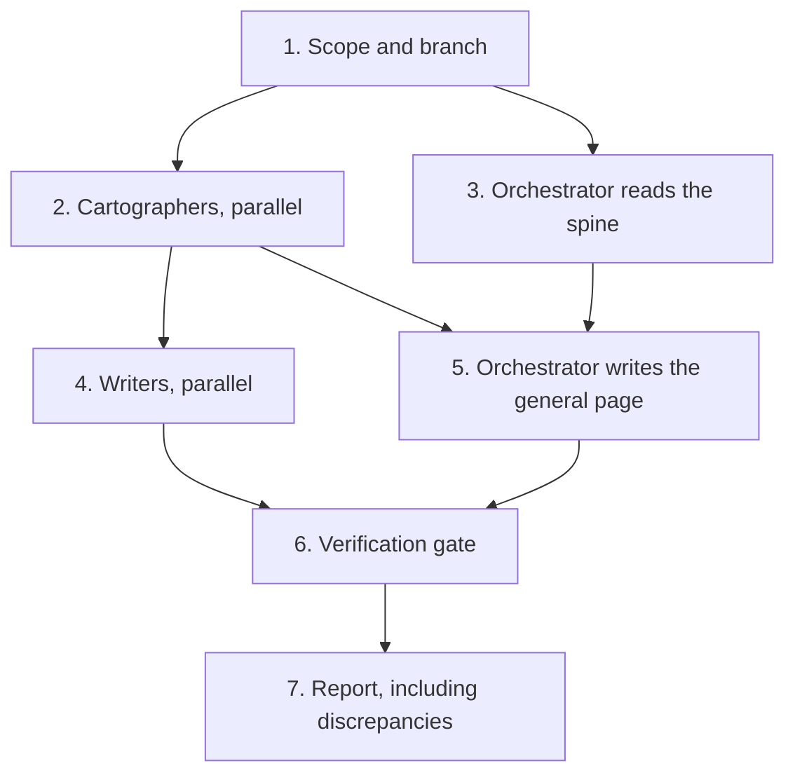

# Documentation process

How this repository's architecture documentation gets written and kept honest: a multi-agent pass
that maps the code in parallel, writes the component pages in parallel, and then proves every claim
mechanically before anyone reads it.

Run it with the **`documentation-set`** skill (`.claude/skills/documentation-set/SKILL.md`). That file
is the executable version of this page; this page is the reasoning behind it.

## Why a pipeline

Architecture documentation fails in two predictable ways. It **drifts** — the prose keeps describing
last quarter's design — and it **duplicates** — the same rule is restated in four places, so fixing it
in one leaves three lies behind. A seed repository suffers both worse than a product does, because
everything in it gets cloned.

The pass is built against those two failures specifically:

- **Against drift**: every claim must name a file path and an exact identifier, and a verification
  gate re-checks all of them on demand. A document that cites a type which no longer exists fails a
  script, not a code review.
- **Against duplication**: the tiers below own disjoint content, and writers are told what they may
  not restate.

## The two tiers

| Tier | Owns | Never contains |
|---|---|---|
| [Repository README](../README.md) | Intention, the layering table, the domain glossary, conventions, how to run | Per-project detail |
| `docs/*.md` | Policy — [Architecture](architecture.md), [API](api.md), [Testing](testing.md), [Observability](observability.md) | Per-project detail |
| [System design](system-design.md) | The whole system as diagrams, plus the component index | Rules already stated in Architecture |
| `src/**/README.md` | Types, invariants, wiring, call flows and DDD rationale for **one** project | Policy already stated above |

(The frontend's README lives in [net-examples-frontend](https://github.com/josnelihurt/net-examples-frontend) since the extraction.)

Component pages sit next to the code on purpose. GitHub renders a folder's `README.md` when you browse
into it, so the explanation is one click from the thing it explains — and a reviewer changing
`Quotes.Domain` sees its document in the same diff.

Docsify serves the `docs/` folder only, so links from [System design](system-design.md) into
`../src/**/README.md` resolve on GitHub and 404 in the served site. That trade is deliberate and
stated on the page itself.

## Pipeline



Stages 2 and 4 each launch their agents in one message so they run concurrently. Stage 3 happens while
stage 2 is still running: the orchestrator reads the cross-cutting files itself, because output can
only be verified against the code, never against another agent's summary.

## Roles

| Role | Defined in | Does | Never does |
|---|---|---|---|
| **Cartographer** | [`doc-cartographer.md`](../.claude/agents/doc-cartographer.md) | Reads one slice in full and reports an exhaustive, opinion-free inventory: types, signatures, exact literals, wiring order, what the tests pin, and factual drift | Writes files; offers opinions or recommendations |
| **Writer** | [`doc-writer.md`](../.claude/agents/doc-writer.md) | Writes the component pages for one partition, verifying every fact against the code before using it | Touches a file outside its partition; changes source or the `docs/` pages |
| **Orchestrator** | the skill | Scopes, briefs, reads the spine, writes the general page and all cross-links, runs the gate, reports | Delegates the general page; reports on the strength of an agent summary |

Two constraints make the parallel stages safe. Cartographer slices are read-only, so overlap is
harmless but wasteful. Writer partitions are **disjoint file lists**, so two writers can never race on
the same file.

## The verification gate

```bash
./scripts/verify-docs.sh              # links + references + mermaid
./scripts/verify-docs.sh --skip-mermaid
```

| Check | Script | Proves |
|---|---|---|
| Links and anchors | `scripts/verify-docs-links.py` | Every markdown link resolves, and every `#anchor` matches a real heading in the target page |
| Code references | `scripts/verify-docs-refs.py` | Every backticked repo path, route string and identifier in the component pages exists in the source. Gitignored paths are allowed (a page may name build output); anything deliberately absent sits in an `ALLOW` list *with its reason* |
| Mermaid | `mmdc` via `pnpm dlx` | Every fence parses and renders. A diagram that would silently break in the browser fails here instead |

The gate is not a substitute for reading. After it passes, serve the site and look:

```bash
./scripts/serve-docs.sh    # http://localhost:3001/#/system-design
```

Mermaid renders in the served site through the plugin wired into `docs/index.html` — `mermaid` is
loaded and initialised with `startOnLoad: false`, then `docsify-mermaid` converts each
`pre[data-lang=mermaid]` into a `div.mermaid` and calls `mermaid.run`. Script order matters: the plugin
must load before `docsify.min.js`, because it registers itself by pushing onto `$docsify.plugins`.

A documentation pass must also leave `./scripts/lint.sh` and `./scripts/test.sh` green and must not
modify a single source file — `git status --short` is the check.

## The recorded run (2026-08-22)

The first full pass, which produced [System design](system-design.md) and all thirteen component pages.

| Stage | Agents | Tool calls | Tokens | Wall clock |
|---|---|---|---|---|
| Map | 3 cartographers (Quotes; Auth + platform + CI; frontend + docs + tooling) | 74 | ~332k | ~6 min |
| Write | 3 writers (Quotes; Auth; platform + UI) | 109 | ~414k | ~12 min |
| **Total** | **6** | **183** | **~746k** | **~19 min** |

Output: 14 documents, 3,085 lines, 30 mermaid diagrams. Gate result: 436 links, 95 repo paths, 29
routes, 1,102 identifiers and 30 diagrams verified; 284 tests and `dotnet format` green; no source
file touched.

Three corrections happened *during* the run, which is the pipeline working as intended:

- The orchestrator's own brief claimed the generated `aspire-output/` was a stale **committed**
  snapshot. It is gitignored. Caught by the reference check, corrected in both the general page and
  the AppHost brief.
- A writer corrected the brief's claim that `Quotes.Infrastructure` references `Quotes.Application`;
  it references `Quotes.Domain` only.
- A writer corrected the claim that all four v0 controller actions carry route names; only two do.

## What the first run surfaced

Documenting a codebase reads it more carefully than writing it did. The pass reports discrepancies
rather than fixing them — the owner decides on each. From the first run:

| Finding | Status |
|---|---|
| `frontend/vite.config.ts` had no `/api/v0/quotes` proxy rule, though the SPA's version switch calls it | Fixed |
| `docs/testing.md` described four CI gates and omitted `tests/Architecture.Tests` | Fixed |
| `Quotes.Api/OpenApiDocs.cs` says "the catalog starts empty"; `InMemoryQuoteRepository.DefaultSeed()` seeds eight quotes, and the text is baked into both frozen contracts | Open |
| The repository README and [Observability](observability.md) disagree on the `outcome` values for `quotes.random.count`, `quotes.getbyid.count` and `quotes.list.count` | Open |
| [Architecture](architecture.md) says the gateway routes two prefixes; `AppHost.cs` declares three. Its AppHost row still reads "(`auth` orchestration)" | Open |

## How to repeat

1. `git fetch origin` and branch from `origin/main`, in the documentation worktree when one exists.
2. Invoke the `documentation-set` skill, stating the scope: a full pass, or one component.
3. Answer the orchestrator's scoping questions — filename convention, depth, how far to wire the new
   pages into the sidebar and existing docs.
4. Let stages 2 and 4 run; each is one parallel batch.
5. `./scripts/verify-docs.sh`, then `./scripts/serve-docs.sh` and look at the pages.
6. Review the discrepancy list at the end of the report and decide on each item.

## References

- Skill: `.claude/skills/documentation-set/SKILL.md`
- Agents: [`doc-cartographer`](../.claude/agents/doc-cartographer.md), [`doc-writer`](../.claude/agents/doc-writer.md)
- The sibling multi-agent workflow for critique rather than description: [Panel Review](panel-review.md)
