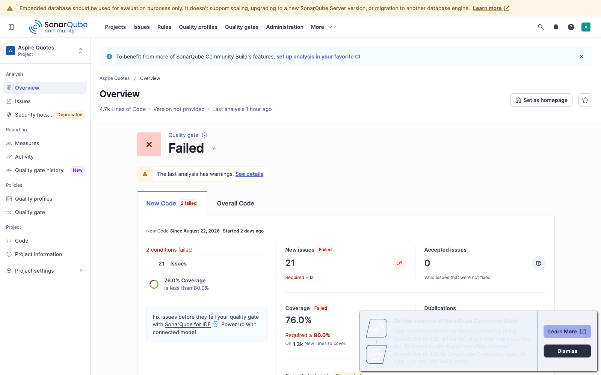

# SonarQube (local)

Static analysis runs against a **Podman** SonarQube Community Build. The scanner is the host-side `dotnet-sonarscanner` tool (C# cannot be scanned from the generic scanner container alone).

## Prerequisites

- Podman machine with enough RAM (script bumps to **6 GB** if below 4 GB, with a prompt)
- `curl`, `python3`

## Start the server

```bash
./scripts/sonar-up.sh
```

Non-interactive resize:

```bash
SONAR_ASSUME_YES=1 ./scripts/sonar-up.sh
```

What it does:

1. Checks / optionally resizes the Podman machine memory
2. Starts container `aspirequotes-sonarqube` on port **9000**
3. Waits until `/api/system/status` is `UP`
4. Rotates the default `admin` password
5. Creates project `aspire-quotes` and writes an analysis token to `.sonar/token`

Defaults (override via env; see `scripts/sonar-env.sh`):

| Variable | Default |
|----------|---------|
| `SONAR_HOST_URL` | `http://localhost:9000` |
| `SONAR_ADMIN_PASSWORD` | none — required, provide your own (see [dev-credentials.md](dev-credentials.md)) |
| `SONAR_PROJECT_KEY` | `aspire-quotes` |

UI: [http://localhost:9000](http://localhost:9000) — login `admin` / password above.

If you already have a local Sonar volume from the previous `aspire-quotes-poc` key, either keep overriding `SONAR_PROJECT_KEY` or run `./scripts/sonar-down.sh --purge` and recreate.

## Run an analysis

```bash
./scripts/sonar-scan.sh
```

Pipeline (C# only — TypeScript coverage moved to code.examples.frontend.quotes with the SPA): `sonarscanner begin` → `dotnet build` → `dotnet test` (OpenCover) → `sonarscanner end`.

Dashboard after upload:

`http://localhost:9000/dashboard?id=aspire-quotes`



## Quality profile (S1128 — unused usings)

The built-in `Sonar way` profile is read-only and does **not** include [S1128 "Unused 'usings' should be removed"](https://sonarcloud.io/organizations/default/rules?open=csharpsquid%3AS1128&rule_languages=cs) — Sonar's counterpart of IDE0005 (ReSharper: *Using directive is unnecessary*). The scanner also only uploads SonarAnalyzer (`S…`) rules, so the IDE0005 warnings the compiler raises during the scan build never reach the dashboard; S1128 has to be active for usings to show up as findings.

`scripts/sonar-quality-profile.sh` creates the child profile `Aspire Quotes way` (extends `Sonar way`, activates S1128, links the project). It is idempotent — run it once after `sonar-up.sh` with the admin password:

```bash
SONAR_ADMIN_PASSWORD='...' ./scripts/sonar-quality-profile.sh
```

## Stop / reset

```bash
./scripts/sonar-down.sh           # remove container
./scripts/sonar-down.sh --purge  # also drop volumes + `.sonar/token`
```

## Intentional local findings

These stay in code with documented suppressions (local scaffolding, not production secrets):

- Hardcoded scaffolding users in `HardcodedCredentialStore` (documented in [dev-credentials.md](dev-credentials.md), refused in Production)
- Aspire service-discovery base address `http://auth-api` (rewritten at runtime)

Real issues (dead code, empty-token guards, duplicated bearer parsing, silent validation, Polly magic numbers) were fixed rather than suppressed.

## Tooling pin

`dotnet-sonarscanner` is pinned in `.config/dotnet-tools.json` (`dotnet tool restore` runs inside `sonar-scan.sh`).
