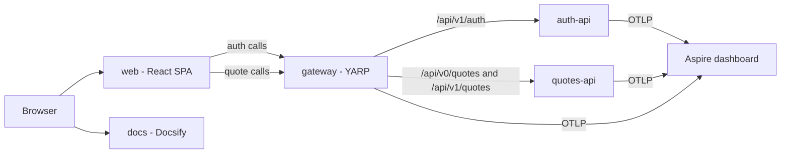
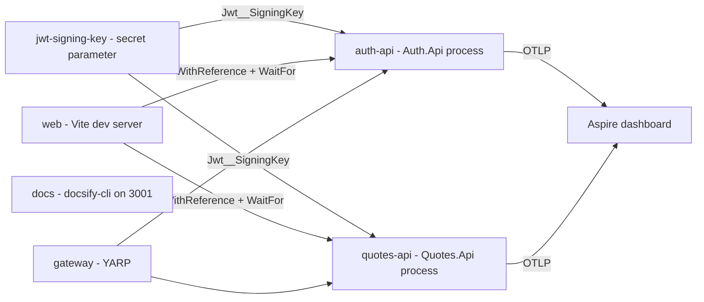
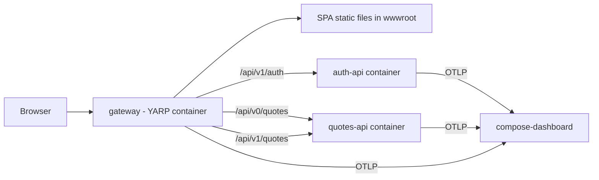
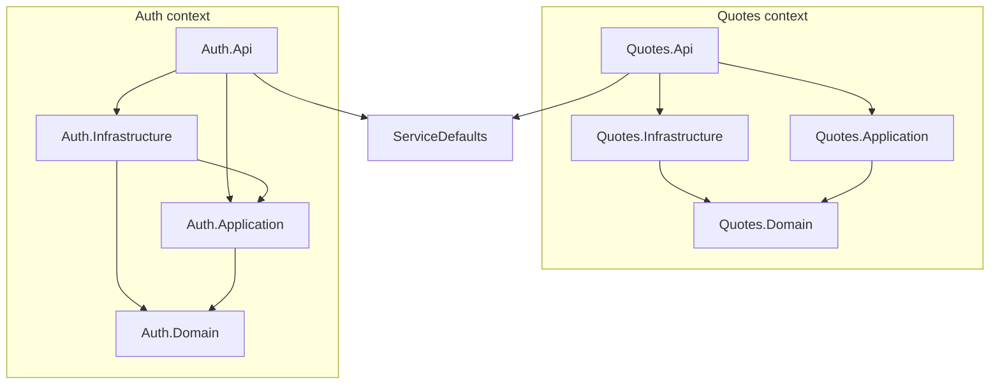
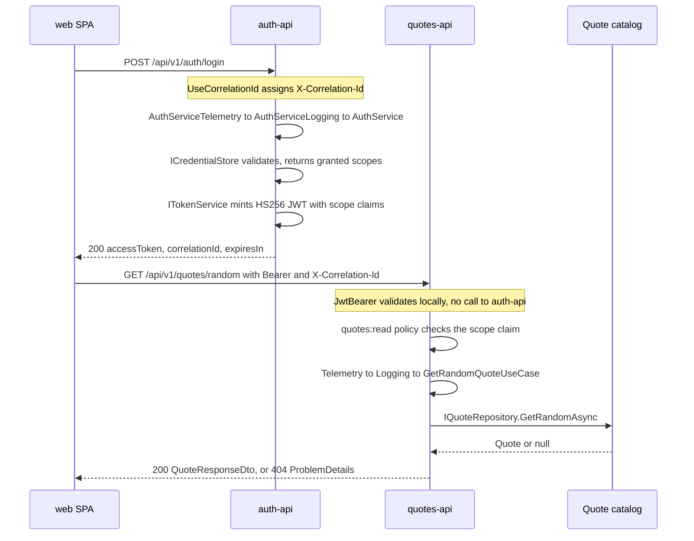
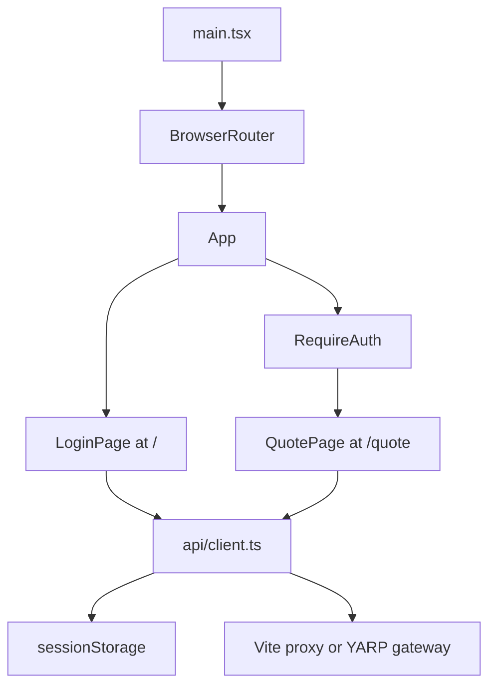
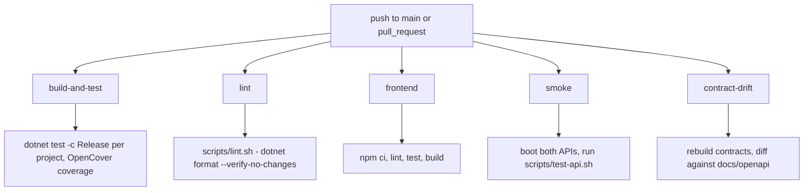

# System design

A single view of the whole system: what runs, how the pieces reach each other, how a request
travels from the browser to the catalog and back, and how the repository is built and shipped.

This page is the **map**. The **policy** — why the layering rules are what they are, how versions
are added, what the error contract guarantees — lives in [Architecture](architecture.md), and the
**detail per component** lives in a `README.md` next to each project's source. Nothing here is
repeated from those; every claim points at the file it came from.

> The component links below are repository paths (`../src/...`). They resolve when you browse this
> file on GitHub. In the Docsify site they will 404, because Docsify serves the `docs/` folder only.

## System context

Two bounded contexts, one SPA, one reverse proxy, one telemetry sink, one documentation site.
`auth-api` issues tokens; `quotes-api` verifies them locally with JwtBearer and never calls back to
`auth-api` on the request path. Both export traces, metrics and logs over OTLP to the Aspire
dashboard.

## Components

| Component | Kind | Source | Detail |
|---|---|---|---|
| `AppHost` | Aspire orchestrator | [`src/AppHost/`](../src/AppHost/) | [README](../src/AppHost/README.md) |
| `ServiceDefaults` | Platform kit (shared library) | [`src/ServiceDefaults/`](../src/ServiceDefaults/) | [README](../src/ServiceDefaults/README.md) |
| Auth context | Bounded context, 4 projects | [`src/Auth/`](../src/Auth/) | [README](../src/Auth/README.md) |
| — `Auth.Domain` | Ports only (no invariants yet) | [`src/Auth/Auth.Domain/`](../src/Auth/Auth.Domain/) | [README](../src/Auth/Auth.Domain/README.md) |
| — `Auth.Application` | Application service, ports | [`src/Auth/Auth.Application/`](../src/Auth/Auth.Application/) | [README](../src/Auth/Auth.Application/README.md) |
| — `Auth.Infrastructure` | Credential store, JWT adapter | [`src/Auth/Auth.Infrastructure/`](../src/Auth/Auth.Infrastructure/) | [README](../src/Auth/Auth.Infrastructure/README.md) |
| — `Auth.Api` (`auth-api`) | Host, minimal APIs | [`src/Auth/Auth.Api/`](../src/Auth/Auth.Api/) | [README](../src/Auth/Auth.Api/README.md) |
| Quotes context | Bounded context, 4 projects | [`src/Quotes/`](../src/Quotes/) | [README](../src/Quotes/README.md) |
| — `Quotes.Domain` | Aggregate, value objects, ports | [`src/Quotes/Quotes.Domain/`](../src/Quotes/Quotes.Domain/) | [README](../src/Quotes/Quotes.Domain/README.md) |
| — `Quotes.Application` | Four use cases | [`src/Quotes/Quotes.Application/`](../src/Quotes/Quotes.Application/) | [README](../src/Quotes/Quotes.Application/README.md) |
| — `Quotes.Infrastructure` | In-memory catalog adapter | [`src/Quotes/Quotes.Infrastructure/`](../src/Quotes/Quotes.Infrastructure/) | [README](../src/Quotes/Quotes.Infrastructure/README.md) |
| — `Quotes.Api` (`quotes-api`) | Host, MVC `v0` + minimal `v1` | [`src/Quotes/Quotes.Api/`](../src/Quotes/Quotes.Api/) | [README](../src/Quotes/Quotes.Api/README.md) |
| `web` | React + TypeScript SPA | [`frontend/`](../frontend/) | [README](../frontend/README.md) |
| `gateway` | YARP reverse proxy (publish) | declared in [`src/AppHost/AppHost.cs`](../src/AppHost/AppHost.cs) | [README](../src/AppHost/README.md) |
| `docs` | Docsify site + combined Scalar | [`docs/`](.) | this site |

## Runtime topology — run mode

`./scripts/start.sh` runs `aspire run`, which starts every resource declared in
[`src/AppHost/AppHost.cs`](../src/AppHost/AppHost.cs) as a local process.

Three things carry the wiring:

- **One secret, two services.** `builder.AddParameter("jwt-signing-key", secret: true)` is passed to
  both APIs as `Jwt__SigningKey`. Auth signs with it, Quotes verifies with it. Locally the dashboard
  supplies a generated value; nothing is committed.
- **`WithReference` is what makes the SPA work.** It injects `AUTH_API_HTTP` / `AUTH_API_HTTPS` and
  `QUOTES_API_HTTP` / `QUOTES_API_HTTPS` into the `web` resource, and
  [`frontend/vite.config.ts`](../frontend/vite.config.ts) reads exactly those variables to build its
  dev proxy. Running `npm run dev` outside Aspire leaves the proxy targets undefined.
- **`WaitFor`** holds the SPA back until both APIs report healthy on `/health`.

In run mode the browser talks to the Vite dev server, which proxies to the APIs. The gateway also
runs, but it is the publish-mode entry point rather than the development path.

## Runtime topology — publish mode

`./scripts/publish.sh` runs `aspire publish`, emitting Docker Compose artifacts into
`src/AppHost/aspire-output/` — a gitignored build output, not a checked-in file. Regenerate it
rather than reading a stale copy; the diagram below comes from
[`AppHost.cs`](../src/AppHost/AppHost.cs), which is the source of truth.

The shape changes in two ways that matter:

- **The SPA stops being a service.** `PublishWithStaticFiles(web)` bakes the Vite build output into
  the gateway image — the generated `gateway.Dockerfile` copies the SPA's `dist` into the YARP
  image's `wwwroot` — so the published topology has no `web` container, and no `docs` container
  either.
- **The gateway becomes the only front door.** It serves the SPA and routes the three API prefixes
  declared in `AppHost.cs`. There is no Traefik.

The signing key surfaces as a `JWT_SIGNING_KEY` variable in the generated `.env`, blank by default;
an operator must supply a real secret. `AddStandardJwtAuthentication` refuses to start in Production
if the value is the public development key.

## Backend layering

Project references *are* the architecture here. Every arrow below is allowed; every arrow not below
is a failing test in [`tests/Architecture.Tests/LayeringTests.cs`](../tests/Architecture.Tests/LayeringTests.cs).

| Rule | Enforced by |
|---|---|
| Domain depends on no project — **not even `ServiceDefaults`** | `Domain_layers_depend_on_no_project` |
| Application depends only on its own Domain | `Application_layers_depend_only_on_their_own_domain` |
| Infrastructure depends on Domain and Application only | `Infrastructure_layers_depend_on_domain_and_application_only` |
| An Api host composes Application + Infrastructure and never references Domain | `Api_hosts_compose_through_application_and_infrastructure_never_domain` |
| The two bounded contexts never reference each other | `Bounded_contexts_never_reference_each_other` |
| `ServiceDefaults` references no bounded context | `ServiceDefaults_is_a_platform_kit_not_a_context` |

Two asymmetries in the diagram are deliberate, not oversights. `Quotes.Infrastructure` references
`Quotes.Domain` only — it implements a port the *domain* declared, so it needs nothing from
Application. `Auth.Infrastructure` references both, because `ITokenService` is an Application port
while `ICredentialStore` is a Domain port. That split is the port-placement rule in
[Architecture](architecture.md#bounded-context-shape-rules) made visible.

## Request lifecycle

One sign-in followed by one quote read, end to end.

Load-bearing details:

1. **Correlation is assigned once and travels everywhere.** `UseCorrelationId` accepts an inbound
   `X-Correlation-Id` or generates one, echoes it on the response, pushes it into the Serilog
   `LogContext` *and* tags the current OpenTelemetry activity. The SPA mints the id at login and
   reuses the value the server returned on every later call, so one filter in the dashboard shows
   both services' lines for one user action.
2. **Authorization is a scope check, not a token check.** A valid token alone grants nothing: reads
   require the `quotes:read` policy and writes require `quotes:write`. Because the credential store
   returns the granted scopes and the token service mints exactly those claims, a `403` is reachable
   by signing in as `reader` — no hand-crafted token needed.
3. **Cross-cutting concerns are decorators, not handler code.** Metrics and structured logging wrap
   each use case at the composition root as `Telemetry → Logging → use case`. Handlers map a route
   to a use case and a result to a response, and nothing else.
4. **Expected failures are values.** Domain and Application return `ErrorOr`; a single
   `ProblemDetailsFactory` turns the first error into an RFC 9457 document at the edge. Exceptions
   are reserved for infrastructure faults.

## Frontend architecture

The SPA holds no state library. `api/client.ts` is the only module that knows about the network and
the only module that touches `sessionStorage`; pages call it and keep the answer in `useState`.
Every request path is **relative** — there is no base-URL configuration and no `import.meta.env`
usage — so routing is entirely the dev proxy's job in run mode and the gateway's job in publish
mode. `RequireAuth` reads the session on render and redirects to `/` when no token is present.

## Build, test and delivery

Five independent gates in [`.github/workflows/ci.yml`](../.github/workflows/ci.yml). Two are worth
understanding rather than just running:

- **Release is the real gate.** `TreatWarningsAsErrors` is set only for `Configuration == Release`
  in [`Directory.Build.props`](../Directory.Build.props), so the local Debug loop is fast and CI is
  strict. Both iterate per project rather than over the solution, because the solution contains
  `frontend/frontend.esproj`, which a clean .NET SDK checkout cannot build.
- **The OpenAPI contracts are product, and drift fails the build.**
  [`Dockerfile.build`](../Dockerfile.build) restores and builds both API hosts inside the SDK image,
  starts them on fixed ports, GETs `/openapi/v0.json` and `/openapi/v1.json`, normalises `servers`
  to `/`, and writes YAML. CI regenerates that hermetically and diffs it against
  [`docs/openapi/`](openapi/); `./scripts/update-contracts.sh` is the same flow locally.

## Where to go next

| You want | Read |
|---|---|
| Why the layers are shaped this way, and the rules for adding to them | [Architecture](architecture.md) |
| A specific project's types, invariants and call flows | that project's `README.md` (see [Components](#components)) |
| Endpoint contracts, error codes, OpenAPI authoring | [API](api.md) |
| Running the stack, docs, Sonar, bundles | [Local development](local-dev.md) |
| What is tested and where | [Testing](testing.md) |
| Traces, structured logs and the metric catalogue | [Observability](observability.md) |
| Why the repo looks like this at all | [repository README](../README.md) |
