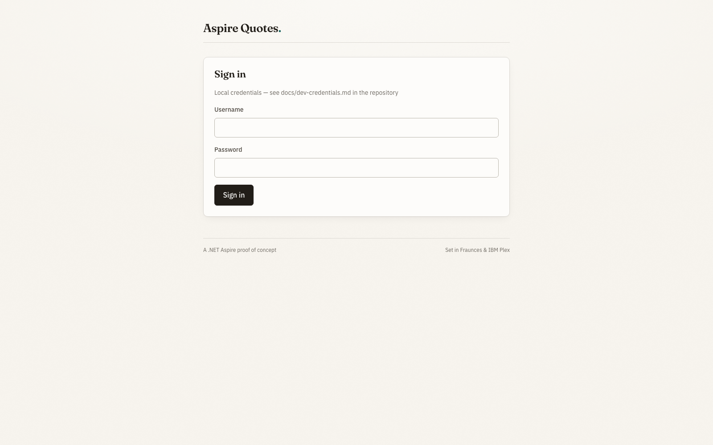
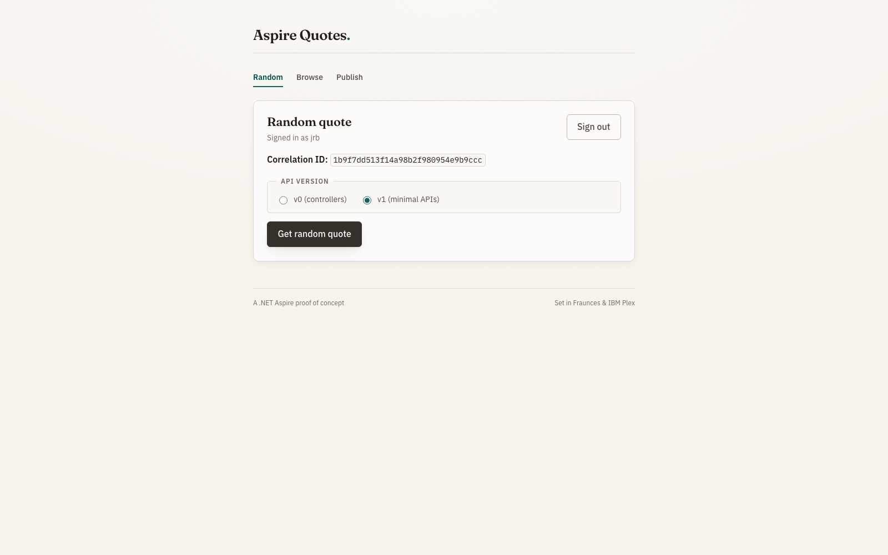
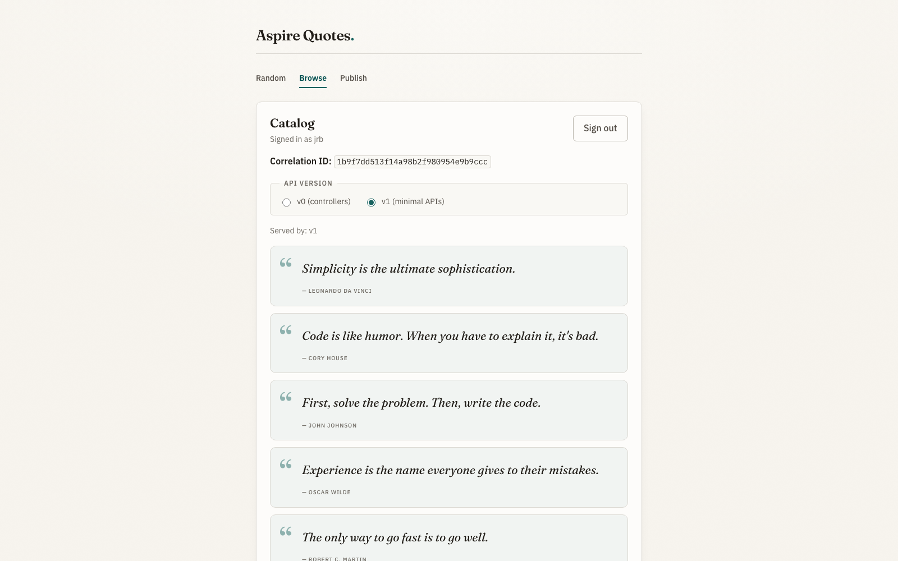
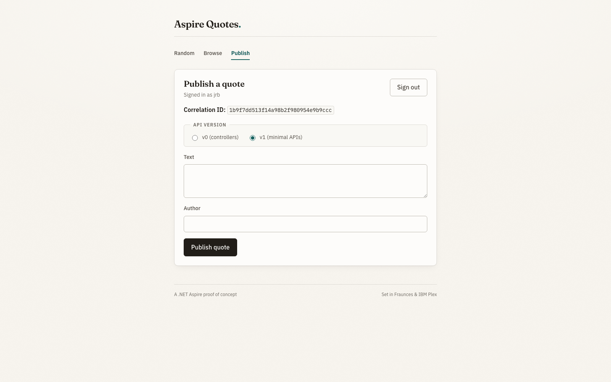
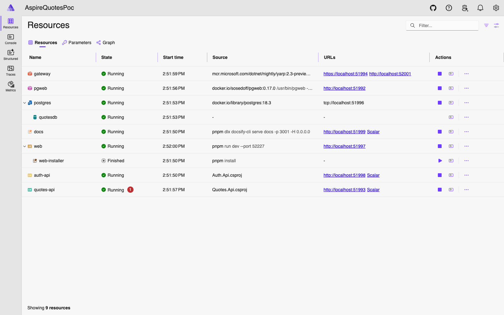
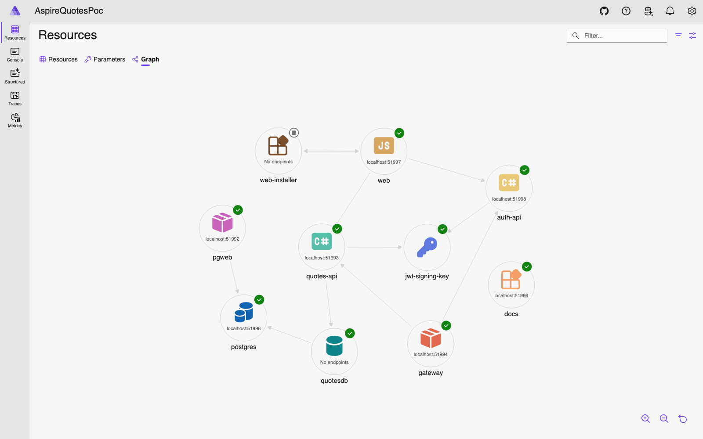
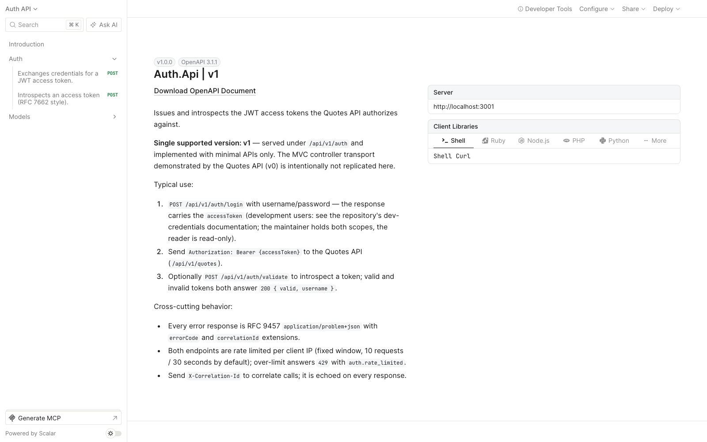

# UI tour

Screenshots of the running system, so you know what to expect **before** booting anything. Each image was captured at 1600×1000 from a live stack started with [`./scripts/start.sh`](../README.md#how-to-run); ports differ per run because the AppHost starts in isolated mode, but every screen looks the same.

Two other surfaces complete the picture: the [Scalar API reference](#scalar-api-reference) below, and the [local SonarQube dashboard](sonar.md) on its own page.

## The quotes app (React SPA)

The `web` resource is a React + TypeScript SPA served by Vite. It opens on the sign-in page; users and passwords live in [dev-credentials.md](dev-credentials.md).

| Screen | Route | What it shows |
|--------|-------|---------------|
| Sign in | `/` | Local scaffolding login — the token is kept in the SPA and sent as a Bearer to the APIs |
| Quote of the moment | `/quote` | `GET /api/v1/quotes/random` through the Vite proxy |
| Catalog | `/quotes` | The paginated catalog (`GET /api/v1/quotes?page=&pageSize=`) |
| Publish | `/publish` | Write path (`POST /api/v1/quotes`, maintainer scope only) — rejects invalid and near-duplicate quotes |

## Aspire dashboard

The dashboard URL (with its login token) is printed to the console when the AppHost starts. The **Resources** view is the control tower: every resource with its state, source, and endpoints. `quotes-api` migrates and seeds `quotesdb` at boot, `pgweb` browses it, YARP (`gateway`) fronts the SPA, and the `docs` resource serves this Docsify site.

The **Graph** tab renders the same topology as a dependency graph — the arrows are the references declared in `AppHost.cs` (who waits for whom, who talks to whom).

The left navigation also hosts the observability views — **Console**, **Structured** (Serilog logs enriched with `CorrelationId`), **Traces**, and **Metrics** — fed by the OTLP exporter every service gets from `ServiceDefaults` (see [observability.md](observability.md)).

## Scalar API reference

Each API serves Scalar at `/scalar` (the dashboard shows a **Scalar** link per API). The Quotes API exposes both documents — `v1` (Minimal API) and `v0` (MVC controllers) — switchable in the sidebar; the two are held to byte-level response parity by tests.

The combined Auth + Quotes reference is served by the `docs` resource at `/scalar/index.html` (`http://localhost:3001/scalar/index.html` when serving docs standalone — use the explicit `index.html`: `docsify-cli` answers the bare `/scalar/` path with its SPA shell, which renders a 404):

## SonarQube

Static analysis runs against a local SonarQube (Podman) via [`sonar-up.sh`](sonar.md) + [`sonar-scan.sh`](sonar.md) — the dashboard screenshot and the setup live on [sonar.md](sonar.md#).
