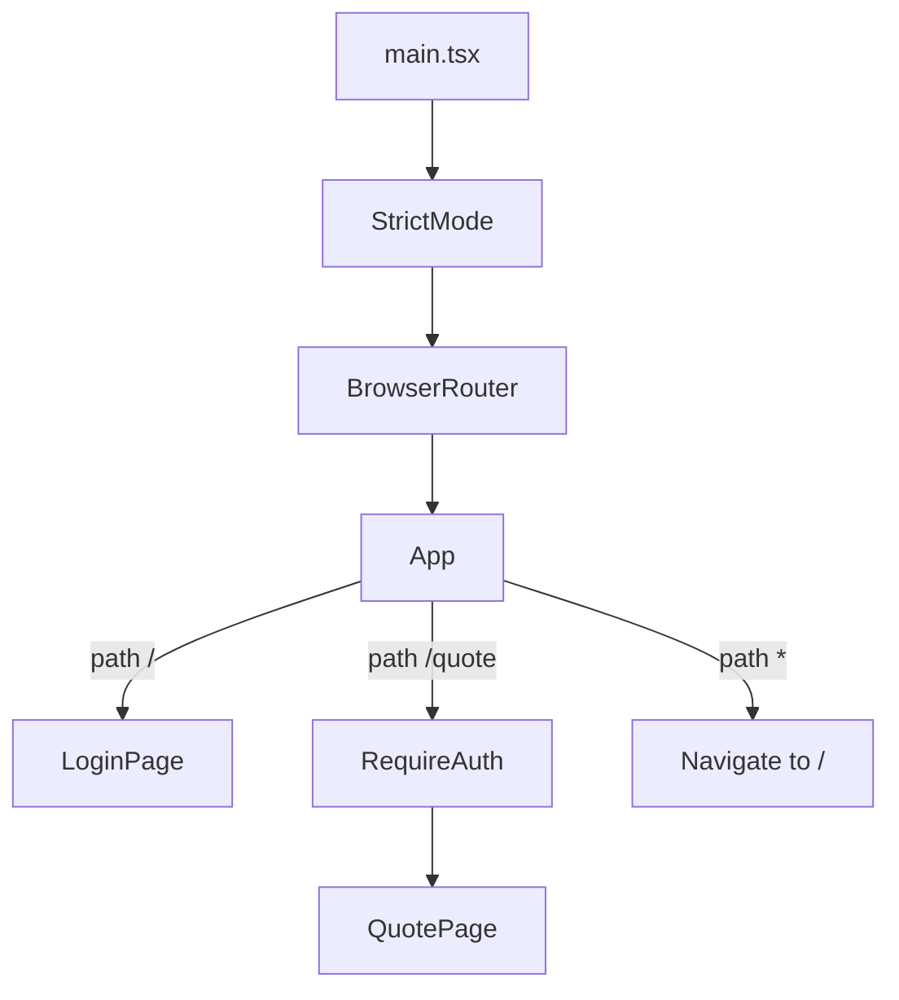
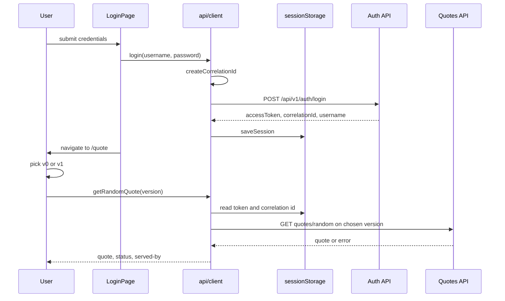

# frontend

The `web` resource: a small React SPA that signs in against the Auth API and reads a random quote
from the Quotes API. It exists to prove the contract end to end — one token, one correlation id,
both quote transports — not to demonstrate front-end architecture.

## Purpose

Two screens and one API module. The SPA is the client that shows the seed's cross-cutting behaviour
from the outside: the correlation id it mints at login is the one that appears in the Aspire
dashboard's structured logs for both services, and the version switch on the quote page exercises
`v0` (MVC controllers) and `v1` (minimal APIs) against the same catalog.

## Stack

| Concern | Choice |
|---|---|
| Framework | React 19 (`react`, `react-dom` ^19.2) |
| Language | TypeScript ~5.9, strict |
| Build/dev server | Vite ^8 with `@vitejs/plugin-react` |
| Routing | `react-router-dom` ^7 |
| State | **none** — `useState` in components, `sessionStorage` for the session |
| Tests | Vitest ^4, Testing Library, jsdom |
| Lint | ESLint 9 flat config + `typescript-eslint` |

There is no Redux, Zustand, React Query or context provider, and no reducer. Component state is
`useState`; anything that must survive a route change lives in `sessionStorage`, read and written by
one module.

There is also **no `import.meta.env` usage anywhere in `src/`**. The SPA has no build-time
configuration: every request path is relative, so whatever is in front of it decides where the call
lands.

## Component and route tree



[`src/App.tsx`](src/App.tsx) renders a fixed shell (a topbar with the brand) around `<Routes>`.
`RequireAuth` is a plain component, not a router loader: it calls `getSession()` on render and
returns `<Navigate to="/" replace />` when there is no access token, otherwise its children. The
catch-all route sends every unknown path back to the login page.

## The API client

[`src/api/client.ts`](src/api/client.ts) is the only module that touches the network and the only
module that touches `sessionStorage`.

**Relative URLs only.** Login posts to `/api/v1/auth/login`, and a quote read goes to
`/api/{version}/quotes/random` — there is no base URL, no host configuration, no environment
variable. Routing is entirely somebody
else's job: the Vite dev proxy in run mode, the YARP gateway in publish mode. That is what lets the
same bundle work in both without a build flag.

Four `sessionStorage` keys:

| Key | Written by | Holds |
|---|---|---|
| `accessToken` | `saveSession` | the JWT returned by login |
| `correlationId` | `saveSession` | the id the server echoed back |
| `username` | `saveSession` | the signed-in user, shown on the quote page |
| `apiVersion` | `setApiVersion` | `v0` or `v1`, the transport the switch selected |

**The correlation id is minted once, at login.** `createCorrelationId()` prefers
`crypto.randomUUID()` with the dashes stripped, and falls back to sixteen bytes from
`crypto.getRandomValues` rendered as hex — `randomUUID` is only exposed in secure contexts, so the
fallback covers plain-HTTP local origins. Either way the result is 32 hex characters, matching what
the server generates when no header arrives. That id goes out as `X-Correlation-Id` on the login
request; afterwards the client stores the value the *server* returned and sends that on every quote
call, so one filter in the dashboard covers the whole user action.

**`clearSession` deliberately keeps `apiVersion`.** It removes the token, the correlation id and the
username, and leaves the chosen version alone: it is a debugging preference, not a credential, and
losing it on every sign-out would make comparing the two transports tedious. A test pins that
behaviour.

**Auth is always `v1`; quotes are version-switchable.** The login path is hard-coded to
`/api/v1/auth/login`, because the Auth API serves one version. `getRandomQuote(version)` defaults to
`getApiVersion()`, which reads the stored value and falls back to `DEFAULT_API_VERSION` (`v1`) when
it is missing or not a known version.

**Errors are ProblemDetails-aware.** A failed login parses the body as RFC 9457 and reports
`title`, then `errorCode`, then a generic "Invalid credentials", always with the status code
appended; a body that is not JSON falls through to the generic message. A failed quote request
reports the status code only. Before either request, `getRandomQuote` throws `Not authenticated`
when the token or the correlation id is missing.

## User flow



`QuotePage` keeps the answer in `useState` and shows the last status and which version served it;
on failure it clears the quote, the status and the served-by marker before showing the error.

## Dev proxy and environment

[`vite.config.ts`](vite.config.ts) builds its proxy targets from environment variables:

```ts
const authTarget = process.env.AUTH_API_HTTPS || process.env.AUTH_API_HTTP;
const quotesTarget = process.env.QUOTES_API_HTTPS || process.env.QUOTES_API_HTTP;
```

Those four variables are injected by Aspire's `WithReference(auth)` / `WithReference(quotes)` on the
`web` resource in [`../src/AppHost/AppHost.cs`](../src/AppHost/AppHost.cs). The practical consequence:
running `npm run dev` **outside** Aspire leaves both targets `undefined`, so API calls do not reach a
service. Start the stack with `./scripts/start.sh` and open the `web` endpoint from the dashboard.

Both proxy rules use `changeOrigin: true` and `secure: false`, the latter so the local development
certificate on the HTTPS endpoint is accepted.

**One real gap.** The proxy declares rules for `/api/v1/auth` and `/api/v1/quotes` — and nothing for
`/api/v0/quotes`. The UI's version switch calls `/api/v0/quotes/random` whenever `v0` is selected, so
that path is unproxied in development: it goes to the Vite server, which has no such route.
The gateway does not share the problem — `AppHost.cs` declares a `/api/v0/quotes/{**catch-all}`
route — so `v0` works in publish mode and fails through the dev proxy.

## Scripts

From [`package.json`](package.json), run inside `frontend/`:

| Command | Does |
|---|---|
| `npm run dev` | Vite dev server (needs the Aspire-injected proxy targets, above) |
| `npm run build` | `tsc -b` then `vite build` — the type check only happens here |
| `npm run preview` | serves the production build |
| `npm run lint` | `eslint .` |
| `npm test` | `vitest run` |
| `npm run test:watch` | `vitest` in watch mode |
| `npm run test:coverage` | `vitest run --coverage` |

Node `^20.19.0 || >=22.12.0` is required (`engines`). `postcss` is pinned to `8.5.10` through
`overrides`.

## Tests

Vitest with the jsdom environment, globals enabled, and `src/**/*.test.{ts,tsx}` as the include
pattern — configured in the `test` block of [`vite.config.ts`](vite.config.ts) rather than a separate
config file. `clearMocks`, `restoreMocks` and `unstubGlobals` are all on, so nothing leaks between
tests.

[`src/test/setup.ts`](src/test/setup.ts) runs after every test: Testing Library's `cleanup()` and
`sessionStorage.clear()`. The second one matters more than it looks — the client stores session state
globally, so without it one test's token would authenticate the next test's render.

Four test files:

| File | Covers |
|---|---|
| [`src/App.test.tsx`](src/App.test.tsx) | routing: login at `/`, the `RequireAuth` redirect when `/quote` has no session, the quote page when a session exists, and the catch-all redirect |
| [`src/api/client.test.ts`](src/api/client.test.ts) | session round-trip and clearing; login posting credentials, sending a 32-character hex correlation id, the `getRandomValues` fallback when `randomUUID` is absent, surfacing the ProblemDetails `title`, and the non-JSON fallback; `getRandomQuote` throwing without a session, sending the bearer token and stored id, and reporting the failure status; version selection — the `v1` default, round-tripping a choice, falling back when the stored value is unknown, surviving sign-out, and being used when no argument is passed |
| [`src/pages/LoginPage.test.tsx`](src/pages/LoginPage.test.tsx) | empty initial fields, passing through exactly what was typed, navigating to `/quote` on success, showing the error message on failure, and the generic message for a non-`Error` rejection |
| [`src/pages/QuotePage.test.tsx`](src/pages/QuotePage.test.tsx) | showing the user and correlation id, rendering a returned quote with its status, error handling and the non-`Error` fallback, sign-out clearing the session and returning to `/`, the `v1` default, remembering the selected version, and not claiming a server when the request fails |

Both page suites mock `useNavigate` while keeping the rest of `react-router-dom` real, and spy on the
client module rather than on `fetch`; the client suite stubs `fetch` directly.

Coverage uses the `v8` provider and reports `text` plus **`lcov`** into `coverage/` — LCOV is the
format SonarQube reads. `src/main.tsx`, `src/vite-env.d.ts`, `src/test/**` and the test files
themselves are excluded.

## TypeScript and lint config

[`tsconfig.json`](tsconfig.json) is a solution file with no sources of its own; it references two
project configs:

- [`tsconfig.app.json`](tsconfig.app.json) — the application (`include: ["src"]`), `ES2020` target,
  DOM libs, `jsx: react-jsx`
- [`tsconfig.node.json`](tsconfig.node.json) — the build tooling (`include: ["vite.config.ts"]`),
  `ES2022` target, no DOM

Both share the strict settings: `strict`, `noUnusedLocals`, `noUnusedParameters`,
`noFallthroughCasesInSwitch`, `erasableSyntaxOnly`, `noUncheckedSideEffectImports`,
`verbatimModuleSyntax`, `moduleResolution: bundler`, and `noEmit` — Vite does the emitting, `tsc` only
checks.

[`eslint.config.js`](eslint.config.js) is a flat config: `js.configs.recommended` plus
`tseslint.configs.recommended` over `**/*.{ts,tsx}`, browser globals, the `react-hooks` recommended
rules, and `react-refresh/only-export-components` as a warning with `allowConstantExport`. `dist` and
`coverage` are globally ignored.

## How it fits the .NET solution

[`frontend.esproj`](frontend.esproj) exists so Visual Studio shows the SPA in the solution tree. It
uses the VS JavaScript SDK and disables both npm hooks:

```xml
<ShouldRunNpmInstall>false</ShouldRunNpmInstall>
<ShouldRunBuildScript>false</ShouldRunBuildScript>
```

So the project builds nothing. It is a solution-explorer entry, and npm remains the only way the
frontend is installed, linted, tested or built — Aspire's `AddViteApp` in run mode, `npm` in CI.

That inert project is also why the tooling never targets the solution file:
[`../scripts/lint.sh`](../scripts/lint.sh) enumerates `*.csproj` under `src` and `tests` and runs
`dotnet format` per project, and CI's test job does the same per `*.Tests.csproj`. A clean .NET SDK
checkout cannot build `frontend.esproj`, so `dotnet format AspireQuotesPoc.sln` would fail on a
project that has nothing to format. CI runs the frontend as its own job: `npm ci`, `npm run lint`,
`npm test`, `npm run build`.

## See also

- [Repository README](../README.md) — goals, solution layout, credentials for signing in
- [docs/architecture.md](../docs/architecture.md) — correlation, the `v0`/`v1` policy the version
  switch exercises
- [docs/api.md](../docs/api.md) — the endpoint contracts this client calls and the error envelope it
  parses
- [docs/local-dev.md](../docs/local-dev.md) — prerequisites and how to start the stack
- [docs/testing.md](../docs/testing.md) — the test stack across the repository
- [`../src/AppHost/README.md`](../src/AppHost/README.md) — the `web` resource, `WithReference`, and
  how the SPA is served in publish mode
