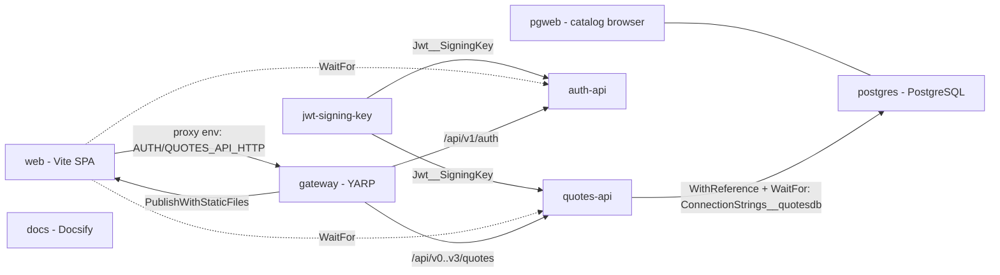

# AppHost

`AspireQuotesPoc.AppHost` is the Aspire orchestrator: the one file that says what runs, what it
talks to, and what it needs to start. [`AppHost.cs`](AppHost.cs) is roughly seventy lines and is the
source of truth for the topology — in run mode and in publish mode alike.

## Purpose

The AppHost is not a service. It builds a `DistributedApplication` model and hands it to the Aspire
CLI, which either runs every resource locally (`aspire run`, via
[`../../scripts/start.sh`](../../scripts/start.sh)) or turns the model into deployment artifacts
(`aspire publish`, via [`../../scripts/publish.sh`](../../scripts/publish.sh)).

Four things live here and nowhere else:

- the list of resources and the dependency edges between them
- the shared JWT signing key parameter
- the catalog database: the PostgreSQL container and the `quotesdb` database on it
- the gateway's routing table

Everything else — endpoint contracts, auth policy, telemetry wiring — belongs to the services.
`AppHost.csproj` references only `Auth.Api` and `Quotes.Api` (so Aspire can generate the strongly
typed `Projects.*` handles) plus the `Aspire.Hosting.JavaScript`, `Aspire.Hosting.Docker`,
`Aspire.Hosting.PostgreSQL` and `Aspire.Hosting.Yarp` packages.

## The resource graph



`docs` has no edges: it serves the `docs/` folder with `docsify-cli` and depends on nothing.

The two `WithEnvironment` calls on `web` are load-bearing rather than decorative — they inject
`AUTH_API_HTTP` and `QUOTES_API_HTTP` with the **gateway's** endpoint, the exact variable names
[`../../frontend/vite.config.ts`](../../frontend/vite.config.ts) reads to build its dev proxy.
Dev traffic therefore crosses the same YARP route table as published traffic — the same trick
the Go sibling uses when it points these names at its Traefik edge. `WaitFor` holds the SPA back
until both APIs pass their health check. The same mechanics wire the catalog:
`WithReference(quotesDb)` injects
`ConnectionStrings__quotesdb` into quotes-api (see
[docs/data-storage.md](../../docs/data-storage.md) for the full connection flow), and `WaitFor`
starts the API only after the database is healthy.

## Resources

All seven are declared in [`AppHost.cs`](AppHost.cs).

| Name | Kind | Declared at | Endpoints | Notes |
|---|---|---|---|---|
| `postgres` | PostgreSQL container (`AddPostgres`) | before both APIs | internal to the deployment network | the catalog engine; image and generated credentials managed by Aspire; deliberately **no data volume** — every run migrates + seeds from scratch, which is what the BDD/e2e suites assert on |
| `pgweb` | pgweb container (`WithPgWeb`) | with `postgres` | external HTTP | lightweight catalog browser, preconfigured with the server's connection |
| `auth-api` | .NET project (`Projects.Auth_Api`) | `builder.AddProject<...>("auth-api")` | `http`, `https`, not externally published | `Jwt__SigningKey` from the parameter; HTTP health check on `/health`; a **Scalar** dashboard link pointing at `/scalar` on each endpoint |
| `quotes-api` | .NET project (`Projects.Quotes_Api`) | `builder.AddProject<...>("quotes-api")` | `http`, `https`, not externally published | like `auth-api`, plus `WithReference(quotesDb)` + `WaitFor(quotesDb)`; migrates and seeds the database at boot |
| `gateway` | YARP (`AddYarp("gateway")`) | after the APIs | external HTTP | five routes; `PublishWithStaticFiles(web)` |
| `web` | Vite app (`AddViteApp("web", "../../frontend")`) | after the gateway | external HTTP | proxy env pointed at the gateway; `WaitFor` on both APIs |
| `docs` | Executable (`AddExecutable`) | `pnpm dlx docsify-cli serve docs -p 3001 -H 0.0.0.0`, working directory `../..` | `http` on target port 3001, external | adds a **Scalar** link to `/scalar/` (the combined Auth + Quotes reference); logs a warning and skips that link if the `http` endpoint is missing |

One environment is declared alongside them: `builder.AddDockerComposeEnvironment("compose")`, which
is what makes `aspire publish` emit Docker Compose artifacts (Podman-compatible) rather than another
deployment format.

## The shared signing key

```csharp
var jwtSigningKey = builder.AddParameter("jwt-signing-key", secret: true);
```

One parameter, marked secret, passed to both APIs as the environment variable `Jwt__SigningKey` —
the double underscore is ASP.NET's separator, so it lands on the `Jwt:SigningKey` configuration key
that `AddStandardJwtAuthentication` reads.

Why one key rather than two: **Auth signs, Quotes verifies**. They are symmetric HS256 halves of the
same trust relationship, so the value must be identical on both sides. `quotes-api` never calls
`auth-api` to check a token; JwtBearer validates locally against this key.

Where the value comes from depends on the mode:

- **Run mode** — the Aspire dashboard prompts for or generates a value and stores it in the
  AppHost's user secrets (`UserSecretsId` in [the csproj](AspireQuotesPoc.AppHost.csproj)). Nothing
  is committed.
- **Publish mode** — the key surfaces as a `JWT_SIGNING_KEY` variable in the generated environment
  file, blank by default. An operator must fill it before starting the stack.
- **Standalone `dotnet run`** (outside Aspire) — neither applies; each API needs the documented
  development key in its own user secrets, as described in the
  [repository README](../../README.md#credentials-and-secrets).

`AddStandardJwtAuthentication` refuses to start when the key is missing, and refuses to start in
Production when it equals the public development key. See
[docs/architecture.md#authentication](../../docs/architecture.md#authentication).

## Run mode vs publish mode

The same model produces two different shapes.

| | Run (`aspire run`) | Publish (`aspire publish`) |
|---|---|---|
| `auth-api`, `quotes-api` | local processes | containers |
| `postgres`, `pgweb` | containers (ephemeral catalog) | containers (ephemeral catalog) |
| `web` | Vite dev server, proxying `/api/*` to the gateway | **no service** — built and baked into the gateway image |
| `docs` | `docsify-cli` on port 3001 | **no service** |
| `gateway` | the single entry point — every API call rides it | the only front door |
| Telemetry sink | the Aspire dashboard the CLI starts | a dashboard container in the generated compose file |
| Signing key | generated locally | a blank variable for the operator |

The two absences are the point worth remembering. `docs` is a developer convenience — a
`pnpm dlx` executable that serves the repository's own Markdown — and has no place in a deployment. `web` is
absent for a different reason: `PublishWithStaticFiles(web)` turns the SPA from a resource into
*content*, building it and copying the Vite `dist` output into the gateway image's `wwwroot`. In
publish mode the browser loads the SPA from the gateway and calls the APIs through the same origin,
so there is no proxy and no CORS.

## The gateway

`builder.AddYarp("gateway")` declares a reverse proxy with five routes, exactly as written in
[`AppHost.cs`](AppHost.cs):

| Route pattern | Destination |
|---|---|
| `/api/v1/auth/{**catch-all}` | `auth-api` |
| `/api/v0/quotes/{**catch-all}` | `quotes-api` |
| `/api/v1/quotes/{**catch-all}` | `quotes-api` |
| `/api/v2/quotes/{**catch-all}` | `quotes-api` |
| `/api/v3/quotes/{**catch-all}` | `quotes-api` |

All quote routes point at the same service: `v0`–`v3` are four transports inside one host, and the
SPA picks one per request. Adding an API version therefore adds a route here — see
[docs/architecture.md#api-versions-and-transport-styles](../../docs/architecture.md#api-versions-and-transport-styles).

`PublishWithStaticFiles(web)` makes the same process serve the SPA, so one container answers both
the static assets and the API prefixes. The gateway is the single entry point in both modes: the
Vite dev proxy targets it in run mode, and the published compose output opens no other stack port.
It plays the role Traefik's `edge` plays in
[code.examples.go.quotes](https://github.com/josnelihurt/code.examples.go.quotes) — there is no
Traefik here, and no separate ingress: YARP *is* the deploy entry point.

## Generated output

`./scripts/publish.sh` runs `aspire publish --non-interactive` and writes Docker Compose artifacts
into an `aspire-output` folder under this directory. That folder is a **build output**: it is
gitignored (`**/aspire-output/` in [`../../.gitignore`](../../.gitignore)), never committed, and
never reviewed. Nothing in the repository reads it.

What a publish emits today:

- a compose file with five services — a dashboard container that receives OTLP, `auth-api`,
  `quotes-api`, `gateway`, and the catalog's `postgres` — on a single `aspire` bridge network.
  Only the `gateway` publishes a host port (5000); `auth-api` and `quotes-api` are `expose`-only,
  reachable through the gateway and from nowhere else
- a Dockerfile for the gateway that starts from the YARP base image and copies the SPA build's
  `dist` directory into `wwwroot`, which is how `PublishWithStaticFiles` is realised
- an environment file listing the values an operator must supply: the container image name and port
  for each API, the gateway image name, and `JWT_SIGNING_KEY`

Both API containers receive `Jwt__SigningKey`, an OTLP endpoint pointing at the dashboard service,
and their own `OTEL_SERVICE_NAME`.

Treat [`AppHost.cs`](AppHost.cs) as the source of truth for the topology and regenerate the output
rather than reading a folder left behind by an earlier run — an old one reflects whatever the model
looked like when it was produced, including route patterns that have since changed.

## Configuration

| Where | What |
|---|---|
| [`appsettings.json`](appsettings.json) | log levels for the AppHost process itself; `Aspire.Hosting.Dcp` is pinned to `Warning` so orchestration chatter stays out of the console |
| [`appsettings.Development.json`](appsettings.Development.json) | the same defaults minus the Dcp override |
| [`Properties/launchSettings.json`](Properties/launchSettings.json) | two profiles, `https` and `http`; each sets `ASPNETCORE_ENVIRONMENT` / `DOTNET_ENVIRONMENT` to `Development` and fixes the dashboard's OTLP and resource-service ports so they do not move between runs |
| [`AspireQuotesPoc.AppHost.csproj`](AspireQuotesPoc.AppHost.csproj) | `Aspire.AppHost.Sdk`, `UserSecretsId` (where the signing key lands locally), the two project references and the three hosting packages |
| [`../../aspire.config.json`](../../aspire.config.json) | points the `aspire` CLI at this csproj and pins the `stable` channel — this is why the CLI commands work from the repository root |
| [`../../scripts/env.sh`](../../scripts/env.sh) | sourced by `start.sh` and `publish.sh`: `ASPIRE_CONTAINER_RUNTIME=podman`, Development environment, and `~/.aspire/bin` on `PATH` |

## See also

- [Repository README](../../README.md) — goals, solution layout, how to run
- [docs/architecture.md](../../docs/architecture.md) — the topology narrative, API versioning policy
- [docs/local-dev.md](../../docs/local-dev.md) — prerequisites and the full command list
- [docs/observability.md](../../docs/observability.md) — what to do with the dashboard once it is up
- [`../ServiceDefaults/README.md`](../ServiceDefaults/README.md) — the platform kit both APIs load
- [`../../frontend/README.md`](../../frontend/README.md) — the `web` resource (the submodule's working-tree copy; the repository is [code.examples.frontend.quotes](https://github.com/josnelihurt/code.examples.frontend.quotes))
