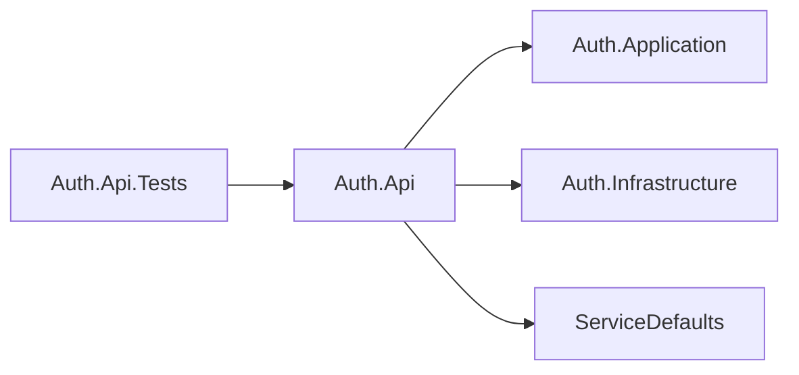
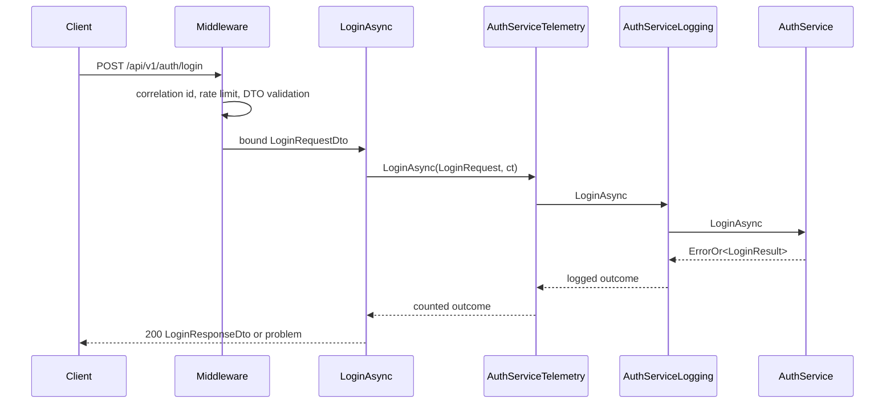

# Auth.Api

## Purpose

`Auth.Api` is the Auth context's host and composition root. It boots the web application, calls each layer's registration in order, applies the platform middleware from `ServiceDefaults`, and maps the two routes of the `/api/v1/auth` group. Beyond composition it owns the things that are transport by nature: the request and response DTOs with their Data Annotations, the OpenAPI narrative, the fixed-window rate limiter that protects two unauthenticated endpoints, and the telemetry/logging decorator chain wrapped around `IAuthService`. It never references `Auth.Domain`.

## Position in the architecture



From `Auth.Api.csproj`:

```xml
<PropertyGroup>
  <UserSecretsId>32794d76-42ca-404e-baee-4257b2292869</UserSecretsId>
</PropertyGroup>

<ItemGroup>
  <InternalsVisibleTo Include="Auth.Api.Tests" />
</ItemGroup>
<ItemGroup>
  <ProjectReference Include="..\..\ServiceDefaults\AspireQuotesPoc.ServiceDefaults.csproj" />
  <ProjectReference Include="..\Auth.Application\Auth.Application.csproj" />
  <ProjectReference Include="..\Auth.Infrastructure\Auth.Infrastructure.csproj" />
</ItemGroup>
```

There are no `<PackageReference>` entries: the SDK is `Microsoft.NET.Sdk.Web`, so the ASP.NET Core shared framework is implicit, and everything else arrives transitively through `ServiceDefaults`. `InternalsVisibleTo` exists because the endpoint handlers and the route-group constants are `internal` — the tests call them directly instead of through HTTP where that is the cheaper check. The `UserSecretsId` is what makes `dotnet user-secrets set "Jwt:SigningKey" …` land on this project for standalone runs.

## Why this layer exists

Everything in this project answers a question the layers below are not allowed to have an opinion about: which URL, which status code, which JSON shape, which middleware order, which lifetime, how many requests per window. Keeping those here is what lets `AuthService` be a class with two methods and no framework types.

The composition-root role is the load-bearing one. Each layer exposes its own `Add…` method and this host is the single place that calls them, so the dependency graph of the running service is readable in one screen of `Program.cs`. That is also why the decorator chain is wired here rather than inside Application: metrics and structured logs are operational concerns of a deployed host, and a use case that logs is a use case that is harder to reuse and harder to test.

One asymmetry is worth stating outright. `Auth.Api` does **not** call `AddStandardJwtAuthentication()`. It *issues* tokens; it does not consume them. There is no authenticated endpoint here, no `RequireAuthorization`, and no scope policy — the `/api/v1/auth/validate` route inspects a token as a *payload*, not as the caller's identity, which is why an invalid token is a 200 rather than a 401. Only `Quotes.Api` registers the bearer middleware and the scope policies ([authentication](../../../docs/architecture.md#authentication)). The practical consequence is that the two hosts must agree on issuer, audience and signing key through configuration rather than through code — see [`Auth.Infrastructure`](../Auth.Infrastructure/README.md#why-this-layer-exists) for the pin that keeps the defaults aligned.

## DDD concepts introduced here

| Concept | Why it matters | In this project | Relates to |
|---------|----------------|-----------------|------------|
| **Composition root** | One place assembles the object graph, so lifetimes and substitutions are reviewable rather than scattered. | `Program.cs`: `AddAuthApplication()`, `AddAuthInfrastructure(builder.Environment)`, `AddAuthServiceTelemetry()`, `AddAuthRateLimiting(builder.Configuration)`, `AddValidation()` | [Root README convention 4](../../../README.md#conventions-in-place) |
| **Transport DTO** | Keeps the wire contract separate from application types, so a JSON rename never reaches a use case. | `Contracts/LoginRequestDto`, `LoginResponseDto`, `ValidateRequestDto`, `ValidateResponseDto` | [docs/api.md](../../../docs/api.md); `LoginRequest` / `LoginResult` in Application |
| **Anti-corruption at the edge** | `ErrorOr` results become RFC 9457 ProblemDetails exactly once, at the boundary. | `result.Match(onValue: …, onError: errors => errors.ToProblem(http))` | [error flow](../../../docs/architecture.md#error-flow) |
| **Decorator chain** | Cross-cutting behavior composes around a service instead of being written inside it. | `AuthServiceTelemetry` → `AuthServiceLogging` → `AuthService`, wired by `AddAuthServiceTelemetry` | [cross-cutting telemetry](../../../docs/architecture.md#cross-cutting-telemetry); Quotes' use-case decorators |
| **Documented exception to a rule** | A rule with an unexplained exception decays; naming the one case keeps the rule intact. | The missing-token metric recorded inline in `ValidateAsync` | Same section of `docs/architecture.md` |
| **Versioned surface** | A context versions its endpoints from its first route, not at its first breaking change. | `DocumentName = "v1"`, group `/api/v1/auth`, document `/openapi/v1.json` | [shape rule 5](../../../docs/architecture.md#bounded-context-shape-rules) |

**`Program.cs` in order.** Serilog first gets a bootstrap console logger so a failure during startup is still recorded. Then: `AddServiceDefaults()` (Serilog, OpenTelemetry, health checks, service discovery), `AddStandardApiServices()` with no arguments — this host serves a single document, so it keeps the framework default name `v1` — and an `OpenApiDocumentInfo` singleton carrying the narrative from `OpenApiDocs`. `AddOpenApi("v1", options => options.ConfigureStandardOpenApi("v1"))` is written with a **string literal** on purpose: the XML-comment source generator only intercepts literal document names, and a constant or a loop would silently empty every operation summary. Then the layer registrations, the telemetry chain, the rate limiter and `AddValidation()`. After `Build()`: `UseExceptionHandler()`, `UseSerilogDefaults()`, `UseCorrelationId()`, `UseRateLimiter()`, `MapDefaultEndpoints()` (`/health` and `/alive`, mapped in every environment because orchestrators cannot depend on a Development flag), `MapStandardApiDocumentation()` (the OpenAPI documents and Scalar), and finally `AuthEndpoints.Map(app)`. The whole body is wrapped in `try`/`catch`/`finally` so a fatal exception is logged before Serilog is flushed; the log-and-rethrow is deliberate and the S2139 warning is suppressed with that reason. A `public partial class Program;` marker at the end is what `WebApplicationFactory<Program>` binds to.

Order matters twice here: `UseCorrelationId()` runs before `UseRateLimiter()` so that a 429 rejection can still put a correlation id in its problem body, and `AddValidation()` means Data Annotations run during binding, so a blank `Username` is a 400 from the framework before any handler executes.

**Endpoints.** `AuthEndpoints.Map` builds one group — `MapGroup($"/api/{DocumentName}/auth")` — tagged `Auth`, assigned to the `v1` OpenAPI document, and covered as a whole by `RequireRateLimiting(RateLimitingExtensions.AuthPolicyName)`. Two routes hang off it:

| Route | Success | Declared failures |
|-------|---------|-------------------|
| `POST /api/v1/auth/login` (`WithName("Login")`) | `200 LoginResponseDto` | `400` validation problem (example keyed on `Username`), `401` with `auth.invalid_credentials`, `429` with `auth.rate_limited` |
| `POST /api/v1/auth/validate` (`WithName("ValidateToken")`) | `200 ValidateResponseDto` — for valid **and** invalid tokens | `400` with `auth.token_missing`, `429` with `auth.rate_limited` |

Each declared problem carries a `.WithProblemExample(...)` so the rendered reference shows a real body rather than a bare schema; the 401 and 400 examples are built from `AuthErrors.InvalidCredentials` and `AuthErrors.MissingToken` themselves, which means the documented `errorCode` cannot drift from the emitted one. The conventions behind those helpers are documented in [docs/api.md](../../../docs/api.md#documenting-operations) and are not repeated here.

The introspection endpoint's shape is the part worth reading twice. The token is taken from the JSON body when present and otherwise from the `Authorization` header via `BearerToken.TryParse`; the body wins when both are supplied. A token that is expired, tampered with, signed by another key or plain garbage answers `200 { "valid": false }` with no username. The *only* error on this route is the absence of a token, which is a malformed request rather than a verdict about a token, and answers `400` with `auth.token_missing`. A 401 would be wrong twice over: the endpoint is unauthenticated by design, and "your token is bad" is the answer the caller asked for.

**Why the missing-token metric is recorded inline.** The seed's rule is that counters and structured logs live in the decorator chain, never in handlers. This one rejection is the documented exception, because bearer parsing is an API concern and the request fails *before* `IAuthService` is invoked — a decorator around the service can only count calls that reach the service, so a missing-token rejection would silently vanish from `auth.validate.count` and make the counter's failure total disagree with the 400s in the access log. The handler therefore calls `AppMetrics.Record(AppMetrics.AuthValidateCount, "failure")` and logs a warning itself, using the `AuthEndpointsLog` marker type that exists only because a static class cannot be an `ILogger<T>` argument. The exception is recorded in [`docs/architecture.md`](../../../docs/architecture.md#cross-cutting-telemetry) and in [`docs/observability.md`](../../../docs/observability.md#metrics) so it does not read as an oversight.

**Contracts.** `LoginRequestDto` declares `MaxUsernameLength = 100` and `MaxPasswordLength = 200` as public constants and applies `[Required]` plus `[MaxLength]` to both properties — shallow transport guards, in line with the seed's split between transport validation and deeper rules. `ValidateRequestDto.AccessToken` is optional (the header is the alternative) but carries `[MaxLength(4096)]`, which is what keeps the DTO annotated at all: the guard test below fails any `*RequestDto` with no validation attribute, because `AddValidation()` validates only what is annotated and an unannotated DTO would fail open. Response DTOs use `required` init-only properties, and every type and property carries `[Description]` plus a class-level `/// <example>` for the schema samples.

**Rate limiting.** `AddAuthRateLimiting` configures a fixed-window limiter under the policy name `auth-endpoints`, bound to `AuthRateLimitOptions` from the `RateLimiting:Auth` configuration section with defaults `PermitLimit = 10` and `WindowSeconds = 30`. Partitions are keyed by `context.Connection.RemoteIpAddress?.ToString() ?? "unknown-client"`, and `QueueLimit = 0` means an over-limit request is rejected immediately rather than parked. Login and introspection are unauthenticated oracles — one confirms credentials, the other confirms tokens — so throttling them is part of the standing posture rather than optional hardening. Rejections answer `429` with `application/problem+json` carrying `errorCode = auth.rate_limited` and the request's correlation id. The `OnRejected` callback builds that body with `ProblemDetailsBuilder` — the same envelope the ErrorOr path uses — because the rejection happens in the rate-limiter middleware, outside the endpoint pipeline that the shared `ToProblem` path serves; the builder exists precisely so middleware can produce the one error shape without a hand-rolled body.

**Telemetry.** `AddAuthServiceTelemetry` registers the bare `AuthService` as a singleton and then registers `IAuthService` as `new AuthServiceTelemetry(new AuthServiceLogging(AuthService, logger))` — telemetry outermost, logging in the middle, the real service innermost. Because the last registration of a service type wins, this resolves ahead of the `AddAuthApplication()` registration made a few lines earlier in `Program.cs`, and the singleton lifetime is preserved. `AuthServiceTelemetry` records one measurement per call on `AppMetrics.AuthLoginCount` and `AppMetrics.AuthValidateCount`. `AuthServiceLogging` logs `"Login attempt"` before the call and success or failure after it, and never logs the request values — credentials are user input, so only outcomes are recorded. Its `ValidateAsync` uses a guard clause rather than an ErrorOr combinator, because `ValidateResult` is not an `ErrorOr`.

The outcome tags are plain `success` / `failure`, not the `UseCaseTelemetry.Outcome` vocabulary (`invalid` / `conflict` / `not_found` / `error`) that the quote counters use. That divergence is deliberate: the quotes vocabulary is a projection of `ErrorType`, and it is useful there because a create can fail four distinguishable ways an operator would want to chart separately. Auth has exactly one failure mode per operation that it is willing to publish — the login endpoint must not reveal whether a credential was blank, unknown or merely wrong, and introspection either recognised the token or did not. A richer tag would either be constant or leak the distinction the 401 response is careful not to make. `UseCaseTelemetry`'s own doc comment records that auth keeps `success`/`failure`, and the tag values are contract, listed in [docs/observability.md](../../../docs/observability.md#metrics).

## File inventory

| File | Type | Role | Key constants / signatures |
|------|------|------|----------------------------|
| `Program.cs` | top-level statements | Composition root and middleware pipeline; declares the test entry-point marker. | `AddServiceDefaults()`, `AddStandardApiServices()`, `AddOpenApi("v1", …)`, `AddAuthApplication()`, `AddAuthInfrastructure(builder.Environment)`, `AddAuthServiceTelemetry()`, `AddAuthRateLimiting(builder.Configuration)`, `AddValidation()`; `public partial class Program;` |
| `Endpoints/AuthEndpoints.cs` | `public static class` (+ `internal sealed class AuthEndpointsLog`) | Maps the `/api/v1/auth` group and both handlers. | `internal const string DocumentName = "v1"`; `Map(IEndpointRouteBuilder)`; `internal static Task<IResult> LoginAsync(LoginRequestDto, IAuthService, HttpContext, CancellationToken)`; `internal static Task<IResult> ValidateAsync(ValidateRequestDto?, IAuthService, HttpContext, ILogger<AuthEndpointsLog>, CancellationToken)` |
| `Contracts/LoginRequestDto.cs` | `public sealed class` | Login body. | `MaxUsernameLength = 100`, `MaxPasswordLength = 200`; `[Required]` + `[MaxLength]` on `Username` and `Password` |
| `Contracts/LoginResponseDto.cs` | `public sealed class` | Login success body. | `required string AccessToken`, `required string CorrelationId`, `required int ExpiresIn`, `required string Username` |
| `Contracts/ValidateRequestDto.cs` | `public sealed class` | Optional introspection body. | `string? AccessToken` with `[MaxLength(4096)]` |
| `Contracts/ValidateResponseDto.cs` | `public sealed class` | Introspection answer, returned for both verdicts. | `required bool Valid`, `string? Username` |
| `RateLimitingExtensions.cs` | `public static class` + `public sealed class AuthRateLimitOptions` | Fixed-window limiter and its 429 problem body. | `AuthPolicyName = "auth-endpoints"`, `RateLimitedErrorCode = "auth.rate_limited"`; `AuthRateLimitOptions.SectionName = "RateLimiting:Auth"`, `PermitLimit = 10`, `WindowSeconds = 30`; `QueueLimit = 0`; `AddAuthRateLimiting(IServiceCollection, IConfiguration)` |
| `Telemetry/AuthServiceTelemetry.cs` | `internal sealed class : IAuthService` | Metrics leg (outermost). | `AppMetrics.Record(AppMetrics.AuthLoginCount, …)`, `AppMetrics.Record(AppMetrics.AuthValidateCount, …)`; outcomes `"success"` / `"failure"` |
| `Telemetry/AuthServiceLogging.cs` | `internal sealed class : IAuthService` | Logging leg (middle); never logs credential values. | `"Login attempt"`, `"Login succeeded"`, `"Login failed"`, `"Token validation failed"`, `"Token validated for user {Username}"` |
| `Telemetry/AuthServiceTelemetryExtensions.cs` | `public static class` | Wires the chain, preserving the singleton lifetime. | `AddAuthServiceTelemetry(this IServiceCollection)` |
| `OpenApiDocs.cs` | `internal static class` | Document narrative rendered by Scalar. | `Description` (v1-only, usage steps, cross-cutting behavior); `TagDescriptions["Auth"]` |
| `appsettings.json`, `appsettings.Development.json` | configuration | Logging levels and `AllowedHosts`. No `Jwt` section is committed — the signing key comes from user-secrets or the Aspire parameter. | — |

## Walkthrough

A login through the full pipeline, from the socket to the token:



1. **Correlation.** `UseCorrelationId` accepts an inbound `X-Correlation-Id` or generates one, echoes it on the response, puts it in `HttpContext.Items`, tags the current activity and pushes it into the Serilog log context.
2. **Rate limiting.** The `auth-endpoints` policy resolves this client IP's fixed-window partition. Over the limit, the request never reaches routing: `OnRejected` writes the 429 problem with the correlation id and `auth.rate_limited`.
3. **Binding and validation.** The JSON body binds to `LoginRequestDto`; `AddValidation()` runs its Data Annotations. A missing or over-long field short-circuits to a 400 validation problem keyed by property name, before the handler runs.
4. **Handler.** `LoginAsync` reads the correlation id from `HttpContext`, builds the Application-level `LoginRequest(body.Username, body.Password)`, and calls the injected `IAuthService` — which the container resolved as the decorator chain.
5. **Telemetry leg.** `AuthServiceTelemetry` calls inward, then records one measurement on `auth.login.count` tagged `success` or `failure` via `MatchFirst`.
6. **Logging leg.** `AuthServiceLogging` writes `"Login attempt"` before the inner call and, using `SwitchFirst`, `"Login succeeded"` or `"Login failed"` after it. No username, no password, no token.
7. **Application.** `AuthService` runs the sequence described in [Auth.Application](../Auth.Application/README.md#walkthrough) and returns `ErrorOr<LoginResult>`.
8. **Mapping.** The handler's `Match` turns a value into `Results.Ok(new LoginResponseDto { … })` — token, correlation id, lifetime, username — and errors into `errors.ToProblem(http)`, the single edge mapping that produces the RFC 9457 body with `errorCode` and `correlationId`. `ErrorType.Unauthorized` is what makes the bad-credentials case a 401.

Introspection follows the same pipeline with one branch before the service: the handler resolves the token from body or header, and if there is none it records the failure measurement itself, logs `"Token validation request carried no token"`, and returns `AuthErrors.MissingToken.ToProblem(http)` — a 400 that never reaches `IAuthService`.

## Rules enforced mechanically

| Rule | Test | Fact |
|------|------|------|
| The Api host never binds to `Auth.Domain` types. | [`tests/Architecture.Tests/LayeringTests.cs`](../../../tests/Architecture.Tests/LayeringTests.cs) | `Api_hosts_compose_through_application_and_infrastructure_never_domain` |
| Login returns a token and echoes the caller's correlation id, through the real composition root. | [`tests/Auth/Auth.Api.Tests/AuthApiFullPipelineTests.cs`](../../../tests/Auth/Auth.Api.Tests/AuthApiFullPipelineTests.cs) | `Login_returns_a_token_and_echoes_the_correlation_id` |
| Wrong credentials answer 401 `application/problem+json` with `auth.invalid_credentials`; an empty body answers a 400 validation problem keyed by property. | [`tests/Auth/Auth.Api.Tests/AuthApiFullPipelineTests.cs`](../../../tests/Auth/Auth.Api.Tests/AuthApiFullPipelineTests.cs) | `Login_with_wrong_credentials_returns_a_401_problem_with_the_error_code`, `Login_with_an_empty_body_returns_a_400_validation_problem` |
| Introspection accepts a body token or a bearer header; garbage and foreign-signed tokens answer `200 valid=false`; only a missing token is `400 auth.token_missing`. | [`tests/Auth/Auth.Api.Tests/AuthApiFullPipelineTests.cs`](../../../tests/Auth/Auth.Api.Tests/AuthApiFullPipelineTests.cs) | `Validate_answers_valid_for_an_issued_token`, `Validate_accepts_the_token_from_the_authorization_header`, `Validate_answers_200_valid_false_for_a_garbage_token`, `Validate_answers_200_valid_false_for_a_foreign_signature`, `Validate_without_any_token_returns_a_400_problem` |
| The published document carries both operations, their summaries, the body description, the coded response descriptions and the schema examples. | [`tests/Auth/Auth.Api.Tests/AuthApiFullPipelineTests.cs`](../../../tests/Auth/Auth.Api.Tests/AuthApiFullPipelineTests.cs) | `The_openapi_document_documents_both_operations` |
| Issued scope claims satisfy the policies the resource API registers, and the reader login mints read only. | [`tests/Auth/Auth.Api.Tests/AuthApiFullPipelineTests.cs`](../../../tests/Auth/Auth.Api.Tests/AuthApiFullPipelineTests.cs) | `Issued_scope_claims_match_the_policies_the_resource_api_registers`, `The_reader_login_mints_only_the_read_scope` |
| Health probes answer in every environment. | [`tests/Auth/Auth.Api.Tests/AuthApiFullPipelineTests.cs`](../../../tests/Auth/Auth.Api.Tests/AuthApiFullPipelineTests.cs) | `The_health_endpoint_answers` |
| Over-limit requests answer 429 as ProblemDetails with `auth.rate_limited` and a correlation id; limiter state does not leak between hosts. | [`tests/Auth/Auth.Api.Tests/AuthRateLimitTests.cs`](../../../tests/Auth/Auth.Api.Tests/AuthRateLimitTests.cs) | `Requests_beyond_the_window_limit_get_a_429_problem_with_the_error_code`, `The_rate_limit_partition_resets_for_a_new_host` |
| Every `*RequestDto` in this assembly declares at least one validation attribute, so no body DTO bypasses `AddValidation()`. | [`tests/Auth/Auth.Api.Tests/RequestDtoValidationGuardTests.cs`](../../../tests/Auth/Auth.Api.Tests/RequestDtoValidationGuardTests.cs) | `Every_request_dto_declares_at_least_one_validation_attribute` |
| The login DTO's required fields and length limits behave at and past their boundaries, reported against the right property. | [`tests/Auth/Auth.Api.Tests/LoginRequestDtoValidationTests.cs`](../../../tests/Auth/Auth.Api.Tests/LoginRequestDtoValidationTests.cs) | `A_well_formed_request_is_valid`, `Empty_fields_are_reported_against_the_right_property`, `Username_longer_than_one_hundred_characters_is_rejected`, `Password_longer_than_two_hundred_characters_is_rejected`, `Values_at_the_length_boundary_are_accepted` |
| The decorators record `success`/`failure` on both counters, pass results through untouched, and resolve as a singleton chain. | [`tests/Auth/Auth.Api.Tests/AuthServiceTelemetryDecoratorTests.cs`](../../../tests/Auth/Auth.Api.Tests/AuthServiceTelemetryDecoratorTests.cs) | `Login_records_success_and_failure_and_passes_the_result_through`, `Validate_records_success_and_failure_and_passes_the_result_through`, `Logging_decorator_passes_results_through_untouched`, `AddAuthServiceTelemetry_resolves_a_singleton_decorator_chain` |
| Both routes are registered at exactly `/api/v1/auth/login` and `/api/v1/auth/validate`, and the handlers behave at unit level (body-over-header precedence, no service call without a token). | [`tests/Auth/Auth.Api.Tests/AuthEndpointsTests.cs`](../../../tests/Auth/Auth.Api.Tests/AuthEndpointsTests.cs) | `Map_registers_both_auth_routes`, `Validate_prefers_the_body_token_over_the_header`, `Validate_returns_a_400_problem_without_calling_the_service_when_no_token_is_present` |

## See also

- [Auth bounded context README](../README.md)
- [Auth.Application README](../Auth.Application/README.md) — the service this host decorates and the error catalog it maps
- [Auth.Infrastructure README](../Auth.Infrastructure/README.md) — the adapters `AddAuthInfrastructure` registers
- [docs/api.md — documenting operations](../../../docs/api.md#documenting-operations), [error contract](../../../docs/api.md#error-contract) and the [endpoint list](../../../docs/api.md#endpoints)
- [docs/architecture.md — cross-cutting telemetry](../../../docs/architecture.md#cross-cutting-telemetry), [authentication](../../../docs/architecture.md#authentication), [correlation](../../../docs/architecture.md#correlation)
- [docs/observability.md — metrics](../../../docs/observability.md#metrics)
- [docs/testing.md — what is covered](../../../docs/testing.md#what-is-covered)
- [Root README — conventions in place](../../../README.md#conventions-in-place)
