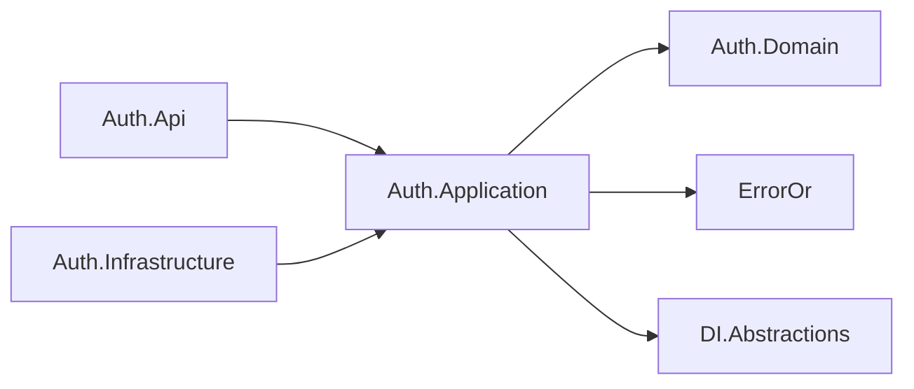
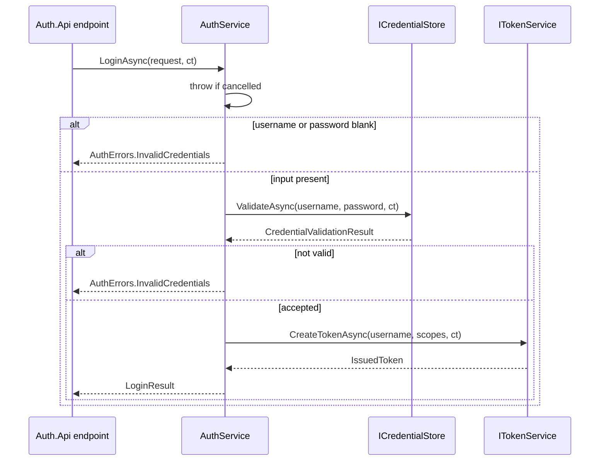

# Auth.Application

## Purpose

`Auth.Application` is the narrative layer of the Auth context: it says what happens during a login and during an introspection, in terms of ports it owns rather than of HTTP or JWT libraries. It holds one application service (`AuthService` behind `IAuthService`), the technical port it needs to mint and verify tokens (`ITokenService`), the records that cross its boundary (`LoginRequest`, `LoginResult`, `IssuedToken`, `ValidateResult`), the context's error catalog (`AuthErrors`), the scope vocabulary the platform's policies consume (`AuthorizationScopes`), and its own DI registration (`AddAuthApplication`). It knows nothing about `HttpContext`, bearer headers, status codes or signing keys.

## Position in the architecture



From `Auth.Application.csproj`:

```xml
<ItemGroup>
  <PackageReference Include="ErrorOr" />
  <PackageReference Include="Microsoft.Extensions.DependencyInjection.Abstractions" />
</ItemGroup>
<ItemGroup>
  <ProjectReference Include="..\Auth.Domain\Auth.Domain.csproj" />
</ItemGroup>
```

Two packages, one project reference. `ErrorOr` is the ratified result type for expected failures; `Microsoft.Extensions.DependencyInjection.Abstractions` is the *abstractions* package only — enough for `AddAuthApplication` to extend `IServiceCollection`, not enough to build a container here. There is no reference to `Auth.Infrastructure`, so nothing in this project can name `JwtTokenService`.

## Why this layer exists

Quotes' Application layer earns its place by composing domain behavior: each use case loads aggregates, invokes their rules, and maps outcomes. Auth's has a narrower but still real job — it is the only place where the *sequence* of a login is written down. Ask nobody if the input is blank; otherwise ask the credential store; if the store accepts, mint a token carrying exactly the scopes the store granted. That sequence is transport-independent (it would be identical behind gRPC), storage-independent (the store is a port), and crypto-independent (the token service is a port), which is precisely why it is worth having its own project rather than living inside an endpoint handler.

The second job is vocabulary. `AuthErrors` fixes the failure codes clients depend on, and `AuthorizationScopes` fixes the permission strings tokens carry. Both are contract-shaped constants: they are consumed outside this project (by ProblemDetails responses and by the resource API's authorization policies) and cannot be renamed without a breaking change. Putting them in Application rather than Domain follows from the same reasoning as the port split — they describe what the *system* offers, not invariants over state the context holds.

What deliberately does not live here: bearer parsing, rate limiting, correlation ids, metric counters and log statements. Those are host concerns, applied around this service by decorators wired at the composition root ([cross-cutting telemetry](../../../docs/architecture.md#cross-cutting-telemetry)), which is why `AuthService` contains no logger and no `HttpContext`.

## DDD concepts introduced here

| Concept | Why it matters | In this project | Relates to |
|---------|----------------|-----------------|------------|
| **Application service** | Orchestrates ports into a use-case sequence without owning rules; the layer's public verb list. | `IAuthService` / `AuthService` with `LoginAsync` and `ValidateAsync` | Quotes' per-use-case classes (`CreateQuoteUseCase`, …) — the same role, split differently |
| **Technical port** | A dependency on a machine capability rather than on state; declared in Application, implemented in Infrastructure. | `ITokenService` | Port placement rule vs `ICredentialStore` in [`Auth.Domain`](../Auth.Domain/README.md) |
| **Boundary records** | Give the layer input and output types of its own, so transport DTOs never leak inward and the service stays unit-testable. | `LoginRequest`, `LoginResult`, `IssuedToken`, `ValidateResult` | `Auth.Api/Contracts/*Dto` map to and from these |
| **Errors as values** | Expected failures are returned, not thrown, so every caller sees the same shape and the edge maps it once. | `ErrorOr<LoginResult>`, `AuthErrors.InvalidCredentials` | [error flow](../../../docs/architecture.md#error-flow); `Quotes.Domain.QuoteErrors` |
| **Result that is not an error** | Modelling "no" as data keeps introspection honest: an invalid token is an answer, not a failure of the call. | `ValidateResult(bool Valid, string? Username)` returned bare, without `ErrorOr` | RFC 7662 introspection; `docs/api.md` endpoint list |
| **Published vocabulary** | Constants consumed by another component that cannot reference this one, pinned by a drift test instead of by convention. | `AuthorizationScopes.ClaimType`, `QuotesRead`, `QuotesWrite` | `ServiceDefaults.JwtAuthExtensions` policies |

**The application service, and why blank input is its business.** `AuthService.LoginAsync` rejects a blank username or password with `AuthErrors.InvalidCredentials` *before* the credential store is consulted. This is not duplicated transport validation: the API's `LoginRequestDto` carries `[Required]` and `[MaxLength]`, but those guard the HTTP surface only, and `IAuthService` is a public entry point that a background job or a future gRPC facade could call directly. The rule belongs here for two more reasons. First, it keeps the port's contract clean — the store is never asked to have an opinion about the empty string, so adapters need no defensive code and no test matrix for whitespace. Second, it is a cheap denial-of-service guard for a store that may hash, hit a network or take a lock. The failure is deliberately the *same* error a wrong password produces: an unauthenticated caller must not be able to tell "you sent nothing" apart from "you sent the wrong thing".

**Introspection returns data, not `ErrorOr`.** `ValidateAsync` is pure delegation to `ITokenService.ValidateTokenAsync` and returns a bare `ValidateResult`. That asymmetry with `LoginAsync` is a modelling decision, not an oversight. In RFC 7662-style introspection the question is "what is the status of this token", and "expired", "tampered" or "signed by someone else" are all valid answers to that question — the call succeeded. Wrapping them in an error would force every caller to unwrap a failure that is not one, and would push the endpoint toward returning 4xx for a token that was simply old. Because the answer is data, the endpoint returns `200 { valid, username }` in both directions, and the only actual error on that route is a request that carried no token at all. The consequence inside this layer is visible in the decorators: `AuthServiceLogging.ValidateAsync` cannot use `Switch`/`Match` and uses a guard clause instead, which [`docs/architecture.md`](../../../docs/architecture.md#error-flow) calls out as the sanctioned exception to the combinator rule.

**`AuthErrors` is public API.** The codes travel to clients as the ProblemDetails `errorCode` extension, so `auth.invalid_credentials` is as much a contract as the URL path. The `ErrorType` chosen for each one is what picks the status code at the edge: `Error.Unauthorized` produces 401 for bad credentials. The transport-level `auth.token_missing` code is *not* in this catalog: it is raised at the endpoint before the service is involved (there is no token for the service to check), and its single declaration lives in ServiceDefaults' `JwtAuthExtensions.TokenMissingErrorCode`, shared by the resource API's 401 challenge and the validate endpoint's 400 — one registry, two producers, no drift pin needed.

**`AuthorizationScopes` and the coupling it makes visible.** The constants are exactly:

```csharp
public const string ClaimType = "scope";
public const string QuotesRead = "quotes:read";
public const string QuotesWrite = "quotes:write";
```

This is an auth context naming permissions that a *different* context enforces. Quotes never sees this project — `Bounded_contexts_never_reference_each_other` forbids it — and the policies that require these strings are declared by the API that enforces them — Quotes declares `QuoteScopes.ReadPolicy` / `WritePolicy` next to its own `ScopeClaimType` spelling — while the platform kit stays context-free: `AddStandardJwtAuthentication` takes the policy/scope pairs as parameters (`ServiceDefaults_is_a_platform_kit_not_a_context`), so it cannot reference any service's application layer. So there are two independent spellings of the same vocabulary, on purpose, and the only thing holding them together is a drift test that asserts constant-for-constant equality and then checks that a token issued by the real host actually carries the scopes the policies demand. Naming that coupling is more useful than hiding it: a scope rename is a two-file change plus a red test if you get it half-right, and the day scopes become a shared contract in their own right, the test is where the pressure will show up first.

**Lifetime.** `AddAuthApplication()` registers `IAuthService` as a **Singleton**. The seed's rule is scoped by default, singleton only for adapters and services proven stateless ([shape rule 4](../../../docs/architecture.md#bounded-context-shape-rules)); `AuthService` holds two readonly collaborators and no per-request state, and both of those collaborators are themselves singletons registered by `AddAuthInfrastructure`, so the whole graph is safe to share. The decorator chain registered by `AddAuthServiceTelemetry` in the API host preserves that lifetime — and, because the last registration of a service type wins, its `IAuthService` registration is the one that resolves.

## File inventory

| File | Type | Role | Key constants / signatures |
|------|------|------|----------------------------|
| `AuthService.cs` | `public sealed class` | The application service. Primary constructor takes `ICredentialStore credentials, ITokenService tokens`. | `Task<ErrorOr<LoginResult>> LoginAsync(LoginRequest, CancellationToken)`; `Task<ValidateResult> ValidateAsync(string accessToken, CancellationToken)` |
| `Abstractions/IAuthService.cs` | `public interface` | The layer's verb list; the type the API host and the decorators depend on. | Same two members; the `ValidateAsync` doc comment states the RFC 7662 stance |
| `Abstractions/ITokenService.cs` | `public interface` | Technical port for minting and verifying tokens. | `Task<IssuedToken> CreateTokenAsync(string username, IReadOnlyList<string> scopes, CancellationToken)`; `Task<ValidateResult> ValidateTokenAsync(string accessToken, CancellationToken)` |
| `Abstractions/LoginRequest.cs` | `public sealed record` | Inbound boundary type for a login. | `LoginRequest(string Username, string Password)` |
| `Abstractions/LoginResult.cs` | `public sealed record` | Outbound boundary type for a successful login. | `LoginResult(string AccessToken, string Username, int ExpiresIn)` |
| `Abstractions/IssuedToken.cs` | `public sealed record` | What the token port hands back: the token plus its configured lifetime. | `IssuedToken(string AccessToken, int ExpiresInSeconds)` |
| `Abstractions/ValidateResult.cs` | `public sealed record` | Introspection answer; deliberately not an `ErrorOr`. | `ValidateResult(bool Valid, string? Username)` |
| `Abstractions/AuthErrors.cs` | `public static class` | The context's error catalog; codes are public contract. | `InvalidCredentials` → `Error.Unauthorized("auth.invalid_credentials", "Invalid credentials.")` |
| `Abstractions/AuthorizationScopes.cs` | `public static class` | The scope vocabulary minted into tokens. | `ClaimType = "scope"`, `QuotesRead = "quotes:read"`, `QuotesWrite = "quotes:write"` |
| `DependencyInjection.cs` | `public static class` | The layer registers itself; the host composes. | `IServiceCollection AddAuthApplication(this IServiceCollection)` → `AddSingleton<IAuthService, AuthService>()` |

## Walkthrough



1. **Cancellation first.** `LoginAsync` opens with `cancellationToken.ThrowIfCancellationRequested()`. An abandoned request must not consume a credential check or a signature.
2. **Blank input short-circuits.** `string.IsNullOrWhiteSpace` on either field returns `AuthErrors.InvalidCredentials` immediately. The credential store is never called — pinned by a theory covering `""`, `"   "` and both fields blank.
3. **Ask the store.** `credentials.ValidateAsync(request.Username, request.Password, cancellationToken)` returns a `CredentialValidationResult`. The service does no hashing, no comparison and no timing defence of its own; that is the adapter's job.
4. **A rejection is the same error as blank input.** `!decision.IsValid` returns `AuthErrors.InvalidCredentials`, and the token service is not touched — also pinned by test.
5. **Mint with exactly the granted scopes.** `tokens.CreateTokenAsync(request.Username, decision.Scopes, cancellationToken)` receives the store's list unmodified. This is the seam that makes least-privilege real: `reader` gets one scope in its token because the store granted one.
6. **Return a boundary record.** `new LoginResult(issued.AccessToken, request.Username, issued.ExpiresInSeconds)` — the token, the echo of the username, and the lifetime the token service reported. The endpoint adds the correlation id; this layer does not know about it.
7. **Introspection is one line.** `ValidateAsync` forwards straight to `tokens.ValidateTokenAsync`, returning whatever the adapter decided. No `ErrorOr`, no branching, no logging.

## Rules enforced mechanically

| Rule | Test | Fact |
|------|------|------|
| This project depends on its own Domain and nothing else — not Infrastructure, not the Api host, not the Quotes context. | [`tests/Architecture.Tests/LayeringTests.cs`](../../../tests/Architecture.Tests/LayeringTests.cs) | `Application_layers_depend_only_on_their_own_domain` |
| The Auth context never references Quotes (and vice versa), which is what forces the scope vocabulary to be duplicated and pinned rather than shared. | [`tests/Architecture.Tests/LayeringTests.cs`](../../../tests/Architecture.Tests/LayeringTests.cs) | `Bounded_contexts_never_reference_each_other` |
| Blank credentials never reach the credential store. | [`tests/Auth/Auth.Application.Tests/AuthServiceTests.cs`](../../../tests/Auth/Auth.Application.Tests/AuthServiceTests.cs) | `LoginAsync_rejects_blank_input_without_touching_the_credential_store` |
| A store rejection yields `auth.invalid_credentials` with `ErrorType.Unauthorized` and no token is minted. | [`tests/Auth/Auth.Application.Tests/AuthServiceTests.cs`](../../../tests/Auth/Auth.Application.Tests/AuthServiceTests.cs) | `LoginAsync_returns_invalid_credentials_when_the_store_rejects` |
| The scopes the store granted are the scopes handed to the token service. | [`tests/Auth/Auth.Application.Tests/AuthServiceTests.cs`](../../../tests/Auth/Auth.Application.Tests/AuthServiceTests.cs) | `LoginAsync_forwards_the_scopes_the_store_granted_to_the_token_service` |
| Introspection delegates and propagates a negative answer as data. | [`tests/Auth/Auth.Application.Tests/AuthServiceTests.cs`](../../../tests/Auth/Auth.Application.Tests/AuthServiceTests.cs) | `ValidateAsync_delegates_to_the_token_service`, `ValidateAsync_propagates_a_negative_result` |
| `AuthorizationScopes` and `JwtAuthExtensions`' policies/claim type/missing-token code do not drift, and a real issued token satisfies the policies. | [`tests/Auth/Auth.Api.Tests/AuthApiFullPipelineTests.cs`](../../../tests/Auth/Auth.Api.Tests/AuthApiFullPipelineTests.cs) | `Issued_scope_claims_match_the_policies_the_resource_api_registers` |
| The registered `IAuthService` is a singleton decorator chain and the bare `AuthService` stays resolvable for its inner leg. | [`tests/Auth/Auth.Api.Tests/AuthServiceTelemetryDecoratorTests.cs`](../../../tests/Auth/Auth.Api.Tests/AuthServiceTelemetryDecoratorTests.cs) | `AddAuthServiceTelemetry_resolves_a_singleton_decorator_chain` |

## See also

- [Auth bounded context README](../README.md)
- [Auth.Domain README — port placement](../Auth.Domain/README.md#ddd-concepts-introduced-here)
- [Auth.Infrastructure README](../Auth.Infrastructure/README.md) — the adapters behind both ports
- [Auth.Api README](../Auth.Api/README.md) — the decorators and the edge mapping
- [docs/architecture.md — error flow](../../../docs/architecture.md#error-flow)
- [docs/architecture.md — authentication](../../../docs/architecture.md#authentication)
- [docs/architecture.md — bounded context shape rules](../../../docs/architecture.md#bounded-context-shape-rules)
- [docs/api.md — error contract](../../../docs/api.md#error-contract)
- [Root README — conventions in place](../../../README.md#conventions-in-place)
