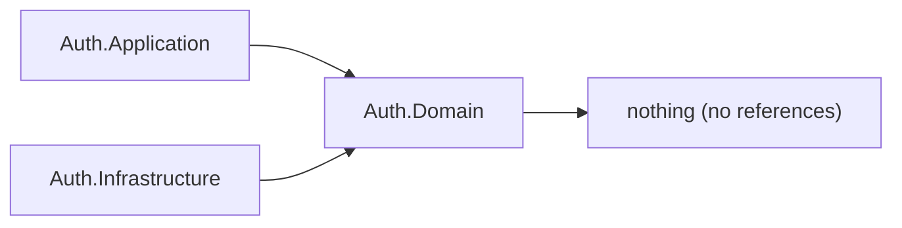
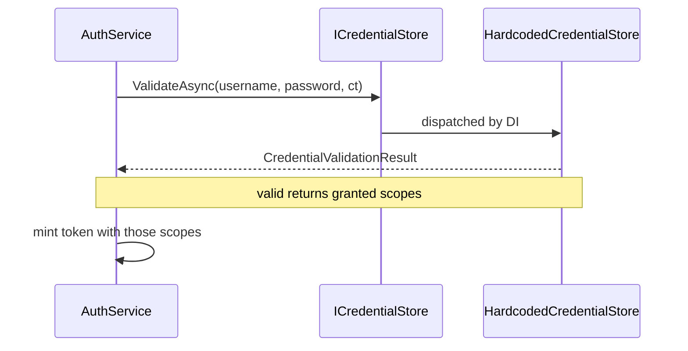

# Auth.Domain

## Purpose

`Auth.Domain` declares what the Auth context needs to know about credentials, and nothing else. It contains two files: the `ICredentialStore` port that asks whether a username and password are accepted, and the `CredentialValidationResult` record that carries the answer together with the scopes granted to the principal. It references no project and no package, so it compiles against the base class library alone and can be read in under a minute. Everything else the context does — minting tokens, mapping errors, naming scopes, throttling callers — belongs to layers above it.

## Position in the architecture



`Auth.Domain.csproj` in full:

```xml
<Project Sdk="Microsoft.NET.Sdk" />
```

There is no `<ProjectReference>` and no `<PackageReference>` to quote — the file is a single self-closing element. `Quotes.Domain.csproj` takes one package (`ErrorOr`) because it publishes an error catalog; Auth's domain publishes none, so it takes zero.

## Why this layer exists

A Domain project is the place where statements that must hold regardless of the caller are written down once. Auth has no such statement today. Login is "ask a store, mint a token": there is no account state to keep consistent, no password whose age or complexity is the context's business, no token whose rotation this context governs. A `Quote` must be at least twelve characters, contain three words, end in terminal punctuation, and carry an author different from its text — those rules must hold whether the quote arrives through the v0 controller, the v1 minimal API, or a seeding routine, so `Quotes.Domain` owns them. A login attempt has no equivalent: reject blanks, ask the store, believe the store.

So this project holds only what the context genuinely owns: the *shape of the question* it asks about credentials, and the *shape of the answer*. Both are expressed as types no adapter can widen. That is a real job — it is why `AuthService` can be unit-tested against a substituted store with no JWT library in sight — but it is a smaller job than a domain with invariants, and the project is honest about its size rather than padded to match Quotes.

The project still exists on day one, empty of rules, for a reason [`docs/architecture.md`](../../../docs/architecture.md#bounded-context-shape-rules) states as a shape rule: when the first real invariant appears, its home must already be obvious, otherwise it lands in Application (where a use case will quietly own it) or in Infrastructure (where an adapter will). Candidates that would move in here as the context grows:

- **Password policy** — minimum length, disallowed values, expiry. A rule about a credential, independent of where credentials are stored.
- **Lockout counters** — "five failures within a window locks the account" is a statement about state consistency across attempts; the counter and the threshold belong to an entity, not to an adapter.
- **Credential lifetime** — issued-at, must-change-at, disabled-at.
- **A `User` aggregate with an account state machine** — pending → active → locked → disabled, with the legal transitions enforced by the root rather than by whoever calls it.
- **Refresh-token rotation rules** — one-time use, family invalidation on replay. Those are invariants over token state and would make this layer the consistency boundary it currently is not.

Add them here, not to Application. Application composes; Domain constrains.

## DDD concepts introduced here

| Concept | Why it matters | In this project | Relates to |
|---------|----------------|-----------------|------------|
| **Port (persistence-style)** | Lets the context state its dependency on externally held state as an interface it owns, so the direction of the dependency points inward. | `ICredentialStore` | `Quotes.Domain.Abstractions.IQuoteRepository`; implemented by `Auth.Infrastructure.HardcodedCredentialStore` |
| **Port placement rule** | Deciding *which* layer declares a port keeps the split reproducible instead of per-author. Persistence-style ports go in Domain; technical ports go in Application. | `ICredentialStore` here vs `ITokenService` in `Auth.Application.Abstractions` | [shape rule 2](../../../docs/architecture.md#bounded-context-shape-rules) |
| **Decision record** | The answer to a domain question is modelled as a value with both the verdict and its consequences, so no caller re-derives authorization from a username. | `CredentialValidationResult(bool IsValid, IReadOnlyList<string> Scopes)` with the shared `Invalid` instance | `Quotes.Domain.Abstractions.QuotePage`, `QuoteAddOutcome` — the same "adapters answer in domain vocabulary" idea |
| **Absence of an aggregate** | A layer with no invariants should hold no entity. Naming the absence prevents a decorative `User` class from being added for symmetry. | No entity, no value object, no aggregate root, no error catalog | Root README's [domain terms](../../../README.md#domain-terms), all of which are exercised by `Quotes.Domain` instead |

**Port placement, concretely.** `ICredentialStore` asks about state the context does not hold: some store somewhere knows whether this credential is good. That is the same category of question `IQuoteRepository` asks, so it is declared in the same place — `*.Domain.Abstractions` — and for the same reason: the domain must be able to describe its world without knowing whether the answer comes from memory, a database, or an LDAP directory. `ITokenService`, by contrast, asks a machine to sign bytes. Nothing about the Auth context's state changes when the signing algorithm changes, so the port lives one layer up in `Auth.Application.Abstractions`, where the use-case narrative that needs it lives. The two ports sitting in different projects while both being implemented in `Auth.Infrastructure` is the clearest live demonstration of the rule in this repository.

**Scope strings here, scope vocabulary above.** `CredentialValidationResult.Scopes` is an `IReadOnlyList<string>`; the constants that give those strings meaning (`AuthorizationScopes.QuotesRead`, `QuotesWrite`) live in `Auth.Application`. Domain therefore transports authorization decisions without knowing the vocabulary, which is what lets it stay free of the naming that another bounded context actually enforces — Quotes' scope policies are declared in `ServiceDefaults`, not here. The practical consequence: a scope string can be added to the platform without touching this project, and this project cannot be the place a typo in a scope name is caught. That check lives where the vocabulary lives (see [Auth.Application](../Auth.Application/README.md)).

**Why the decision carries scopes.** An earlier shape would return a bare boolean and let the caller decide what a username is allowed to do. Returning `(IsValid, Scopes)` moves that decision to the only component that knows it — the store — and makes least-privilege reachable end to end: `reader` receives one scope, `jrb` receives two, and the difference survives all the way into the token's claims.

## File inventory

| File | Type | Role | Key constants / signatures |
|------|------|------|----------------------------|
| `Abstractions/ICredentialStore.cs` | `public interface` | The persistence-style port for credential checks. Asynchronous by contract so hashing or a remote store never blocks callers. | `Task<CredentialValidationResult> ValidateAsync(string username, string password, CancellationToken cancellationToken)` |
| `Abstractions/CredentialValidationResult.cs` | `public sealed record` | The store's answer: verdict plus granted scopes. | `CredentialValidationResult(bool IsValid, IReadOnlyList<string> Scopes)`; `static CredentialValidationResult Invalid { get; } = new(false, [])` |
| `Auth.Domain.csproj` | project file | Zero packages, zero project references. | `<Project Sdk="Microsoft.NET.Sdk" />` |

## Walkthrough

The representative flow is the only one this layer participates in: the credential question asked during login.



1. `AuthService` (Application) holds a constructor-injected `ICredentialStore`. It knows the interface declared here and nothing about the implementation.
2. It calls `ValidateAsync` with the raw username and password and the request's cancellation token. Blank input never reaches this point — Application short-circuits first, so the store is only asked well-formed questions.
3. The registered adapter answers. In this seed that is `HardcodedCredentialStore`, registered as a singleton by `AddAuthInfrastructure`; the port makes it the only file to replace when a real store arrives.
4. A rejection is the shared `CredentialValidationResult.Invalid` instance — `IsValid = false` with an empty scope list. A single cached instance is safe because the record is immutable.
5. An acceptance carries the scopes the store decided this principal holds. `AuthService` passes exactly that list to `ITokenService.CreateTokenAsync`; it never edits, filters or supplements it, so the store's decision is what ends up in the token's `scope` claims.

## Rules enforced mechanically

| Rule | Test | Fact |
|------|------|------|
| This project references no other project (not Application, Infrastructure, Api, the other context, or ServiceDefaults). | [`tests/Architecture.Tests/LayeringTests.cs`](../../../tests/Architecture.Tests/LayeringTests.cs) | `Domain_layers_depend_on_no_project` |
| Nothing in the Auth context reaches into Quotes, and nothing in Quotes reaches in here. | [`tests/Architecture.Tests/LayeringTests.cs`](../../../tests/Architecture.Tests/LayeringTests.cs) | `Bounded_contexts_never_reference_each_other` |
| The Api host never binds to Domain types; it composes through Application and Infrastructure. | [`tests/Architecture.Tests/LayeringTests.cs`](../../../tests/Architecture.Tests/LayeringTests.cs) | `Api_hosts_compose_through_application_and_infrastructure_never_domain` |

There is no `Auth.Domain.Tests` project, and that is consistent with the contents: an interface and an immutable record with no behavior have nothing to assert in isolation. The two types are exercised through [`tests/Auth/Auth.Application.Tests/AuthServiceTests.cs`](../../../tests/Auth/Auth.Application.Tests/AuthServiceTests.cs) (which substitutes the port) and [`tests/Auth/Auth.Infrastructure.Tests/HardcodedCredentialStoreTests.cs`](../../../tests/Auth/Auth.Infrastructure.Tests/HardcodedCredentialStoreTests.cs) (which asserts the decisions a real adapter returns). When invariants move in here, a domain test project comes with them — `tests/Quotes/Quotes.Domain.Tests` is the pattern to copy.

## See also

- [Auth bounded context README](../README.md) — and the [thin-Domain discussion](../README.md#why-this-context-is-shaped-differently-from-quotes)
- [Auth.Application README](../Auth.Application/README.md) — where `ITokenService` and the scope vocabulary live
- [docs/architecture.md — bounded context shape rules](../../../docs/architecture.md#bounded-context-shape-rules)
- [Root README — layering table](../../../README.md#layering-dependency-rule) and [domain terms](../../../README.md#domain-terms)
- [`Quotes.Domain`](../../Quotes/Quotes.Domain) — the same layer in a context that does own invariants
