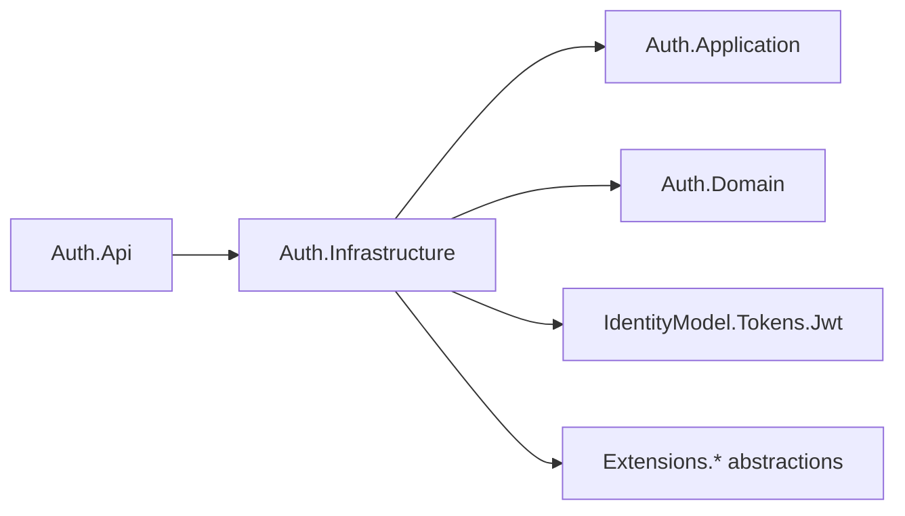
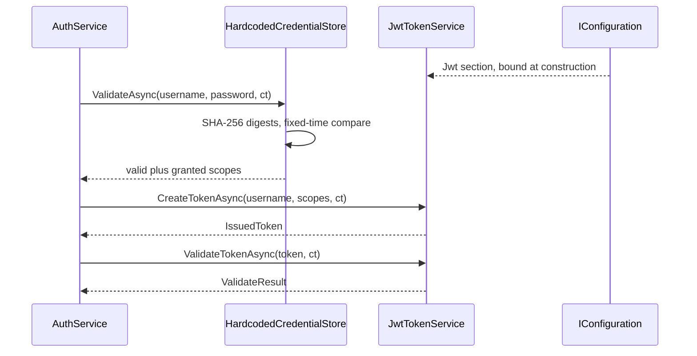

# Auth.Infrastructure

## Purpose

`Auth.Infrastructure` holds the two adapters that make the Auth context runnable: `HardcodedCredentialStore`, which answers the Domain's credential question from a fixed in-process table, and `JwtTokenService`, which mints and verifies HS256 JSON Web Tokens for the Application's token port. It also owns `AddAuthInfrastructure`, which registers both — and refuses to register anything at all in Production, because the credential store is local scaffolding rather than an identity model. This is the only project in the context that names a cryptography or configuration API.

## Position in the architecture



From `Auth.Infrastructure.csproj`:

```xml
<ItemGroup>
  <PackageReference Include="Microsoft.Extensions.Configuration.Abstractions" />
  <PackageReference Include="Microsoft.Extensions.DependencyInjection.Abstractions" />
  <PackageReference Include="Microsoft.Extensions.Hosting.Abstractions" />
  <PackageReference Include="Microsoft.Extensions.Logging.Abstractions" />
  <PackageReference Include="System.IdentityModel.Tokens.Jwt" />
</ItemGroup>
<ItemGroup>
  <ProjectReference Include="..\Auth.Application\Auth.Application.csproj" />
  <ProjectReference Include="..\Auth.Domain\Auth.Domain.csproj" />
</ItemGroup>
```

Every `Microsoft.Extensions.*` reference is the abstractions package: this project consumes `IConfiguration`, `ILogger<T>`, `IHostEnvironment` and `IServiceCollection` but hosts none of them. It references both layers below it because it implements one port from each — `ICredentialStore` from Domain, `ITokenService` from Application — and it does not reference `Auth.Api`, so an adapter can never reach back into transport.

## Why this layer exists

The two ports above describe *what* the context needs; this project decides *how*, and it is the only place where that decision can change without the rest of the context noticing. Both adapters here are replaceable in isolation: swapping `HardcodedCredentialStore` for a database or directory adapter is a one-line change in `AddAuthInfrastructure` and touches nothing in Application or Domain, and the same is true for replacing HS256 tokens with an asymmetric scheme or an external identity provider.

The layer also absorbs the parts of the problem that must not leak upward. Configuration keys and their defaults, the signing key, the clock skew, the claim names, the exception thrown by a malformed token — all of it terminates here and is converted into the vocabulary the ports declare (`CredentialValidationResult`, `IssuedToken`, `ValidateResult`). `AuthService` therefore has no `try`/`catch` and no knowledge that JWTs exist.

Finally, this is where the seed states an operational refusal in code rather than in a comment: the scaffolding store is not permitted to boot in Production.

## DDD concepts introduced here

| Concept | Why it matters | In this project | Relates to |
|---------|----------------|-----------------|------------|
| **Adapter** | Implements a port declared by an inner layer, so the direction of dependency stays inward and the implementation is swappable. | `HardcodedCredentialStore` implements `ICredentialStore`; `JwtTokenService` implements `ITokenService` | [`Auth.Domain`](../Auth.Domain/README.md), [`Auth.Application`](../Auth.Application/README.md); `Quotes.Infrastructure.InMemoryQuoteRepository` |
| **Answering in domain vocabulary** | An adapter returns the inner layer's types, never its own; the boundary is the translation point. | Both adapters return `CredentialValidationResult` / `IssuedToken` / `ValidateResult`, never a `ClaimsPrincipal` or a raw exception | Repository pattern; `QuotePage` in Quotes |
| **Local scaffolding** | Named as such so nobody mistakes a runnable default for a design. | `HardcodedCredentialStore`'s two fixed users | Root README's [intention](../../../README.md#intention); `Quotes.Infrastructure`'s in-memory catalog |
| **Startup-time refusal** | A misconfiguration that cannot be safe is a boot failure, not a warning to be filtered out of a log. | `AddAuthInfrastructure` throws when `IHostEnvironment.IsProduction()` | `JwtAuthExtensions`' rejection of the public development signing key |
| **Mirrored constant** | Two components that cannot reference each other agree on a literal, and a test — not a comment — keeps them agreeing. | `_issuer = "auth-api"`, `_audience = "aspire-quotes-poc"` mirroring `JwtAuthExtensions.DefaultIssuer` / `DefaultAudience` | The scope drift pin in [`Auth.Application`](../Auth.Application/README.md) |

**`HardcodedCredentialStore` is scaffolding, and it is written carefully anyway.** The store holds two users — `jrb`/`supersecret` granted `[QuotesRead, QuotesWrite]`, and `reader`/`readsecret` granted `[QuotesRead]` — so a least-privilege token and a 403 are reachable from the first run without hand-minting anything. It reads no file and opens no connection, which is what lets the seed boot offline. It is not a production identity model: passwords are compile-time literals in the assembly (the Sonar `S2068` hard-coded-credentials rule is suppressed with that justification in the source), there is no registration, no lockout, no password change, no per-user state of any kind. Replacing this single class is the whole job of moving off hard-coded credentials, which is exactly what the port was for.

Within those limits the comparison is done properly. Both the submitted and the expected values are reduced to SHA-256 digests and compared with `CryptographicOperations.FixedTimeEquals`, so the comparison time does not depend on how many leading characters matched. Hashing first also makes every comparison operate on 32 bytes, which is why a wrong-length password reveals nothing. The loop over the user table has **no early exit**: username and password are both evaluated for every entry and the first full match wins, so response time does not disclose how far down the table a username matched — or whether it matched at all. The test theory covers case variants (`JRB`, `SuperSecret`) and a mismatched pairing (`reader`/`supersecret`) to pin that the check is ordinal and that scopes are never granted across users.

**`JwtTokenService` binds configuration once, in the constructor.** Everything comes from the `Jwt` section:

| Key | Behavior |
|-----|----------|
| `Jwt:SigningKey` | Required. Absent ⇒ `InvalidOperationException("Jwt:SigningKey is required")` at construction, so a host without a key fails to start rather than issuing unverifiable tokens. |
| `Jwt:Issuer` | Defaults to `auth-api`. |
| `Jwt:Audience` | Defaults to `aspire-quotes-poc`. |
| `Jwt:ExpiresInSeconds` | Defaults to `3600`; a non-numeric value falls back to the same default rather than throwing. |

The issuer and audience defaults are not arbitrary — they are the literals `JwtAuthExtensions.DefaultIssuer` and `DefaultAudience` use when the resource API configures its bearer validation. This project cannot reference `ServiceDefaults` (the platform kit is not allowed to be a dependency of a context adapter, and the architecture tests keep it that way), so the pair is held together by `Fallback_issuer_and_audience_match_the_platform_defaults`, which mints a token with the fallbacks and verifies it with a service configured from the platform constants. Without that pin, a rename in one file would produce tokens Quotes rejects with a 401 that says nothing about why. The Auth.Infrastructure test project references `ServiceDefaults` for this single purpose, and its csproj says so in a comment.

Minting uses `SecurityAlgorithms.HmacSha256` over a `SymmetricSecurityKey` built from the UTF-8 bytes of the signing key. The claim set is `ClaimTypes.Name` and `JwtRegisteredClaimNames.Sub` (both the username), plus one claim of type `AuthorizationScopes.ClaimType` (`scope`) per **distinct** scope — `scopes.Distinct()` keeps a duplicated grant from producing a duplicated claim. Expiry is `DateTime.UtcNow.AddSeconds(_expiresInSeconds)`, and the same number is reported back in `IssuedToken.ExpiresInSeconds` so the client's countdown matches the token's.

Validation checks issuer, audience, signing key and lifetime, with `ClockSkew = TimeSpan.FromMinutes(1)` — one minute instead of the library's five-minute default, tight enough to keep expired tokens from lingering but wide enough for ordinary clock drift between hosts. It matches the skew `JwtAuthExtensions` configures for the resource API, so a token near expiry is treated the same by both sides. Failure is not propagated as an exception: the handler's throw is caught, logged at warning level, and converted to `new ValidateResult(false, null)` — which is what makes "invalid is data" true all the way down to the crypto boundary. A token that validates but resolves to no username is also reported invalid.

**`AddAuthInfrastructure(IHostEnvironment)` throws in Production.** The first statement checks `environment.IsProduction()` and, if true, throws `InvalidOperationException` telling the operator to register a real `ICredentialStore` adapter. Nothing is registered, so the host cannot start. The alternative — registering the store and logging a warning — fails open: the service would come up, accept `jrb`/`supersecret` from anyone who has read this repository, and mint tokens the Quotes API honours, with the only trace being a log line someone might filter out. A boot failure is loud, immediate, and impossible to ignore in a deployment pipeline. It is the same stance `JwtAuthExtensions` takes on the public development signing key, and the reason `AddAuthInfrastructure` takes an `IHostEnvironment` parameter at all.

Both adapters are registered as **Singleton**. The seed permits that only where statelessness is proven, and it is here: the credential store's table is `static readonly` and its method holds no state between calls, and the token service caches only immutable configuration plus a static `JwtSecurityTokenHandler`. Those lifetimes are what allow the application service above to be a singleton too.

## File inventory

| File | Type | Role | Key constants / signatures |
|------|------|------|----------------------------|
| `HardcodedCredentialStore.cs` | `public sealed class : ICredentialStore` | Fixed two-user credential table with constant-time comparison. | `_users`: `("jrb", "supersecret", [QuotesRead, QuotesWrite])`, `("reader", "readsecret", [QuotesRead])`; `Task<CredentialValidationResult> ValidateAsync(string, string, CancellationToken)`; `SHA256.HashData` + `CryptographicOperations.FixedTimeEquals`; `[SuppressMessage("Security", "S2068:…")]` |
| `JwtTokenService.cs` | `public sealed class : ITokenService` | HS256 mint and verify; owns all `Jwt:*` configuration. | ctor `(IConfiguration, ILogger<JwtTokenService>)`; `Jwt:SigningKey` required, `Jwt:Issuer` → `"auth-api"`, `Jwt:Audience` → `"aspire-quotes-poc"`, `Jwt:ExpiresInSeconds` → `3600`; `SecurityAlgorithms.HmacSha256`; `ClockSkew = TimeSpan.FromMinutes(1)`; static `JwtSecurityTokenHandler _handler` |
| `DependencyInjection.cs` | `public static class` | Registers the adapters only; refuses Production. | `IServiceCollection AddAuthInfrastructure(this IServiceCollection, IHostEnvironment)`; `AddSingleton<ICredentialStore, HardcodedCredentialStore>()`; `AddSingleton<ITokenService, JwtTokenService>()` |

## Walkthrough

The representative flow is a login reaching both adapters, followed by an introspection of the token it produced.



1. **Construction.** The container builds `JwtTokenService` once. The constructor reads `Jwt:SigningKey` and throws if it is absent; issuer, audience and lifetime fall back to their defaults. A bad configuration therefore fails at the first resolution, not at the first login.
2. **Credential check.** `HardcodedCredentialStore.ValidateAsync` honours cancellation, then hashes the submitted username and password (null coalesced to the empty string) to SHA-256 digests.
3. **Fixed-time scan.** For every entry in `_users` it hashes the expected values and compares both digests with `FixedTimeEquals`. There is no `break` and no ordering shortcut; the loop always runs to completion unless a full match returns.
4. **Decision.** A full match returns `new CredentialValidationResult(true, scopes)` with that user's scope array; otherwise the shared `CredentialValidationResult.Invalid`.
5. **Mint.** `JwtTokenService.CreateTokenAsync` builds the claim list (`ClaimTypes.Name`, `sub`, one `scope` per distinct value), constructs a `JwtSecurityToken` with the configured issuer, audience, expiry and HS256 credentials, and returns the serialized token together with `ExpiresInSeconds`.
6. **Verify.** `ValidateTokenAsync` returns `ValidateResult(false, null)` immediately for a blank token, otherwise calls `_handler.ValidateToken` with issuer, audience, signing key and lifetime validation and the one-minute skew.
7. **Resolve the principal.** From the returned `ClaimsPrincipal` it takes `Identity.Name`, then `ClaimTypes.Name`, then `sub`. A blank result counts as invalid.
8. **Failure is data.** Any exception from validation — malformed token, wrong signature, foreign issuer or audience, expiry — is caught, logged as `"JWT validation failed"` at warning level, and returned as `ValidateResult(false, null)`.

## Rules enforced mechanically

| Rule | Test | Fact |
|------|------|------|
| This project may depend on Domain and Application only — never on the Api host or the Quotes context. | [`tests/Architecture.Tests/LayeringTests.cs`](../../../tests/Architecture.Tests/LayeringTests.cs) | `Infrastructure_layers_depend_on_domain_and_application_only` |
| Both adapters resolve from a container configured only with a signing key and logging. | [`tests/Auth/Auth.Infrastructure.Tests/DependencyInjectionTests.cs`](../../../tests/Auth/Auth.Infrastructure.Tests/DependencyInjectionTests.cs) | `AddAuthInfrastructure_resolves_the_infrastructure_adapters` |
| Registration throws in Production instead of wiring the scaffolding store. | [`tests/Auth/Auth.Infrastructure.Tests/DependencyInjectionTests.cs`](../../../tests/Auth/Auth.Infrastructure.Tests/DependencyInjectionTests.cs) | `AddAuthInfrastructure_refuses_to_register_the_scaffolding_store_in_production` |
| Each seeded user gets exactly its scopes, and everything else — including case variants and crossed pairs — is rejected with no scopes. | [`tests/Auth/Auth.Infrastructure.Tests/HardcodedCredentialStoreTests.cs`](../../../tests/Auth/Auth.Infrastructure.Tests/HardcodedCredentialStoreTests.cs) | `ValidateAsync_grants_the_maintainer_both_scopes`, `ValidateAsync_grants_the_reader_the_read_scope_only`, `ValidateAsync_rejects_anything_else` |
| A missing signing key fails at construction. | [`tests/Auth/Auth.Infrastructure.Tests/JwtTokenServiceTests.cs`](../../../tests/Auth/Auth.Infrastructure.Tests/JwtTokenServiceTests.cs) | `Constructor_throws_when_the_signing_key_is_absent` |
| The configured lifetime is reported back, and a non-numeric value falls back to an hour. | [`tests/Auth/Auth.Infrastructure.Tests/JwtTokenServiceTests.cs`](../../../tests/Auth/Auth.Infrastructure.Tests/JwtTokenServiceTests.cs) | `CreateTokenAsync_reports_the_configured_lifetime`, `CreateTokenAsync_falls_back_to_an_hour_when_the_lifetime_is_not_a_number` |
| A fresh token round-trips and carries exactly the requested scopes. | [`tests/Auth/Auth.Infrastructure.Tests/JwtTokenServiceTests.cs`](../../../tests/Auth/Auth.Infrastructure.Tests/JwtTokenServiceTests.cs) | `A_freshly_issued_token_validates_and_carries_the_username`, `A_freshly_issued_token_carries_exactly_the_requested_scopes` |
| The fallback issuer and audience match the platform defaults in `JwtAuthExtensions`. | [`tests/Auth/Auth.Infrastructure.Tests/JwtTokenServiceTests.cs`](../../../tests/Auth/Auth.Infrastructure.Tests/JwtTokenServiceTests.cs) | `Fallback_issuer_and_audience_match_the_platform_defaults` |
| Malformed, foreign-signed, foreign-issuer, foreign-audience, tampered and expired tokens all answer invalid rather than throwing. | [`tests/Auth/Auth.Infrastructure.Tests/JwtTokenServiceTests.cs`](../../../tests/Auth/Auth.Infrastructure.Tests/JwtTokenServiceTests.cs) | `ValidateTokenAsync_rejects_malformed_input`, `…rejects_a_token_signed_with_a_different_key`, `…rejects_a_token_from_another_issuer`, `…rejects_a_token_for_another_audience`, `…rejects_a_token_whose_payload_was_tampered_with`, `…rejects_an_expired_token` |

## See also

- [Auth bounded context README](../README.md)
- [Auth.Domain README](../Auth.Domain/README.md) — the port this project's credential store implements
- [Auth.Application README](../Auth.Application/README.md) — the token port and the scope vocabulary
- [Auth.Api README](../Auth.Api/README.md) — where `AddAuthInfrastructure` is called
- [docs/architecture.md — authentication](../../../docs/architecture.md#authentication)
- [docs/architecture.md — bounded context shape rules](../../../docs/architecture.md#bounded-context-shape-rules)
- [Root README — credentials and secrets](../../../README.md#credentials-and-secrets)
