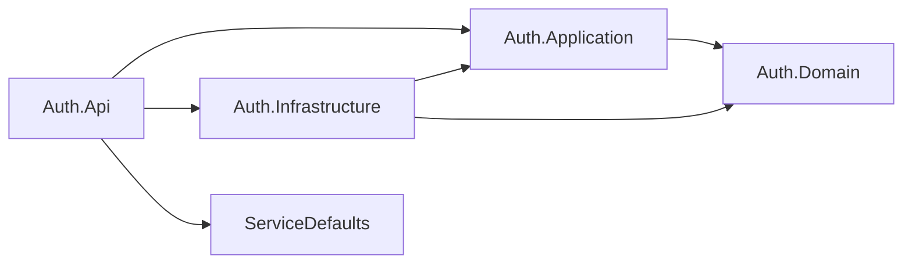

# Auth bounded context

## Purpose

Auth issues and introspects the JWT access tokens the rest of the platform authorizes against. It owns exactly two operations — exchange a credential for a token (`POST /api/v1/auth/login`) and answer whether a token is still valid and for whom (`POST /api/v1/auth/validate`) — and it owns the scope vocabulary those tokens carry. It never authorizes a request itself: Quotes validates bearer tokens locally with the platform's JwtBearer wiring, so Auth is on the login path and off the read path. The context is laid out in the same four projects as Quotes (Domain / Application / Infrastructure / Api), but the weight sits in different places, which is the point of reading it next to Quotes.

## Ubiquitous language

| Term | Meaning in this context | Where it lives |
|------|-------------------------|----------------|
| **Credential** | The username and password pair submitted at login. Never logged, never echoed. | `LoginRequest` (Application), `LoginRequestDto` (Api) |
| **Credential store** | The port asked whether a credential is accepted, and with which scopes. | [`ICredentialStore`](Auth.Domain/Abstractions/ICredentialStore.cs) (Domain) |
| **Decision** | The store's answer: a validity flag plus the scopes granted to the principal, so no caller infers authorization from the username. | [`CredentialValidationResult`](Auth.Domain/Abstractions/CredentialValidationResult.cs) (Domain) |
| **Scope** | A permission string minted as a `scope` claim — `quotes:read`, `quotes:write`. | [`AuthorizationScopes`](Auth.Application/Abstractions/AuthorizationScopes.cs) (Application) |
| **Access token** | The signed JWT handed back by login, carrying name, `sub` and one `scope` claim per granted scope. | `IssuedToken` (Application), [`JwtTokenService`](Auth.Infrastructure/JwtTokenService.cs) (Infrastructure) |
| **Introspection** | Answering "is this token valid, and for whom" — RFC 7662 style, where "invalid" is a successful answer. | `IAuthService.ValidateAsync`, `ValidateResult` (Application) |
| **Principal** | The username a valid token resolves to; the only identity fact this context returns. | `ValidateResult.Username` (Application) |
| **Auth error** | A named, coded failure value (`auth.invalid_credentials`, `auth.token_missing`) mapped once at the edge to ProblemDetails. | [`AuthErrors`](Auth.Application/Abstractions/AuthErrors.cs) (Application) |

## The four projects

| Project | README | What it holds today |
|---------|--------|---------------------|
| `Auth.Domain` | [Auth.Domain/README.md](Auth.Domain/README.md) | Two files: the credential-store port and its decision record. No entity, no aggregate, no error catalog. |
| `Auth.Application` | [Auth.Application/README.md](Auth.Application/README.md) | `IAuthService` / `AuthService`, the `ITokenService` technical port, the boundary records, `AuthErrors`, `AuthorizationScopes`, `AddAuthApplication()`. |
| `Auth.Infrastructure` | [Auth.Infrastructure/README.md](Auth.Infrastructure/README.md) | `HardcodedCredentialStore` (local scaffolding, constant-time comparison) and `JwtTokenService` (HS256 mint/validate), plus the Production refusal in `AddAuthInfrastructure`. |
| `Auth.Api` | [Auth.Api/README.md](Auth.Api/README.md) | Composition root, the `/api/v1/auth` group, transport DTOs, the fixed-window rate limiter, and the telemetry/logging decorator chain. |

Endpoint contracts, status codes and problem shapes are documented once in [docs/api.md](../../docs/api.md#endpoints); this set of READMEs explains the code behind them.

## Why this context is shaped differently from Quotes

Quotes and Auth answer every *structural* question identically — four projects, the same dependency direction, the same composition root, the same error and telemetry conventions ([bounded context shape rules](../../docs/architecture.md#bounded-context-shape-rules)). What differs is where the substance sits, and that difference is not accidental.

`Quotes.Domain` holds an entity, three value objects (text, author, fingerprint), an error catalog and a repository port, because a quote has rules that must hold no matter who calls: minimum length, word count, terminal punctuation, an author distinct from the text, a fingerprint that makes near-duplicates detectable. Those are invariants — statements about state that stay true across every code path — so they live in one place that no transport, adapter or use case can bypass.

`Auth.Domain` holds two files and references nothing, because authentication here is currently "ask a store, mint a token". There is no state whose consistency this context must protect: no account that can be locked, no password with a policy or an age, no refresh token that can be rotated or revoked. Inventing a `User` entity to fill the folder would produce a type with no rules to enforce and no behavior worth testing — a container that makes the layering look symmetric and teaches the wrong lesson. The honest shape is the thin one, and the Domain project exists from day one so that the moment a real invariant appears it has an obvious home ([shape rule 1](../../docs/architecture.md#bounded-context-shape-rules)).

The port split follows the same logic rather than a habit. `ICredentialStore` sits in `Auth.Domain.Abstractions` alongside `Quotes.Domain.Abstractions.IQuoteRepository`, because both are persistence-style ports — questions about externally held state the context depends on. `ITokenService` sits in `Auth.Application.Abstractions` because signing a JWT is a machine concern, not a statement about the context's state. Two ports, two layers, one rule ([shape rule 2](../../docs/architecture.md#bounded-context-shape-rules)).

The Application layers diverge for the same reason. Quotes has four use cases, each a class with its own decorator chain, because each one composes domain behavior. Auth has a single application service with two methods and one branch worth naming (blank input never reaches the store), because there is no domain behavior to compose. Where Quotes registers scoped use cases, Auth registers one singleton service whose collaborators are both proven stateless ([shape rule 4](../../docs/architecture.md#bounded-context-shape-rules)).

## See also

- [Root README — layering table and domain glossary](../../README.md#layering-dependency-rule)
- [docs/architecture.md — bounded context shape rules](../../docs/architecture.md#bounded-context-shape-rules)
- [docs/architecture.md — authentication](../../docs/architecture.md#authentication)
- [docs/architecture.md — error flow](../../docs/architecture.md#error-flow)
- [docs/architecture.md — cross-cutting telemetry](../../docs/architecture.md#cross-cutting-telemetry)
- [docs/api.md — endpoints and error contract](../../docs/api.md#error-contract)
- [docs/testing.md — what is covered](../../docs/testing.md#what-is-covered)
- [docs/observability.md — metrics](../../docs/observability.md#metrics)
