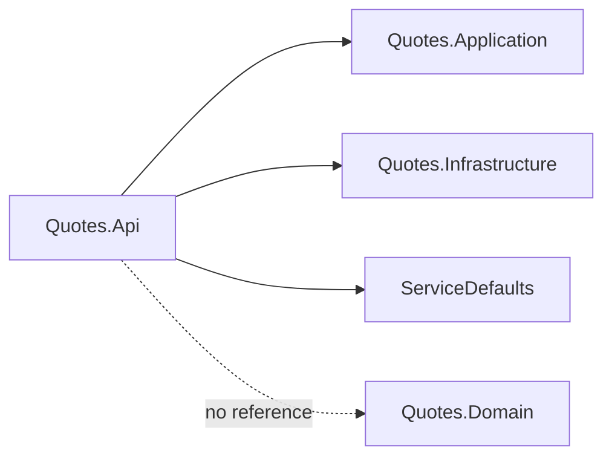
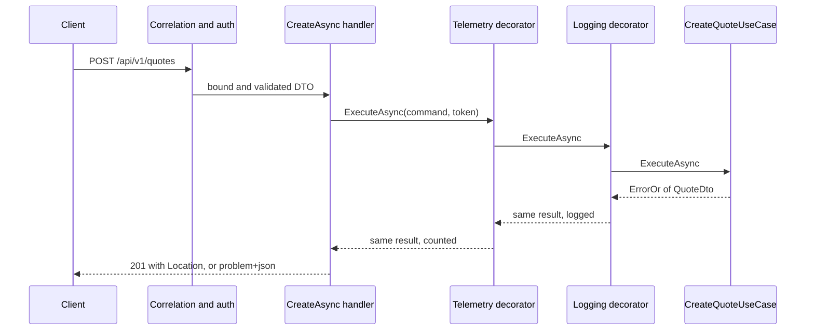

# Quotes.Api

## Purpose

`Quotes.Api` is the host and the composition root of the Quotes context. It wires the platform
defaults from `ServiceDefaults`, registers the application and infrastructure layers, wraps every use
case in the telemetry/logging decorator chain, and exposes the same four operations twice: as MVC
controllers under `/api/v0/quotes` and as minimal APIs under `/api/v1/quotes`. Everything in this
project is transport, wiring or documentation — request DTOs and their Data Annotations, hand-written
mappers, route and policy metadata, OpenAPI narrative, decorators. It holds no rule about quotes and,
by the layering, cannot even name a domain type.

## Position in the architecture



Proof, from `Quotes.Api.csproj`:

```xml
  <ItemGroup>
    <InternalsVisibleTo Include="Quotes.Api.Tests" />
  </ItemGroup>
  <ItemGroup>
    <!-- The API host is the composition root: it references Application (contracts) and
         Infrastructure (adapters), never the Domain directly. -->
    <ProjectReference Include="..\..\ServiceDefaults\AspireQuotesPoc.ServiceDefaults.csproj" />
    <ProjectReference Include="..\Quotes.Application\Quotes.Application.csproj" />
    <ProjectReference Include="..\Quotes.Infrastructure\Quotes.Infrastructure.csproj" />
  </ItemGroup>
```

There is no `<PackageReference>` element in the file. Serilog, the OpenAPI generator, Scalar,
JwtBearer and the OpenTelemetry exporters all arrive transitively through `ServiceDefaults`, which is
the point of the platform kit: a new host gets the whole cross-cutting stack from one project
reference and cannot pick a different Serilog or a different Scalar by accident. `Quotes.Domain`
reaches this project transitively (through both Application and Infrastructure) but is never named in
code — [`LayeringTests`](../../../tests/Architecture.Tests/LayeringTests.cs) fails the build if a type
here so much as mentions it.

## Why this layer exists

The composition root is the only place that is allowed to know everything. It knows that
`IQuoteRepository` is served by an in-memory list, that `ICreateQuoteUseCase` is really three objects
stacked, that a bearer token is how identity arrives, and that the catalog is published twice under
two route prefixes. Every other project stays ignorant of at least one of those facts, and that
ignorance is what makes them substitutable.

Concentrating the wiring here also means the wiring is *testable as wiring*. `QuoteApiFactory` boots
this exact `Program` — same middleware order, same registrations, same decorators — so the
full-pipeline suite asserts on the composed system rather than on a hand-built approximation.
`The_real_composition_root_resolves_the_create_chain` is a test about this file existing in the shape
it does.

Push any of this outward and something breaks. Register the decorators inside
`AddQuotesApplication` and the application layer starts depending on `ILogger` and the metrics
package, which is how a use case ends up unable to run without a host. Move the route metadata into
the use cases and the two versions can no longer differ. Move DTO validation into the domain and the
domain grows attributes about JSON binding. The value of a fat composition root is that everything
below it can be thin.

## DDD concepts introduced here

| Concept | Why it matters | In this project | Relates to |
|---|---|---|---|
| Composition root | One place chooses the implementations; nothing else calls `new` on a dependency | `Program.cs` — `AddQuotesApplication`, `AddQuotesInfrastructure`, `AddQuotesUseCaseTelemetry` | [Conventions in place](../../../README.md#conventions-in-place) |
| Published language | The version's DTOs and error codes are the contract other teams compile against | `V0/Contracts`, `V1/Contracts`, `errorCode` from `QuoteErrors` | [docs/api.md](../../../docs/api.md#error-contract) |
| Contract ownership per version | A version that shares types with another cannot change alone | duplicated `QuoteResponseDto` / `QuotePageResponseDto` / `CreateQuoteRequestDto` per folder | [API versions](../../../docs/architecture.md#api-versions-and-transport-styles) |
| Translation at the boundary | Transport shapes are converted to and from application types in one greppable place | `V0/Mapping`, `V1/Mapping` — `ToCommand`, `ToResponse` | `QuoteDto`, `CreateQuoteCommand` |
| Cross-cutting via decorators | Observability is composed around the use case, not scattered inside handlers | `Telemetry/` — 8 decorators, wired by `AddQuotesUseCaseTelemetry` | [Cross-cutting telemetry](../../../docs/architecture.md#cross-cutting-telemetry) |
| Anti-corruption inward | The host never constructs a domain object; it hands raw strings to a command | `ToCommand(this CreateQuoteRequestDto)` | [`Quote.Create`](../Quotes.Domain/README.md) |

### Transport validation is shallow on purpose

Both `CreateQuoteRequestDto` types carry `[Required]` and `[MaxLength(QuoteRules.MaxTextLength)]` /
`[MaxLength(QuoteRules.MaxAuthorLength)]`, and `builder.Services.AddValidation()` makes the framework
run them during binding. Those guards are about payload shape — reject a megabyte of text before it
reaches a use case — and their numbers are *forwarded from* `QuoteRules`, never typed as literals, so
the schema in the OpenAPI document and the domain constant cannot drift apart.

What they deliberately do not do is duplicate the catalog rules. Word count, terminal punctuation, the
allowed author characters and the author-equals-text rule are absent from the DTOs; they live in the
domain and surface as `400` with a `quote.*` code. Two guards, two vocabularies: a transport failure is
keyed by property name, a domain failure by error code (see
[the error contract](../../../docs/api.md#error-contract)).

## The composition root, step by step

`Program.cs` in order:

1. **Bootstrap logger before anything else.** `Log.Logger = new LoggerConfiguration().WriteTo.Console()
   .CreateBootstrapLogger()` exists so a failure *during* host construction is still logged. The real
   Serilog configuration arrives with `AddServiceDefaults`.
2. **`builder.AddServiceDefaults()`** — the platform kit: Serilog defaults, OpenTelemetry metrics and
   tracing (including the `AspireQuotesPoc` meter the decorators write to), the `self` health check,
   and service discovery on the global `HttpClient` defaults.
3. **`builder.AddStandardApiServices(QuotesController.DocumentName, QuoteEndpoints.DocumentName)`** —
   registers ProblemDetails and declares the document names Scalar will offer in its version picker.
   The arguments are the `internal const string DocumentName` fields on the two entry points
   (`"v0"` and `"v1"`), so the picker is fed from the same constants the endpoints group themselves
   with. This call deliberately does *not* call `AddOpenApi`.
4. **`AddSingleton(new OpenApiDocumentInfo(...))`** — the host's narrative from `OpenApiDocs`: the info
   description Scalar renders above the reference, and the per-tag descriptions. ServiceDefaults'
   `DocumentInfoTransformer` applies it to every document.
5. **The two literal `AddOpenApi` calls.**
   ```csharp
   builder.Services.AddOpenApi("v0", options => options.ConfigureStandardOpenApi("v0"));
   builder.Services.AddOpenApi("v1", options => options.ConfigureStandardOpenApi("v1"));
   ```
   The document names must be **string literals**. .NET 10's XML-comment source generator works by
   intercepting `AddOpenApi` call sites, and it can only recognize one whose name is a literal. Replace
   the pair with a `foreach` over the document names, or hoist `"v0"` into a `const`, and the calls
   still compile, the documents are still served, every wire test still passes — and every `<summary>`,
   `<remarks>`, `<param>` and `<response>` silently vanishes from both documents. That failure mode is
   why `OpenApiDocumentationTests` exists.
6. **`builder.AddStandardJwtAuthentication()`** — JwtBearer plus the two scope policies
   (`quotes:read`, `quotes:write`), and the Production guard on the development signing key.
7. **`AddQuotesApplication()`** then **`AddQuotesInfrastructure()`** — each layer contributes its own
   registrations; the host composes them rather than knowing their internals.
8. **`AddQuotesUseCaseTelemetry()` — after `AddQuotesApplication()`, and the order is load-bearing.**
   The last registration of a service type wins in `IServiceCollection`, so these factory registrations
   are what `IGetRandomQuoteUseCase` and friends resolve to; the plain registrations from step 7 remain
   as the fallback if the telemetry call is ever removed. Swap the two lines and the decorators are
   registered first, `AddQuotesApplication` overwrites them with the bare use cases, and the service
   keeps working while every `quotes.*` counter flatlines.
9. **`AddValidation()`** — the framework validation for the annotated request DTOs.
10. **`AddStandardControllers()`** — `AddControllers()`, plus a `PostConfigure` that rebuilds
    `[ApiController]`'s automatic 400 through the seed's problem envelope. `PostConfigure`, not
    `Configure`, because MVC's own `ApiBehaviorOptionsSetup` would overwrite it. Without this the two
    versions answer a malformed body differently and `VersionParityTests` fails.
11. **Pipeline** — `UseExceptionHandler()`, `UseSerilogDefaults()`, `UseCorrelationId()`,
    `UseStandardAuthentication()`, `MapDefaultEndpoints()` (`/health`, `/alive`),
    `MapStandardApiDocumentation()` (`/openapi/{documentName}.json` and Scalar over both documents).
    Correlation is installed before authentication so a rejected request still carries the id it will
    be reported under.
12. **Both transports mapped** — `QuoteEndpoints.Map(app)` then `app.MapControllers()`. Same container,
    same decorated use cases; only the routing style differs.
13. **`catch` / `finally`** — a fatal exception is logged and rethrown (the `S2139` suppression documents
    that the log-and-rethrow is intentional), and `Log.CloseAndFlushAsync()` runs in `finally` so the
    fatal entry is actually written.
14. **`public partial class Program;`** — the marker that lets `WebApplicationFactory<Program>` boot this
    exact host in tests.

## The two versions

Both versions resolve the same four interfaces from the same container and therefore run the same
decorators, the same use cases, the same repository. Everything below the handler is shared verbatim;
the policy behind having two of them is in
[docs/architecture.md](../../../docs/architecture.md#api-versions-and-transport-styles) and is not
repeated here. What follows is the code.

### V0 — MVC controllers

One class, [`V0/Controllers/QuotesController.cs`](V0/Controllers/QuotesController.cs), with
`[ApiController]`, `[Route("api/v0/quotes")]`, `[Authorize]` and
`[ApiExplorerSettings(GroupName = DocumentName)]` — the group name is what routes its operations into
`/openapi/v0.json`. The four use-case interfaces arrive through the primary constructor. Class-level
`[ProducesResponseType<ProblemDetails>]` declares 401 and 403 once for every action, with
`application/problem+json` spelled out (`_problemContentType`) so the document does not advertise
plain JSON and drift from v1; success payloads declare `application/json` per response
(`_jsonContentType`) rather than through a class-level `[Produces]`, which would leak into the problem
responses.

| Verb | Route | Route name | Policy | Status codes | Types |
|---|---|---|---|---|---|
| GET | `/api/v0/quotes/random` | — | `quotes:read` | 200, 401, 403, 404 | → `QuoteResponseDto` |
| GET | `/api/v0/quotes` | `ListQuotesV0` | `quotes:read` | 200, 400, 401, 403 | `page`, `pageSize` query → `QuotePageResponseDto` |
| GET | `/api/v0/quotes/{id}` | `GetQuoteByIdV0` | `quotes:read` | 200, 401, 403, 404 | → `QuoteResponseDto` |
| POST | `/api/v0/quotes` | — | `quotes:write` | 201, 400, 401, 403, 409 | `CreateQuoteRequestDto` → `QuoteResponseDto` |

Actions return `ActionResult<T>` and branch with `result.Match(...)`: `Ok(value.ToResponse())` on the
value side, `errors.ToActionResult(HttpContext)` on the error side. `ToActionResult` builds the payload
from the same `ProblemDetailsFactory` as v1's `ToProblem` and writes it through the same
`IProblemDetailsService`, which is what makes byte-level parity achievable at all.

The route names are suffixed `V0` for a specific reason. `CreateAsync` answers with
`CreatedAtRoute(GetByIdRouteName, new { id = value.Id }, ...)`; if that constant named v1's
`GetQuoteById` route, a create issued against `/api/v0/quotes` would hand back a `Location` header
pointing into `/api/v1/quotes` and quietly move the client to the other version.
`A_create_succeeds_on_both_versions_and_points_at_its_own_version` pins it.

### V1 — minimal APIs

One static class, [`V1/Endpoints/QuoteEndpoints.cs`](V1/Endpoints/QuoteEndpoints.cs), whose `Map`
builds a group:

```csharp
var quotes = endpoints.MapGroup("/api/v1/quotes")
    .RequireAuthorization()
    .WithGroupName(DocumentName)
    .WithTags("Quotes v1")
    .ProducesProblem(StatusCodes.Status401Unauthorized)
```

`WithGroupName("v1")` is the minimal-API counterpart of `[ApiExplorerSettings]`; `WithTags` is the
Scalar grouping label described in `OpenApiDocs.TagDescriptions`. Group-level metadata carries the 401
for every endpoint under it.

| Verb | Route | Route name | Policy | Status codes | Types |
|---|---|---|---|---|---|
| GET | `/api/v1/quotes/random` | `GetRandomQuote` | `quotes:read` | 200, 401, 403, 404 | → `QuoteResponseDto` |
| GET | `/api/v1/quotes` | `ListQuotes` | `quotes:read` | 200, 400, 401, 403 | `page`, `pageSize` query → `QuotePageResponseDto` |
| GET | `/api/v1/quotes/{id}` | `GetQuoteById` | `quotes:read` | 200, 401, 403, 404 | → `QuoteResponseDto` |
| POST | `/api/v1/quotes` | `CreateQuote` | `quotes:write` | 201, 400, 401, 403, 409 | `CreateQuoteRequestDto` → `QuoteResponseDto` |

Handlers are `internal static` methods returning `IResult`, taking their use case and `HttpContext` as
parameters (minimal-API DI) and branching with `result.Match(onValue: …, onError: errors =>
errors.ToProblem(http))`. Create answers `Results.CreatedAtRoute(GetByIdRouteName, …)` — same pattern
as v0, with this version's own route name.

### The DTOs are duplicated, deliberately

`V0/Contracts` and `V1/Contracts` hold three types each with identical members today, and the v0
`CreateQuoteRequestDto` carries the `<remarks>` that says why:

> Deliberately a separate type from its v1 twin. Versions own their contracts so one can change
> without dragging the other along; sharing the DTO would couple the two versions permanently.

A shared DTO makes every field addition a simultaneous change to both published contracts, which is
the one thing versioning exists to avoid. The duplication costs three small files and a mapper per
version; the coupling would cost the ability to evolve either version independently. The mappers are
hand-written for the same reason — the v0 mapper's summary notes it is "greppable" and compiler-checked
against contract drift, which a reflection-based mapper is not.

Textual parity between the two is a separate concern from structural independence: everything a client
reads — summaries, remarks, parameter descriptions, response descriptions, schema descriptions — must
match today, and `OpenApiParityTests` fails on drift.

## Telemetry

`Telemetry/` holds eight decorators, two per use case, plus the extension that wires them. The chain
is **Telemetry → Logging → concrete use case**: metrics outermost, so the counter observes the outcome
after the logging leg has run and cannot be skipped by an early return inside it.

| Use case | Telemetry decorator | Counter | Outcome tag values |
|---|---|---|---|
| `IGetRandomQuoteUseCase` | `GetRandomQuoteUseCaseTelemetry` | `quotes.random.count` | `success`, `not_found`, `error` |
| `IGetQuoteByIdUseCase` | `GetQuoteByIdUseCaseTelemetry` | `quotes.getbyid.count` | `success`, `not_found`, `error` |
| `IListQuotesUseCase` | `ListQuotesUseCaseTelemetry` | `quotes.list.count` | `success`, `invalid`, `error` |
| `ICreateQuoteUseCase` | `CreateQuoteUseCaseTelemetry` | `quotes.create.count` | `success`, `invalid`, `conflict`, `error` |

Each decorator records exactly one increment per execution: `"success"` on the value side, otherwise
`UseCaseTelemetry.Outcome(error.Type)`, which maps `ErrorType.Validation → "invalid"`,
`Conflict → "conflict"`, `NotFound → "not_found"` and anything else to `"error"`. The tag vocabulary is
metric contract, listed in [docs/observability.md](../../../docs/observability.md#metrics).

The logging leg logs an entry line, then a success or a rejection line built from `SwitchFirst`. The
create logger is the one to copy from:

```csharp
// Author is user input: log its length, never the value itself.
logger.LogInformation("Creating quote attributed to an author of length {AuthorLength}", command.Author.Length);
```

The author is arbitrary user input and never reaches the logs; its length does, which is enough to
debug a rejected create without putting an unvetted string into the log pipeline. Rejections log
`error.Code` — the public error code — rather than the message, so log queries key off the same
vocabulary as clients.

`AddQuotesUseCaseTelemetry` registers the concrete use case as itself (`AddScoped<CreateQuoteUseCase>()`)
and the interface as a factory that news up the two wrappers around it. Everything stays **Scoped**, the
seed's default for use cases and their chains.

## File inventory

| File | Type | Role | Key constants / signatures |
|---|---|---|---|
| [`Program.cs`](Program.cs) | top-level program | Composition root and pipeline; `try`/`catch`/`finally` around the host | `AddStandardApiServices(QuotesController.DocumentName, QuoteEndpoints.DocumentName)`; two literal `AddOpenApi` calls; `public partial class Program;` |
| [`OpenApiDocs.cs`](OpenApiDocs.cs) | `internal static class` | Document narrative and tag descriptions | `const string Description`; `IReadOnlyDictionary<string, string> TagDescriptions` for `"Quotes v0"` and `"Quotes v1"` |
| [`V0/Controllers/QuotesController.cs`](V0/Controllers/QuotesController.cs) | `sealed class : ControllerBase` | v0 transport | `DocumentName = "v0"`; `GetByIdRouteName = "GetQuoteByIdV0"`; `_problemContentType = "application/problem+json"`; `_jsonContentType = "application/json"`; four `ActionResult<T>` actions |
| [`V0/Contracts/*.cs`](V0/Contracts) | 3 `sealed class` | v0 request and response shapes | `CreateQuoteRequestDto` (`[Required]`, `[MaxLength(QuoteRules.*)]`), `QuoteResponseDto`, `QuotePageResponseDto` (all `required init`) |
| [`V0/Mapping/QuoteMappingExtensions.cs`](V0/Mapping/QuoteMappingExtensions.cs) | `static class` | v0 translation, hand-written | `ToCommand(this CreateQuoteRequestDto)`, `ToResponse(this QuoteDto)`, `ToResponse(this QuotePageDto)` |
| [`V1/Endpoints/QuoteEndpoints.cs`](V1/Endpoints/QuoteEndpoints.cs) | `static class` | v1 transport | `DocumentName = "v1"`; `GetByIdRouteName = "GetQuoteById"`; `Map(IEndpointRouteBuilder)`; four `internal static Task<IResult>` handlers |
| [`V1/Contracts/*.cs`](V1/Contracts) | 3 `sealed class` | v1 request and response shapes | same members as v0, separate types |
| [`V1/Mapping/QuoteMappingExtensions.cs`](V1/Mapping/QuoteMappingExtensions.cs) | `static class` | v1 translation | `ToCommand`, two `ToResponse` overloads |
| [`Telemetry/UseCaseTelemetryExtensions.cs`](Telemetry/UseCaseTelemetryExtensions.cs) | `static class` | Builds the chains | `AddQuotesUseCaseTelemetry(this IServiceCollection)` — four concrete + four factory `AddScoped` |
| [`Telemetry/GetRandomQuoteUseCaseTelemetry.cs`](Telemetry/GetRandomQuoteUseCaseTelemetry.cs) | `internal sealed class` | Metrics leg | `AppMetrics.QuotesRandomCount` |
| [`Telemetry/GetQuoteByIdUseCaseTelemetry.cs`](Telemetry/GetQuoteByIdUseCaseTelemetry.cs) | `internal sealed class` | Metrics leg | `AppMetrics.QuotesGetByIdCount` |
| [`Telemetry/ListQuotesUseCaseTelemetry.cs`](Telemetry/ListQuotesUseCaseTelemetry.cs) | `internal sealed class` | Metrics leg | `AppMetrics.QuotesListCount` |
| [`Telemetry/CreateQuoteUseCaseTelemetry.cs`](Telemetry/CreateQuoteUseCaseTelemetry.cs) | `internal sealed class` | Metrics leg | `AppMetrics.QuotesCreateCount` |
| [`Telemetry/GetRandomQuoteUseCaseLogging.cs`](Telemetry/GetRandomQuoteUseCaseLogging.cs) | `internal sealed class` | Logging leg | "Fetching random quote" / "Returning quote {QuoteId}" / "Random quote rejected: {ErrorCode}" |
| [`Telemetry/GetQuoteByIdUseCaseLogging.cs`](Telemetry/GetQuoteByIdUseCaseLogging.cs) | `internal sealed class` | Logging leg | "Fetching quote {QuoteId}" / "Quote lookup rejected: {ErrorCode}" |
| [`Telemetry/ListQuotesUseCaseLogging.cs`](Telemetry/ListQuotesUseCaseLogging.cs) | `internal sealed class` | Logging leg | "Listing quotes page {Page} with page size {PageSize}" / "Returning {ItemCount} of {TotalItems} quotes" |
| [`Telemetry/CreateQuoteUseCaseLogging.cs`](Telemetry/CreateQuoteUseCaseLogging.cs) | `internal sealed class` | Logging leg; logs the author's length only | "Creating quote attributed to an author of length {AuthorLength}" / "Created quote {QuoteId}" |

## Walkthrough

The representative flow is `POST /api/v1/quotes` with a valid write-scoped token.



1. `UseCorrelationId` accepts or mints `X-Correlation-Id`, echoes it on the response, pushes it into
   the Serilog `LogContext` and tags the current `Activity`. Everything after this point is
   attributable to one id, including failures.
2. JwtBearer authenticates the token; the endpoint's `RequireAuthorization(WriteQuotesPolicy)` then
   requires a `scope` claim of `quotes:write`. A missing or invalid token answers 401, a valid token
   without the scope answers 403 — both as problem+json, both before any handler runs.
3. Model binding materializes `V1.Contracts.CreateQuoteRequestDto` and `AddValidation()` runs its Data
   Annotations. A missing or oversized field short-circuits here with a validation problem keyed by
   property name.
4. `CreateAsync` calls `body.ToCommand()` — raw strings into `CreateQuoteCommand`, no domain object
   built in this layer — and invokes `ICreateQuoteUseCase`.
5. What it invokes is `CreateQuoteUseCaseTelemetry`, which delegates to `CreateQuoteUseCaseLogging`,
   which logs the entry line (author length only) and delegates to the real `CreateQuoteUseCase`.
6. The use case calls `Quote.Create`, then `AddAsync`, and returns `ErrorOr<QuoteDto>`.
7. On the way out the logging leg records success (`Created quote {QuoteId}`) or the rejection's error
   code, and the telemetry leg increments `quotes.create.count` with the outcome tag.
8. `Match` maps the value to `Results.CreatedAtRoute("GetQuoteById", new { id }, value.ToResponse())` —
   201 with a `Location` inside v1 — or maps the errors through `ToProblem(http)`, which produces RFC
   9457 problem+json with `errorCode` and `correlationId`, and a status derived from the `ErrorType`
   (validation → 400, conflict → 409, not found → 404).

The v0 path differs in exactly two places: `ActionResult<T>` instead of `IResult`, and
`ToActionResult(HttpContext)` instead of `ToProblem(http)`. Steps 1, 2, 5, 6 and 7 are the same objects.

## Rules enforced mechanically

| Rule | Pinned by | Fact |
|---|---|---|
| The host never references the domain | [`tests/Architecture.Tests/LayeringTests.cs`](../../../tests/Architecture.Tests/LayeringTests.cs) | `Api_hosts_compose_through_application_and_infrastructure_never_domain` |
| The two versions answer identically on the wire, and each create points at its own version | [`VersionParityTests.cs`](../../../tests/Quotes/Quotes.Api.Tests/VersionParityTests.cs) | `A_read_endpoint_answers_identically_on_both_versions`, `A_missing_quote_produces_the_same_404_problem_on_both_versions`, `A_domain_validation_failure_produces_the_same_400_problem_on_both_versions`, `A_contract_validation_failure_produces_the_same_400_problem_on_both_versions`, `A_paging_validation_failure_produces_the_same_400_problem_on_both_versions`, `A_create_succeeds_on_both_versions_and_points_at_its_own_version`, `A_quote_created_on_one_version_is_readable_from_the_other`, `An_unauthenticated_read_is_rejected_the_same_way_on_both_versions`, `A_token_without_the_write_scope_is_rejected_the_same_way_on_both_versions` |
| The two published contracts match once transport labels are normalized | [`OpenApiParityTests.cs`](../../../tests/Quotes/Quotes.Api.Tests/OpenApiParityTests.cs) | `Both_versions_publish_the_same_contract` |
| XML documentation actually reaches both documents — the literal-`AddOpenApi` tripwire | [`OpenApiDocumentationTests.cs`](../../../tests/Quotes/Quotes.Api.Tests/OpenApiDocumentationTests.cs) | `Every_quote_operation_is_fully_documented`, `Pagination_parameters_carry_descriptions_and_examples`, `Request_bodies_carry_the_body_param_description`, `Schemas_carry_examples_and_errors_carry_samples` |
| No request DTO can be unannotated (which would bypass `AddValidation()` fail-open) | [`RequestDtoValidationGuardTests.cs`](../../../tests/Quotes/Quotes.Api.Tests/RequestDtoValidationGuardTests.cs) | `Every_request_dto_declares_at_least_one_validation_attribute` |
| The real composition root boots and behaves | [`QuoteApiFullPipelineTests.cs`](../../../tests/Quotes/Quotes.Api.Tests/QuoteApiFullPipelineTests.cs) | `The_real_composition_root_resolves_the_create_chain`, `Create_returns_201_and_the_location_header_resolves`, `Create_returns_a_409_problem_for_a_duplicate_fingerprint`, `List_without_query_parameters_uses_the_documented_defaults`, `List_second_page_continues_without_overlapping_the_first`, `Requests_without_a_token_get_a_401_problem_with_a_correlation_id`, `The_health_endpoint_answers_in_the_configured_environment` |
| The decorator chain counts what it should and changes nothing | [`UseCaseTelemetryDecoratorTests.cs`](../../../tests/Quotes/Quotes.Api.Tests/UseCaseTelemetryDecoratorTests.cs) | `AddQuotesUseCaseTelemetry_resolves_each_use_case_as_the_telemetry_decorator`, `Create_decorator_maps_error_types_onto_the_documented_outcomes`, `Logging_decorators_pass_the_result_through_untouched`, plus one per counter |
| Handler-level behaviour per transport | `QuoteEndpointsTests.cs`, `V0/QuotesControllerTests.cs` | `Map_registers_quote_routes_with_authorization`, `Create_returns_201_pointing_at_this_versions_route`, and the 200/400/404/409 cases |
| Scope enforcement end to end | `QuoteAuthIntegrationTests.cs` | `Missing_bearer_token_returns_401_problem_with_www_authenticate`, `Create_with_a_token_lacking_the_write_scope_returns_403`, `Create_with_a_scoped_token_returns_201` |

## See also

- [Quotes bounded context overview](../README.md)
- [`Quotes.Application`](../Quotes.Application/README.md) — the interfaces this host registers and decorates
- [`Quotes.Infrastructure`](../Quotes.Infrastructure/README.md) — the adapters `AddQuotesInfrastructure()` supplies
- [API versions and transport styles](../../../docs/architecture.md#api-versions-and-transport-styles) — the versioning policy and what adding a version costs
- [Documenting operations](../../../docs/api.md#documenting-operations) and [Endpoints](../../../docs/api.md#endpoints) — XML-comment conventions and the published contract
- [Cross-cutting telemetry](../../../docs/architecture.md#cross-cutting-telemetry) and [Metrics](../../../docs/observability.md#metrics) — the decorator policy and the tag values
- [Authentication](../../../docs/architecture.md#authentication) and [Error flow](../../../docs/architecture.md#error-flow)
