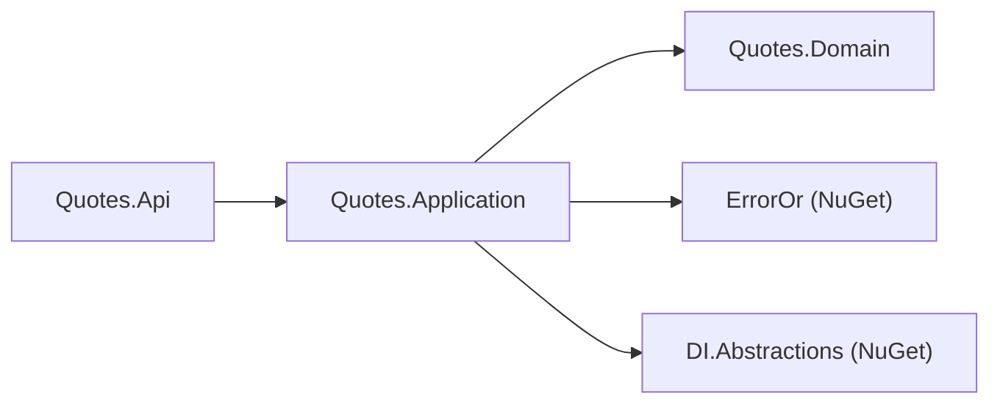
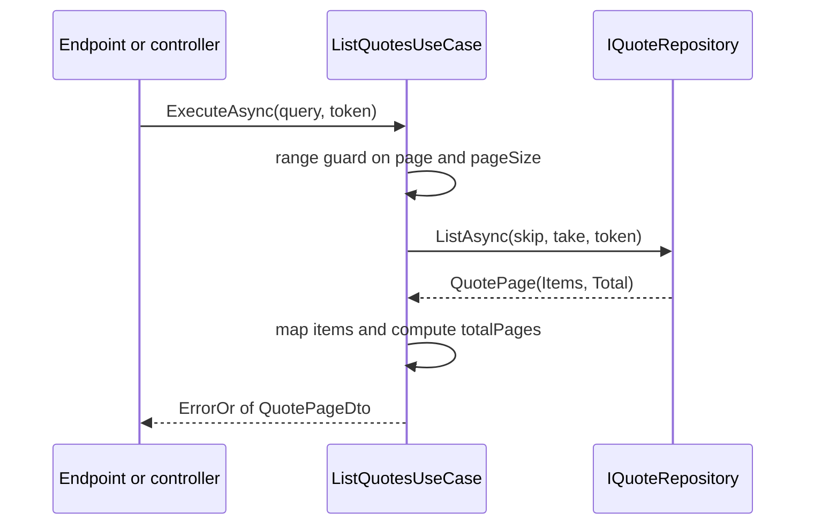

# Quotes.Application

## Purpose

`Quotes.Application` turns intents into outcomes. It holds the four use cases of the quote catalog —
create, get by id, get random, list — each behind its own interface, plus the command, query and DTO
types they speak in, the transport-guard constants in `QuoteRules`, the domain-to-DTO mapper, and the
`AddQuotesApplication()` registration. It orchestrates: call the domain factory, call the repository
port, translate the result. It contains no business rule of its own — every rejection it produces is
either a domain error it forwarded or a request-shape error about paging.

## Position in the architecture



Proof, from `Quotes.Application.csproj`:

```xml
  <ItemGroup>
    <PackageReference Include="ErrorOr" />
    <PackageReference Include="Microsoft.Extensions.DependencyInjection.Abstractions" />
  </ItemGroup>
  <ItemGroup>
    <ProjectReference Include="..\Quotes.Domain\Quotes.Domain.csproj" />
  </ItemGroup>
```

One project reference, to its own domain. `Microsoft.Extensions.DependencyInjection.Abstractions` is
the abstractions package only — enough to expose `AddQuotesApplication(this IServiceCollection)` so
the layer owns its own registrations, without pulling in a container implementation or the hosting
stack. `Quotes.Infrastructure` does **not** reference this project (see its README); the adapter
implements the domain's port, so it needs nothing from here.

## Why this layer exists

Two other places could plausibly hold this code, and both are worse.

Put it in the endpoint handlers and every rule is written once per transport. This repo makes the
cost visible: the same catalog is served by MVC controllers at `/api/v0/quotes` and minimal APIs at
`/api/v1/quotes`. With the orchestration in `CreateQuoteUseCase`, both transports are four lines that
map a DTO to a command and a result to a response, and [`VersionParityTests`](../../../tests/Quotes/Quotes.Api.Tests/VersionParityTests.cs)
can hold them to byte-level identical answers. With the orchestration in the handlers, "byte-level
parity" would mean maintaining the same logic twice and hoping.

Put it in the domain and the domain acquires policy that is not about what a quote *is*. Page size
defaults are the clearest case: 20 items per page is a decision about this API's clients, not about
quotes. A quote is no more or less valid inside a page of 20 than inside a page of 50. Policy that
would change when the *consumer* changes belongs here; rules that would change only when the
*business* changes belong in the domain.

What the constraint buys: the layer is testable with a substituted `IQuoteRepository` and nothing
else — no host, no HTTP context, no database. `tests/Quotes/Quotes.Application.Tests` is exactly
that, and its speed is a direct consequence of this project's reference list.

## DDD concepts introduced here

| Concept | Why it matters | In this project | Relates to |
|---|---|---|---|
| Use case / application service | One entry point per intent, transaction-shaped, no business rules | `CreateQuoteUseCase`, `GetQuoteByIdUseCase`, `GetRandomQuoteUseCase`, `ListQuotesUseCase` | `Abstractions/I*UseCase.cs` |
| Command vs query | A command changes state and is named for the intent; a query only reads and carries its request shape | `CreateQuoteCommand(Text, Author)` vs `ListQuotesQuery(Page, PageSize)` | [`Quotes.Api`](../Quotes.Api/README.md) maps DTOs onto them |
| Boundary DTO | The layer answers in its own flat types so callers never hold an aggregate | `QuoteDto`, `QuotePageDto` | transport DTOs live per API version |
| Application policy | Decisions about the consumer, not about the business | `QuoteRules.DefaultPageSize`, `QuoteRules.MaxPageSize` | [Collections and pagination](../../../docs/architecture.md#collections-and-pagination) |
| One-way mapping | The domain factory stays the only way to build an aggregate | `Mapping/QuoteMappingExtensions.ToDto` — domain → DTO, and nothing back | [`Quote.Create`](../Quotes.Domain/README.md) |
| Port consumption | The layer depends on the interface the domain declared, never on an adapter | constructor-injected `IQuoteRepository` in all four use cases | [`IQuoteRepository`](../Quotes.Domain/Abstractions/IQuoteRepository.cs) |

### The use cases

Each use case is a `sealed class` with a primary constructor taking `IQuoteRepository`, implementing a
single-method interface named for the intent. The interface is what the host registers and what the
telemetry decorators wrap; the class is the concrete leg of that chain. All four begin with
`cancellationToken.ThrowIfCancellationRequested()`, so an abandoned request stops before it touches
the port.

They are deliberately thin, and the thinness is checkable: the only branch in
`CreateQuoteUseCase` is "did the domain reject it" and "did the port report a duplicate". Neither
decision is made here — `Quote.Create` makes the first and the adapter makes the second. The use case
only decides which `QuoteErrors` member represents the outcome, which is translation, not policy.

`GetQuoteByIdUseCase` carries the one guard that looks like validation: a blank id returns
`QuoteErrors.NotFound` without calling the port. That is a null-object convenience, not a rule — it
answers the same way the port would for an id nobody holds, and it keeps a whitespace id out of the
adapter's `ArgumentException.ThrowIfNullOrWhiteSpace`.

### Command and query

`CreateQuoteCommand(string Text, string Author)` is a command: it names an intent to change the
catalog and carries the raw user strings, untouched. It is deliberately *not* validated here — the
strings go straight into `Quote.Create`, which is where the vocabulary for rejecting them lives.

`ListQuotesQuery(int Page, int PageSize)` is a query: a request shape with no side effect. It is
1-based because that is the ratified pattern for this seed's collections, and it is validated in the
use case rather than in the record, so the failure is an `ErrorOr` result on the same channel as
every other failure instead of a constructor exception.

### Why the DTO is not the transport DTO

`QuoteDto(Id, Text, Author)` and `QuotePageDto(Items, Page, PageSize, TotalItems, TotalPages)` are the
application's answer shape. They look almost identical to the API's `QuoteResponseDto` and
`QuotePageResponseDto`, and that similarity is a coincidence of the current contract, not a design.
The API's DTOs carry `[Description]` attributes, `<example>` documentation and version identity; they
exist in two copies, one per API version, precisely so one version can change without the other. If
the API returned `QuoteDto` directly, the first v2 field would either change v1's wire format or force
the application layer to grow a version-shaped type. The extra mapping in each version's
`Mapping/QuoteMappingExtensions` is the price of that independence, and it is a few lines per type.

`QuotePageDto` also carries `TotalPages`, computed here as `Math.Ceiling(Total / (double)PageSize)`.
The port supplies `Total`; the arithmetic a client needs to build page navigation is assembled at this
boundary so neither the adapter nor the two transports repeat it.

### `QuoteRules`: where each number originates

```csharp
public const int MinTextLength = QuoteText.MinLength;      // 12, from the domain
public const int MaxTextLength = QuoteText.MaxLength;      // 280, from the domain
public const int MinAuthorLength = QuoteAuthor.MinLength;  // 2, from the domain
public const int MaxAuthorLength = QuoteAuthor.MaxLength;  // 80, from the domain
public const int MinWordCount = QuoteText.MinWordCount;    // 3, from the domain
public const int DefaultPageSize = 20;                     // originates here
public const int MaxPageSize = 100;                        // originates here
```

The first five *forward* domain constants. They exist so the API's Data Annotations
(`[MaxLength(QuoteRules.MaxTextLength)]` on both versions' `CreateQuoteRequestDto`) can size
themselves without the host referencing `Quotes.Domain` — which the layering forbids and
[`LayeringTests`](../../../tests/Architecture.Tests/LayeringTests.cs) enforces. Forwarding, not
copying: change `QuoteText.MaxLength` and the schema limit follows on recompile.

The last two originate here and have no domain counterpart, because paging is not a property of a
quote. It is a decision about how much of the catalog this API hands over in one response — driven by
payload size, client rendering and rate limits, all of which are consumer concerns. Moving them into
the domain would mean a domain constant that no invariant ever reads.

### Mapping goes one way only

`Mapping/QuoteMappingExtensions` contains exactly one method:

```csharp
public static QuoteDto ToDto(this Quote quote) =>
    new(quote.Id, quote.Text.Value, quote.Author.Value);
```

There is no `ToDomain`, and the absence is the design. A DTO-to-domain mapper would be a second
constructor for the aggregate — one that assigns properties instead of running invariants — and the
moment it exists, someone will build a `Quote` with it. Callers pass raw strings to `Quote.Create`
instead, so the factory stays the only door in. (Infrastructure does map inward, from `QuoteRecord`,
but it routes through `Quote.Reconstitute`, the explicitly-marked rehydration path.)

Note also what `ToDto` drops: `Fingerprint` never leaves this layer. It is how the catalog decides
identity of meaning, not something a client needs or should depend on.

### Out-of-range paging is rejected, not clamped

```csharp
if (query.Page < 1 || query.PageSize < 1 || query.PageSize > QuoteRules.MaxPageSize)
{
    return QuoteErrors.InvalidPageRequest;
}
```

`pageSize=500` answers `400 quote.invalid_page_request`. It does not quietly become 100. Clamping
would mean the response says `"pageSize": 100` while the client believes it asked for 500 and got
everything — a paging loop built on that assumption silently skips items, and the bug surfaces as
missing data far from its cause. Rejecting makes the disagreement immediate and attributable, and it
keeps the response's echoed `page` / `pageSize` honest: they are always the values that were
requested and accepted.

`page=999` on a short catalog is a different case and is *not* an error: the page number is within
range, the catalog simply ends earlier, so the port returns an empty page and the response carries
`items: []` with the real `totalItems`. The distinction is between a request that cannot be honoured
(range violation) and a request that is honoured but finds nothing.

## File inventory

| File | Type | Role | Key constants / signatures |
|---|---|---|---|
| [`CreateQuoteUseCase.cs`](CreateQuoteUseCase.cs) | `sealed class` | Domain factory → port → DTO; maps `DuplicateFingerprint` onto the conflict error | `Task<ErrorOr<QuoteDto>> ExecuteAsync(CreateQuoteCommand, CancellationToken)` |
| [`GetQuoteByIdUseCase.cs`](GetQuoteByIdUseCase.cs) | `sealed class` | Lookup by id; blank id and missing quote both answer `NotFound` | `Task<ErrorOr<QuoteDto>> ExecuteAsync(string, CancellationToken)` |
| [`GetRandomQuoteUseCase.cs`](GetRandomQuoteUseCase.cs) | `sealed class` | Random read; empty catalog answers `NotFound` | `Task<ErrorOr<QuoteDto>> ExecuteAsync(CancellationToken)` |
| [`ListQuotesUseCase.cs`](ListQuotesUseCase.cs) | `sealed class` | Range guard, 1-based page → `skip`/`take`, total-pages arithmetic | `Task<ErrorOr<QuotePageDto>> ExecuteAsync(ListQuotesQuery, CancellationToken)` |
| [`Abstractions/ICreateQuoteUseCase.cs`](Abstractions/ICreateQuoteUseCase.cs) | `interface` | Contract the host registers and the decorators wrap | one `ExecuteAsync` |
| [`Abstractions/IGetQuoteByIdUseCase.cs`](Abstractions/IGetQuoteByIdUseCase.cs) | `interface` | as above | one `ExecuteAsync` |
| [`Abstractions/IGetRandomQuoteUseCase.cs`](Abstractions/IGetRandomQuoteUseCase.cs) | `interface` | as above | one `ExecuteAsync` |
| [`Abstractions/IListQuotesUseCase.cs`](Abstractions/IListQuotesUseCase.cs) | `interface` | as above | one `ExecuteAsync` |
| [`Abstractions/CreateQuoteCommand.cs`](Abstractions/CreateQuoteCommand.cs) | `sealed record` | Create intent, raw strings | `CreateQuoteCommand(string Text, string Author)` |
| [`Abstractions/ListQuotesQuery.cs`](Abstractions/ListQuotesQuery.cs) | `sealed record` | 1-based page request | `ListQuotesQuery(int Page, int PageSize)` |
| [`Abstractions/QuoteDto.cs`](Abstractions/QuoteDto.cs) | `sealed record` | Boundary shape of one quote | `QuoteDto(string Id, string Text, string Author)` |
| [`Abstractions/QuotePageDto.cs`](Abstractions/QuotePageDto.cs) | `sealed record` | Boundary shape of one page | `QuotePageDto(IReadOnlyList<QuoteDto> Items, int Page, int PageSize, int TotalItems, int TotalPages)` |
| [`Abstractions/QuoteRules.cs`](Abstractions/QuoteRules.cs) | `static class` | Single source of the transport guard numbers | table above; `DefaultPageSize = 20`, `MaxPageSize = 100` |
| [`Mapping/QuoteMappingExtensions.cs`](Mapping/QuoteMappingExtensions.cs) | `static class` | The entire mapping surface of the layer | `QuoteDto ToDto(this Quote)` |
| [`DependencyInjection.cs`](DependencyInjection.cs) | `static class` | The layer's own registrations | `AddQuotesApplication(this IServiceCollection)` — four `AddScoped` |

`AddQuotesApplication()` registers all four use cases as **Scoped**, which is the seed's default
lifetime for use cases and their decorator chains ([shape rule 4](../../../docs/architecture.md#bounded-context-shape-rules)).
Scoped is the safe default for anything that will one day hold a unit of work; the host layers the
telemetry decorators on top with the same lifetime.

## Walkthrough

The representative flow is `ListQuotesUseCase`, the one use case that computes something.



1. `cancellationToken.ThrowIfCancellationRequested()` — a client that has already disconnected costs
   no repository work.
2. The range guard rejects `Page < 1`, `PageSize < 1` and `PageSize > QuoteRules.MaxPageSize` with
   `QuoteErrors.InvalidPageRequest`. The repository is not touched; the pinned fact
   `ExecuteAsync_rejects_pages_outside_the_allowed_range_without_touching_the_repository` asserts
   exactly that. There is no upper bound on `Page` — a page past the end is a legitimate request.
3. The 1-based page becomes an offset: `skip = (Page - 1) * PageSize`, `take = PageSize`. This single
   line is the only place the two conventions meet — the HTTP surface is 1-based because that is what
   clients render, the port is offset-based because that is what stores implement.
4. `ListAsync` returns `QuotePage(Items, Total)` in stable catalog order, with `Total` counting the
   whole catalog rather than the page.
5. Each `Quote` becomes a `QuoteDto` through the single `ToDto` mapper.
6. `TotalPages` is `Math.Ceiling(Total / (double)PageSize)` — the `double` cast is what makes 21 items
   at page size 20 report 2 pages instead of 1.
7. The result is `QuotePageDto` echoing the *requested* `Page` and `PageSize`, so a client can
   confirm what it asked for was what was served.

The other three follow the same skeleton with less arithmetic: guard, call the port, translate `null`
into `QuoteErrors.NotFound` or `QuoteAddOutcome.DuplicateFingerprint` into
`QuoteErrors.DuplicateFingerprint`, map to a DTO.

## Rules enforced mechanically

| Rule | Pinned by | Fact |
|---|---|---|
| Application references only its own domain — no Infrastructure, no Api, no Auth | [`tests/Architecture.Tests/LayeringTests.cs`](../../../tests/Architecture.Tests/LayeringTests.cs) | `Application_layers_depend_only_on_their_own_domain` |
| All four use cases resolve from `AddQuotesApplication()` | `tests/Quotes/Quotes.Application.Tests/DependencyInjectionTests.cs` | `AddQuotesApplication_resolves_every_use_case` |
| Paging arithmetic, rounding and the 1-based translation | `tests/Quotes/Quotes.Application.Tests/ListQuotesUseCaseTests.cs` | `ExecuteAsync_returns_a_page_with_the_paging_arithmetic`, `ExecuteAsync_rounds_total_pages_up`, `ExecuteAsync_translates_the_1_based_page_into_a_skip_offset`, `ExecuteAsync_accepts_the_maximum_page_size` |
| Out-of-range page requests are rejected, and rejected early | same file | `ExecuteAsync_rejects_pages_outside_the_allowed_range_without_touching_the_repository` |
| Create forwards domain errors and the port's duplicate outcome | `tests/Quotes/Quotes.Application.Tests/CreateQuoteUseCaseTests.cs` | `Creates_and_persists_a_valid_quote`, `Returns_conflict_when_the_repository_reports_a_duplicate_fingerprint`, `Returns_invalid_without_touching_the_repository` |
| Reads answer `NotFound` rather than null, and honour cancellation | `GetQuoteByIdUseCaseTests.cs`, `GetRandomQuoteUseCaseTests.cs` | `Returns_not_found_for_an_unknown_id`, `Returns_not_found_for_a_blank_id_without_touching_the_repository`, `Returns_not_found_when_the_catalog_is_empty`, `Honors_cancellation_before_loading`, `Honors_cancellation_before_loading_a_quote` |

## See also

- [Quotes bounded context overview](../README.md)
- [`Quotes.Domain`](../Quotes.Domain/README.md) — the invariants and error codes this layer forwards
- [`Quotes.Api`](../Quotes.Api/README.md) — where these use cases are registered, decorated and exposed twice
- [Collections and pagination](../../../docs/architecture.md#collections-and-pagination) — the ratified list pattern this use case implements
- [Error flow](../../../docs/architecture.md#error-flow) — `ErrorOr` combinators and the mapping at the edge
- [Layering (dependency rule)](../../../README.md#layering-dependency-rule) in the root README
