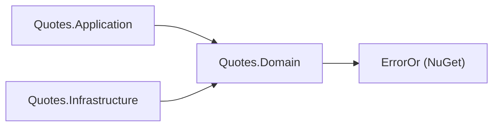
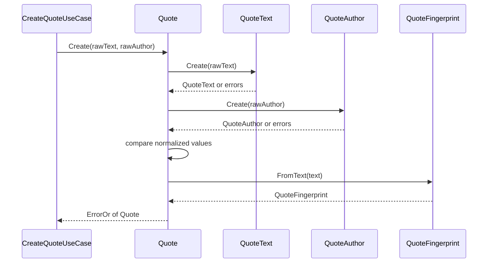

# Quotes.Domain

## Purpose

`Quotes.Domain` holds the catalog's rules and vocabulary: the `Quote` aggregate root, the three
value objects it is composed of (`QuoteText`, `QuoteAuthor`, `QuoteFingerprint`), the canonical
error catalog (`QuoteErrors`), and the repository port the rest of the system must satisfy
(`IQuoteRepository` with `QuotePage` and `QuoteAddOutcome`). It decides what a quote *is*, when a
candidate quote is acceptable, and when two quotes count as the same quote. It knows nothing about
HTTP, DI containers, storage, serialization, or the two API versions above it.

## Position in the architecture



Proof, the whole of `Quotes.Domain.csproj` below the SDK line:

```xml
  <!-- The domain references no project. ErrorOr is the one allowed package: it is the
       ratified error standard and carries zero transitive dependencies. -->
  <ItemGroup>
    <PackageReference Include="ErrorOr" />
  </ItemGroup>
```

There is no `<ProjectReference>` element in the file, and exactly one `<PackageReference>`. Both
inbound arrows are references *to* this project; the project itself points nowhere except at
`ErrorOr`.

## Why this layer exists

The rules in this project are the only thing in the Quotes context that is not replaceable. The
transport is replaceable — the seed proves it by serving the same catalog twice, as MVC controllers
and as minimal APIs. The store is replaceable — `InMemoryQuoteRepository` is one adapter behind a
port, and the contract suite exists so a second one can be dropped in. If "text must end with `.`,
`!` or `?`" lived in a request DTO's `[RegularExpression]`, adding v2 would fork the rule; if it
lived in the repository, swapping to a database adapter would lose it. Putting it here means the
rule is stated once, in the only project both other layers already depend on.

The zero-reference constraint is what makes that credible. A domain that can reference
`Microsoft.Extensions.*` starts resolving services; a domain that can reference ASP.NET starts
returning status codes; a domain that can reference EF Core starts shaping its types around a
storage schema, at which point "the domain owns the invariants" becomes a slogan rather than a
description. `ErrorOr` is admitted because expected failures need a return type, and it brings no
transitive dependencies with it — the exception documents the rule rather than eroding it.

The cost is real and deliberate: the domain cannot log, cannot read configuration, cannot call
anything asynchronous of its own. Everything it needs from the outside world has to be declared as
a port and handed to it. That is the trade this layer is making.

## DDD concepts introduced here

| Concept | Why it matters | In this project | Relates to |
|---|---|---|---|
| Entity / aggregate root | An object with identity whose invariants must hold at every observable moment | `Quote` — private constructor, get-only properties, identity in `Id` | [`Quote.cs`](Quote.cs) |
| Value object | No identity, equality by value; validity is a property of the type, not of the caller | `QuoteText`, `QuoteAuthor`, `QuoteFingerprint`, all `IEquatable<T>` with ordinal equality plus `==` / `!=` | [Bounded context shape rule 6](../../../docs/architecture.md#bounded-context-shape-rules) |
| Invariant | A rule that can never be false for an accepted instance | Length, word count and terminal punctuation on text; character set on author; `AuthorEqualsText` on the aggregate | [`QuoteErrors.cs`](QuoteErrors.cs) |
| Creation vs rehydration | New facts must pass the invariants; already-accepted facts must not be re-litigated | `Quote.Create` returns `ErrorOr<Quote>`; `Quote.Reconstitute` throws and skips validation | [`Quotes.Infrastructure`](../Quotes.Infrastructure/README.md) |
| Meaning identity | Two records can be distinct rows and still be the same thing to the business | `QuoteFingerprint` — case-folded, punctuation dropped as word breaks | `quote.duplicate_fingerprint` |
| Ubiquitous language as code | Error codes are the words the whole system uses for a failure | `QuoteErrors` — codes surface as ProblemDetails `errorCode` | [docs/api.md](../../../docs/api.md#error-contract) |
| Repository port (dependency inversion) | The domain states what it needs; infrastructure supplies it | `IQuoteRepository`, `QuotePage`, `QuoteAddOutcome` in `Quotes.Domain.Abstractions` | [Bounded context shape rule 2](../../../docs/architecture.md#bounded-context-shape-rules) |

### Creation is not rehydration

`Quote.Create(string? text, string? author)` is the only door in for new material. It takes raw,
possibly-null strings, runs every value object's `Create`, checks the cross-field rule, computes the
fingerprint, assigns `Guid.NewGuid().ToString("N")` as the id, and returns `ErrorOr<Quote>` — a
rejection here is an expected outcome, not an exception.

`Quote.Reconstitute(id, text, author, normalizedFingerprint)` is the opposite: it *throws*
(`ArgumentException.ThrowIfNullOrWhiteSpace`) and validates nothing beyond blankness, because it
rebuilds a quote the catalog already accepted. This is not laziness. Re-running `Create` at load
time would mean that tightening a rule silently deletes history: rows written under the old rule
would start failing to load, and a read of an existing quote would turn into a validation error the
caller cannot act on. Validation belongs at the moment a fact enters the system. Afterwards the fact
is a fact. The same split runs through the value objects, each of which pairs `Create` (validating,
`ErrorOr`) with `FromTrusted` (throwing, blank-check only).

### Why the fingerprint is a domain type

`QuoteText.ComputeFingerprint` lower-cases the normalized text, keeps letters and digits, and
converts everything else — whitespace *and* punctuation alike — into a single word break. `"First,
solve the problem."` and `"first solve the problem"` therefore produce the same fingerprint. That
statement is a business rule: it says two quotes that differ only in punctuation or casing are the
same quote, which is what makes the `409 quote.duplicate_fingerprint` answer meaningful rather than
arbitrary.

A unique index on a text column cannot express this. It would either compare raw text — letting the
same quote in eight times with different trailing punctuation — or push the normalization into a
computed column, at which point the definition of "same quote" lives in a migration script, is
invisible to `Quote.Create`, and changes meaning when the storage engine's collation changes. The
fingerprint is computed here, travels with the aggregate as a value object, and is what the adapter
compares; a database index over the stored fingerprint is then an *enforcement* of the rule, not the
rule itself.

### Why `AuthorEqualsText` sits on the aggregate

Every other rule is enforceable by one value object looking at its own value: `QuoteText` can decide
whether text is too short, `QuoteAuthor` can decide whether a character is allowed. "The author must
not be the same as the text" spans two values, and neither type can see the other without acquiring a
dependency on it. The aggregate is the smallest scope that holds both, so the check lives in
`Quote.Create` between the two successful value-object results, comparing the *normalized* values
with `StringComparison.OrdinalIgnoreCase`. This is the general rule for cross-field invariants: they
belong at the lowest level that can see all the fields involved, which is usually the aggregate root.

### The error catalog is public API

`QuoteErrors` is a static catalog of `ErrorOr.Error` values, each carrying a code and a message. The
codes are not log strings — they reach clients as the `errorCode` extension on every RFC 9457
problem response, and both API versions name them in their `<response>` documentation. Renaming one
is a breaking change for every consumer that branches on it.

| Member | Code | `ErrorType` | Raised by |
|---|---|---|---|
| `TextTooShort` | `quote.text_too_short` | Validation | `QuoteText.Create`, under `MinLength` (12) |
| `TextTooLong` | `quote.text_too_long` | Validation | `QuoteText.Create`, over `MaxLength` (280) |
| `TextNeedsMoreWords` | `quote.text_needs_more_words` | Validation | `QuoteText.Create`, under `MinWordCount` (3) |
| `TextMustEndWithPunctuation` | `quote.text_must_end_with_punctuation` | Validation | `QuoteText.Create`, last char not `.` `!` `?` |
| `AuthorTooShort` | `quote.author_too_short` | Validation | `QuoteAuthor.Create`, under `MinLength` (2) |
| `AuthorTooLong` | `quote.author_too_long` | Validation | `QuoteAuthor.Create`, over `MaxLength` (80) |
| `AuthorInvalidCharacters` | `quote.author_invalid_characters` | Validation | `QuoteAuthor.Create`, disallowed character |
| `AuthorEqualsText` | `quote.author_equals_text` | Validation | `Quote.Create`, cross-field check |
| `NotFound` | `quote.not_found` | NotFound | the read use cases, when the port returns `null` |
| `InvalidPageRequest` | `quote.invalid_page_request` | Validation | `ListQuotesUseCase`, out-of-range page request |
| `DuplicateFingerprint` | `quote.duplicate_fingerprint` | Conflict | `CreateQuoteUseCase`, on `QuoteAddOutcome.DuplicateFingerprint` |

The last three are raised in `Quotes.Application` but declared here, because the *words* belong to
the domain even when the moment of failure does not. `ErrorType` is what decides the HTTP status at
the edge and the outcome tag on the metric, so the type chosen here has consequences two layers up.

### The port the domain declares

`IQuoteRepository` lives in `Quotes.Domain.Abstractions`, not in Infrastructure. The direction is the
point: the domain writes down the four operations it needs — `GetRandomAsync`, `GetByIdAsync`,
`ListAsync(skip, take)`, `AddAsync` — in its own vocabulary (`Quote`, `QuotePage`), and Infrastructure
implements that interface. Neither the domain nor the application layer ever names a storage type.

Two clauses in the port are load-bearing:

- **`ListAsync` returns `QuotePage(Items, Total)` and never errors on an over-run.** Offsets beyond
  the end return an empty page. Paging arithmetic is the caller's business; the port answers what is
  there.
- **`AddAsync` is documented as atomic.** The adapter owns duplicate detection and reports it as
  `QuoteAddOutcome.DuplicateFingerprint`, so no caller performs a check-then-insert and no caller can
  lose that race. In a database adapter this maps to catching the unique-index violation rather than
  querying first. The enum exists precisely so "already present" is an ordinary return value instead
  of an exception the caller has to recognize.

## File inventory

| File | Type | Role | Key constants / signatures |
|---|---|---|---|
| [`Quote.cs`](Quote.cs) | `sealed class` | Aggregate root; composes the value objects and owns the cross-field rule | `static ErrorOr<Quote> Create(string?, string?)`; `static Quote Reconstitute(string, string, string, string)`; get-only `Id`, `Text`, `Author`, `Fingerprint`; private constructor |
| [`QuoteText.cs`](QuoteText.cs) | `sealed class`, `IEquatable<QuoteText>` | Quote body; length, word-count and punctuation invariants; owns fingerprint computation and whitespace normalization | `MinLength = 12`, `MaxLength = 280`, `MinWordCount = 3`; `Create`, `FromTrusted`, `ComputeFingerprint()`, `static ComputeFingerprint(string)`, `internal static NormalizeWhitespace(string?)` |
| [`QuoteAuthor.cs`](QuoteAuthor.cs) | `sealed class`, `IEquatable<QuoteAuthor>` | Attribution; length and character-set invariants | `MinLength = 2`, `MaxLength = 80`; `Create`, `FromTrusted`; allows letters, whitespace, `-`, `'`, `.`, `’` and non-spacing marks |
| [`QuoteFingerprint.cs`](QuoteFingerprint.cs) | `sealed class`, `IEquatable<QuoteFingerprint>` | Meaning identity of a quote | `static FromText(QuoteText)`, `static FromTrusted(string)` |
| [`QuoteErrors.cs`](QuoteErrors.cs) | `static class` | Canonical error catalog; codes are public contract | 11 `Error` members, table above |
| [`Abstractions/IQuoteRepository.cs`](Abstractions/IQuoteRepository.cs) | `interface` + `enum` | Repository port and its add outcome | `GetRandomAsync`, `GetByIdAsync`, `ListAsync(int skip, int take, …)`, `AddAsync`; `enum QuoteAddOutcome { Added, DuplicateFingerprint }` |
| [`Abstractions/QuotePage.cs`](Abstractions/QuotePage.cs) | `sealed record` | One page plus the total, so callers need no second query | `QuotePage(IReadOnlyList<Quote> Items, int Total)` |

All three value objects implement structural equality the same way: `Equals` over
`StringComparison.Ordinal`, `GetHashCode` via `StringComparer.Ordinal`, and `==` / `!=` operators
that are null-safe on the left.

## Walkthrough

The representative flow is a create attempt reaching `Quote.Create`.



1. `QuoteText.Create` normalizes whitespace first — `NormalizeWhitespace` splits on any whitespace,
   drops empty entries and re-joins with single spaces, so leading, trailing and repeated whitespace
   never reach a rule. Every subsequent check runs on the normalized string.
2. It then checks length (`MinLength` 12, `MaxLength` 280), word count (at least `MinWordCount` 3
   space-separated words) and terminal punctuation (`.`, `!` or `?`), returning the matching
   `QuoteErrors` member on the first failure.
3. `Quote.Create` short-circuits on `textResult.IsError` and returns those errors unchanged, so the
   caller sees the domain's own error code rather than a wrapped one.
4. `QuoteAuthor.Create` reuses `QuoteText.NormalizeWhitespace` — one normalization definition for the
   context — then checks length (2..80) and the character set: letters of any alphabet,
   whitespace, `-`, `'`, `.`, `’`, plus Unicode non-spacing marks for combining accents. Digits fail.
5. With both values in hand, `Quote.Create` compares them with
   `StringComparison.OrdinalIgnoreCase` and returns `QuoteErrors.AuthorEqualsText` if they match.
6. `QuoteFingerprint.FromText` computes the meaning identity from the accepted text.
7. The private constructor runs with a fresh `Guid.NewGuid().ToString("N")` id. From this point the
   instance cannot be mutated: every property is get-only and there is no other public way to build
   one except `Reconstitute`.

## Rules enforced mechanically

| Rule | Pinned by | Fact |
|---|---|---|
| The domain references no other project | [`tests/Architecture.Tests/LayeringTests.cs`](../../../tests/Architecture.Tests/LayeringTests.cs) | `Domain_layers_depend_on_no_project` |
| Quotes never reaches into Auth | same file | `Bounded_contexts_never_reference_each_other` |
| Value objects have ordinal value equality and matching hash codes | `tests/Quotes/Quotes.Domain.Tests/ValueObjectEqualityTests.cs` | `Value_objects_with_the_same_value_are_equal`, `Equal_values_hash_equally`, `Value_objects_with_different_values_are_not_equal`, `Value_objects_are_not_equal_to_null_or_other_types` |
| Text invariants and normalization | `tests/Quotes/Quotes.Domain.Tests/QuoteTextTests.cs` | `Create_normalizes_whitespace`, `Create_rejects_text_that_is_too_short`, `Create_rejects_text_that_is_too_long`, `Create_rejects_text_without_terminal_punctuation`, `Create_rejects_text_with_fewer_than_three_words` |
| Author invariants | `tests/Quotes/Quotes.Domain.Tests/QuoteAuthorTests.cs` | `Create_normalizes_whitespace`, `Create_rejects_an_author_that_is_too_short`, `Create_rejects_an_author_that_is_too_long`, `Create_rejects_author_with_digits` |
| Fingerprint ignores case and punctuation | `tests/Quotes/Quotes.Domain.Tests/QuoteFingerprintTests.cs` | `Fingerprint_ignores_case_and_punctuation`, `FromText_matches_ComputeFingerprint_on_the_text_value` |
| Aggregate composition and the cross-field rule | `tests/Quotes/Quotes.Domain.Tests/QuoteCreateTests.cs` | `Create_accepts_a_well_formed_quote`, `Create_rejects_author_equal_to_text`, `Create_propagates_text_validation_errors`, `Create_propagates_author_validation_errors` |
| Rehydration still refuses blanks | `QuoteCreateTests.cs`, plus each value object's suite | `Reconstitute_rejects_a_blank_id`, `Reconstitute_rejects_a_blank_fingerprint`, `FromTrusted_rejects_a_blank_value` |

## See also

- [Quotes bounded context overview](../README.md)
- [`Quotes.Application`](../Quotes.Application/README.md) — the only caller of `Quote.Create`
- [`Quotes.Infrastructure`](../Quotes.Infrastructure/README.md) — the adapter behind `IQuoteRepository`
- [Bounded context shape rules](../../../docs/architecture.md#bounded-context-shape-rules) — port placement, dependency direction, value-object equality
- [Error flow](../../../docs/architecture.md#error-flow) — how an `ErrorOr` failure becomes a problem response
- [Layering (dependency rule)](../../../README.md#layering-dependency-rule) and [Domain terms](../../../README.md#domain-terms) in the root README
