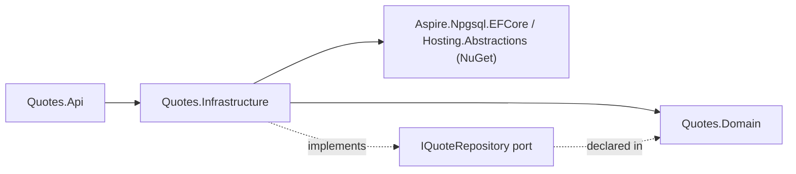
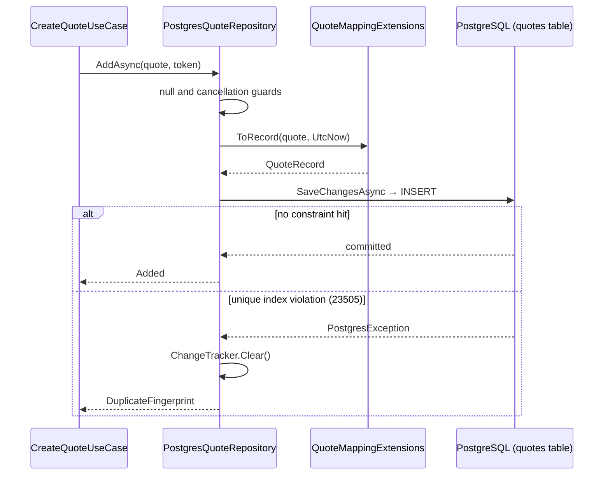

# Quotes.Infrastructure

## Purpose

`Quotes.Infrastructure` is the adapter side of the catalog. It implements the domain's
`IQuoteRepository` port with `PostgresQuoteRepository` over EF Core and PostgreSQL, owns the
persistence model `QuoteRecord`, the mapping between it and the `Quote` aggregate, the
`QuotesDbContext` that expresses the schema in code, and the EF migrations that create and seed the
database automatically. It registers everything through `AddQuotesInfrastructure()`. It is where
storage concerns — record shape, table and index DDL, ordering, duplicate detection — are allowed to
exist, and the only place in the context that knows the catalog lives in a `quotes` table inside the
PostgreSQL container the AppHost orchestrates.

## Position in the architecture



Proof, from `Quotes.Infrastructure.csproj`:

```xml
  <ItemGroup>
    <PackageReference Include="Aspire.Npgsql.EntityFrameworkCore.PostgreSQL" />
    <PackageReference Include="Microsoft.Extensions.DependencyInjection.Abstractions" />
    <PackageReference Include="Microsoft.Extensions.Hosting.Abstractions" />
  </ItemGroup>
  <ItemGroup>
    <InternalsVisibleTo Include="Quotes.Infrastructure.Tests" />
  </ItemGroup>
  <ItemGroup>
    <ProjectReference Include="..\Quotes.Domain\Quotes.Domain.csproj" />
  </ItemGroup>
```

The project reference list is one project: `Quotes.Domain`. The seed's dependency rule permits
Infrastructure to reference Application as well ([shape rule 3](../../../docs/architecture.md#bounded-context-shape-rules)),
and this project does not use that permission — the port it implements is the *domain's*, expressed
in domain types, so there is nothing in Application it needs. The `InternalsVisibleTo` exists so the
internal mapper is reachable from `Quotes.Infrastructure.Tests` without widening it to the whole
solution. The persistence packages (`Aspire.Npgsql.EntityFrameworkCore.PostgreSQL`, which brings EF
Core and Npgsql) live here and only here — the layering tests would flag them anywhere else, and the
Domain stays free of any storage SDK.

## Why this layer exists

`QuoteRecord` and `Quote` describe the same thing and must not be the same type. The record is flat
primitives with `required init` setters, carries `NormalizedFingerprint` as a plain string, and has a
field the domain has never heard of: `CreatedAtUtc`. The aggregate has get-only properties, value
objects, a private constructor and no timestamp. Collapsing them means the aggregate grows a
parameterless constructor and settable properties so EF can materialize it — and once those
exist, `Quote.Create` is no longer the only door in and the invariants are advisory.

The direction of the pressure matters. Storage always wants something from the model: a surrogate key,
a nullable column during a migration, a `[Timestamp]` for optimistic concurrency, a shadow property,
a discriminator. Each of those is reasonable *for storage* and none is a statement about quotes. With
a separate record they land in `QuoteRecord`, the mapper absorbs the difference, and the domain does
not move. Without it, every schema decision becomes a domain decision, and EF attributes end up on
`Quote` — which is exactly the case the root README calls out in its
[domain-terms table](../../../README.md#domain-terms).

`CreatedAtUtc` is the concrete example already present. The catalog records when a row was written,
because a store that cannot say when something arrived is hard to operate. No quote invariant reads
it, no use case returns it, and `ToDomain` drops it. It exists on exactly one side of the boundary,
which is what the boundary is for.

The second thing this layer buys is that the engine is a swappable fact. The use cases name
`IQuoteRepository`; nothing above this project names `PostgresQuoteRepository`, `QuoteRecord`, EF or
PostgreSQL. The contract suite in `tests/Quotes/Quotes.Infrastructure.Tests/QuoteRepositoryContractTests.cs`
is an abstract class any adapter's test project inherits — the in-memory adapter it was written
against is gone, and the suite did not change a line when the PostgreSQL adapter inherited it. That
is the swap proven behaviour-preserving rather than assumed to be.

## DDD concepts introduced here

| Concept | Why it matters | In this project | Relates to |
|---|---|---|---|
| Persistence model | Storage shape evolves on its own schedule and must not drag the aggregate along | `Persistence/QuoteRecord` — flat primitives plus `CreatedAtUtc` | [Domain terms](../../../README.md#domain-terms) |
| Anti-corruption boundary | Exactly one place converts between the two shapes, in both directions | `Mapping/QuoteMappingExtensions` (`internal`): `ToDomain`, `ToRecord`, `Seed` | `Quote.Reconstitute` |
| Adapter behind a port | The implementation is chosen at composition time, not by the caller | `PostgresQuoteRepository : IQuoteRepository` | [`IQuoteRepository`](../Quotes.Domain/Abstractions/IQuoteRepository.cs) |
| Atomicity owned by the adapter | Callers must not be able to race a check against an insert | `AddAsync` inserts and catches the unique-index violation (`23505`) | `QuoteAddOutcome` |
| Schema as code | The shape of the store is a compile-time fact, versioned with the code that uses it | `Persistence/QuotesDbContext` + `Persistence/Migrations` | [data storage](../../../docs/data-storage.md) |
| Adapter lifetime | The adapter owns no cross-request state, so it is Scoped like the DbContext it uses | `AddScoped<IQuoteRepository, PostgresQuoteRepository>` | [Shape rule 4](../../../docs/architecture.md#bounded-context-shape-rules) |

### The mapper is the whole boundary

```csharp
public static Quote ToDomain(this QuoteRecord record) =>
    Quote.Reconstitute(record.Id, record.Text, record.Author, record.NormalizedFingerprint);
```

Three things are worth reading closely. First, `ToDomain` routes through `Reconstitute`, not
`Create` — these rows were validated when they entered, and re-validating on every read would make a
tightened rule retroactively delete data (see [the domain README](../Quotes.Domain/README.md#creation-is-not-rehydration)).
Second, `CreatedAtUtc` is not passed: the mapper is where the extra column stops. Third, the class is
`internal`. Nothing outside this assembly can map a record into an aggregate, so the boundary cannot
be bypassed by a helper somewhere else.

`ToRecord(this Quote quote, DateTimeOffset createdAtUtc)` goes the other way and takes the timestamp
as a parameter rather than reading the clock itself, so the caller decides — `AddAsync` passes
`DateTimeOffset.UtcNow`, the seed passes a fixed date.

`Seed(id, text, author, createdAtUtc)` builds a record directly from raw strings, computing the
fingerprint with the domain's own `QuoteText.ComputeFingerprint(text)`. It is the one path that
creates catalog rows without an aggregate ever existing — acceptable because the fingerprint is still
computed by the domain's algorithm, so a seeded row and a created row are comparable.

### The schema, in code

`QuotesDbContext` maps `QuoteRecord` with no attributes anywhere: table `quotes`, a primary key on
`Id`, column lengths mirroring the domain's own limits (`Text` 280, `Author` 80), and — the load-bearing
line — a **unique index on `NormalizedFingerprint`**. Near-duplicate detection is a database
constraint, not a discipline. Everything `OnModelCreating` declares is what the migration files
under `Persistence/Migrations` contain; the model is the source of truth and the DDL is generated
from it (`dotnet ef migrations add`, run with `Quotes.Api` as the startup project).

The seed rides in the same migration. `HasData(QuotesSeed.Records)` bakes the eight shipped quotes —
ids `"1"` through `"8"`, all stamped `2024-01-01T00:00:00+00:00` — into `InitialCreate`, so any
empty database that migrates immediately holds the deterministic catalog the API, BDD and e2e suites
assert against. Changing the seed means changing the model and adding a migration, never a manual
`INSERT`.

The migrations are applied by the API host at startup (`Database.MigrateAsync()` in `Program.cs`):
idempotent, creating the database when missing and applying only what is pending, with EF Core 9+'s
database-wide migration lock so replicas starting together cannot corrupt it. There is no manual
migration step in any environment — the same boot path runs under the AppHost, in the standalone e2e
topology, and in the test containers.

### Atomicity, and the index that provides it

`AddAsync` honours the port's documented atomicity clause by leaning on the constraint instead of a
check-then-insert race:

```csharp
context.Quotes.Add(quote.ToRecord(DateTimeOffset.UtcNow));
try
{
    await context.SaveChangesAsync(cancellationToken);
    return QuoteAddOutcome.Added;
}
catch (DbUpdateException ex) when (ex.InnerException is PostgresException
{
    SqlState: _uniqueViolation // "23505"
})
{
    context.ChangeTracker.Clear();
    return QuoteAddOutcome.DuplicateFingerprint;
}
```

Two concurrent creates of the same text both reach `SaveChangesAsync`; exactly one insert survives
and the loser surfaces PostgreSQL's `23505` unique violation, which the adapter translates to
`QuoteAddOutcome.DuplicateFingerprint`. If the existence check were exposed as a separate port
method and the use case called it before `AddAsync`, a window would exist between check and insert
that no amount of care in the use case could close — which is why the port's contract puts duplicate
detection on the adapter and returns it as an outcome rather than exposing an `ExistsAsync`. The
in-memory adapter implemented the same clause with a lock; the caller's code never knew the
difference.

Why this happens, in detail:

- **`23505` is not one of our codes — it is PostgreSQL's.** It is the SQL standard's five-character
  SQLSTATE class for `unique_violation`, returned by the server whenever an insert breaks *any*
  unique constraint: the fingerprint index here, or the primary key. The catch matches the class,
  not the constraint name, so renaming an index or adding another unique constraint later cannot
  silently break duplicate detection — and it is exactly the error the database is guaranteeing to
  raise under concurrency, which is what makes the clause race-free.
- **The catch unwraps twice on purpose.** EF Core does not let the provider's exception surface
  directly: `SaveChangesAsync` wraps it in a `DbUpdateException`, with the driver's
  `PostgresException` (carrying `SqlState`) as the `InnerException`. Catching `PostgresException`
  alone would never fire; catching bare `DbUpdateException` would swallow unrelated failures (e.g.
  a lost connection). The `when` clause pins both layers to the one condition that means
  "conflicts with an existing entry".
- **`ChangeTracker.Clear()` is recovery, not hygiene.** The failed insert leaves the entity tracked,
  and the context is scoped to the whole request: without clearing, any later `SaveChanges` on the
  same scope would replay the poisoned entry and throw again mid-request. After the clear, the
  adapter's contract is already settled (`DuplicateFingerprint` returned), so nothing further reads
  that context's state.

Id collisions collapse into the same outcome deliberately. Ids come from `Guid.NewGuid()`, so a
collision means a broken caller rather than a business condition, and "conflicts with an existing
entry" is the honest answer for both — the primary key and the fingerprint index raise the same
`23505`.

### Ordering, paging, and the random pick

`ListAsync` queries `ORDER BY created_at_utc, id` with `OFFSET`/`LIMIT` (`Skip`/`Take` in LINQ) and a
`COUNT` for the true `Total`. The order is the stable catalog order the port promises: the eight
seeds share a fixed timestamp and tie-break on their ids, so they read back `"1"`–`"8"`, and created
quotes follow in creation order with the id as a deterministic tiebreaker for same-tick writes. The
guards are argument-level (`ThrowIfNegative(skip)`, `ThrowIfNegativeOrZero(take)`) because a negative
offset is a caller bug, not a user error — user-facing range validation happened one layer up in
`ListQuotesUseCase`. An offset past the end is not a bug: it yields an empty `Items` with the true
`Total`, exactly as the port documents.

`GetRandomAsync` pushes the pick into the database — `select * from quotes order by random() limit 1`
— so the catalog the API serves is the catalog the engine holds, with no second copy in process
memory. A full sort per random read is the simple, correct tool at PoC catalog sizes; the port does
not promise uniformity or scalability, it promises *a* quote or `null` when empty.

### Why Scoped

```csharp
builder.AddNpgsqlDbContext<QuotesDbContext>("quotesdb");
builder.Services.AddScoped<IQuoteRepository, PostgresQuoteRepository>();
```

The adapter owns no state that must outlive a request — the database holds the catalog, and the
scoped `QuotesDbContext` is the unit of work. That is the seed's default lifetime rule restored:
use cases and adapters are Scoped unless proven otherwise. The connection itself is not the
repository's problem: `AddNpgsqlDbContext` (the Aspire client integration) resolves the
`ConnectionStrings:quotesdb` key the AppHost injects via `WithReference`, pools the connections
(`NpgsqlDataSource`), and layers on health checks, OpenTelemetry tracing and retry policy. A full
explanation of that wiring — including what a *non-.NET* service would consume to reach the same
database — lives in [docs/data-storage.md](../../../docs/data-storage.md).

## File inventory

| File | Type | Role | Key constants / signatures |
|---|---|---|---|
| [`PostgresQuoteRepository.cs`](PostgresQuoteRepository.cs) | `sealed class : IQuoteRepository` | The adapter: server-side random, ordered paging, index-backed atomic add | `PostgresQuoteRepository(QuotesDbContext)`; `_uniqueViolation = "23505"`; `FromSql($"select * from quotes order by random() limit 1")` |
| [`Persistence/QuotesDbContext.cs`](Persistence/QuotesDbContext.cs) | `sealed class : DbContext` | The schema in code | `DbSet<QuoteRecord> Quotes`; unique index on `NormalizedFingerprint`; `HasData(QuotesSeed.Records)`; lengths 64/280/80/280 |
| [`Persistence/QuotesSeed.cs`](Persistence/QuotesSeed.cs) | `internal static class` | The shipped catalog, baked into the migration | `Records` (ids `"1"`–`"8"`); `_seedCreatedAt = 2024-01-01T00:00:00+00:00` |
| [`Persistence/QuoteRecord.cs`](Persistence/QuoteRecord.cs) | `sealed class` | Persistence model | `required` `Id`, `Text`, `Author`, `NormalizedFingerprint`, `CreatedAtUtc`; all `init` |
| [`Persistence/Migrations/`](Persistence/Migrations/) | EF migrations | Generated DDL, committed | `InitialCreate` (table + unique index + 8 seed rows); `QuotesDbContextModelSnapshot` |
| [`Mapping/QuoteMappingExtensions.cs`](Mapping/QuoteMappingExtensions.cs) | `internal static class` | The anti-corruption boundary | `Quote ToDomain(this QuoteRecord)`; `QuoteRecord ToRecord(this Quote, DateTimeOffset)`; `QuoteRecord Seed(string, string, string, DateTimeOffset)` |
| [`DependencyInjection.cs`](DependencyInjection.cs) | `static class` | The layer's own registrations | `AddQuotesInfrastructure(this IHostApplicationBuilder)` — `AddNpgsqlDbContext` + one `AddScoped` |

## Walkthrough

The representative flow is `AddAsync`, where the atomicity clause, the mapper and the unique index
all meet.



1. `ArgumentNullException.ThrowIfNull(quote)` and the cancellation guard run before anything touches
   the context — programmer errors and abandoned requests never open a transaction.
2. `ToRecord(quote, DateTimeOffset.UtcNow)` flattens the aggregate and stamps the creation time that
   only this side of the boundary models. The fingerprint arrives already computed on the aggregate
   (`quote.Fingerprint.Value`); the adapter stores and constrains it, it does not decide what "same"
   means.
3. `SaveChangesAsync` issues the `INSERT`. Either it commits, or the unique index on
   `NormalizedFingerprint` (or the primary key) rejects it with `23505` — the check and the insert
   are one statement, which is what makes the clause atomic.
4. On violation the adapter clears the change tracker — the failed entry must not be retried by a
   later `SaveChanges` on the same scoped context — and returns `DuplicateFingerprint`.
   `CreateQuoteUseCase` turns the enum into `QuoteErrors.DuplicateFingerprint`, which the edge
   renders as `409` with `errorCode: quote.duplicate_fingerprint`.
5. Reads (`GetRandomAsync`, `GetByIdAsync`, `ListAsync`) run `AsNoTracking` queries and call
   `ToDomain` on each row. Callers never see a `QuoteRecord`.

## Rules enforced mechanically

| Rule | Pinned by | Fact |
|---|---|---|
| Infrastructure never references the Api host or the other context | [`tests/Architecture.Tests/LayeringTests.cs`](../../../tests/Architecture.Tests/LayeringTests.cs) | `Infrastructure_layers_depend_on_domain_and_application_only` |
| The adapter and context resolve from the layer's own registration | `tests/Quotes/Quotes.Infrastructure.Tests/DependencyInjectionTests.cs` | `AddQuotesInfrastructure_resolves_the_persistence_adapters` |
| The port contract any adapter must satisfy, against real PostgreSQL | `tests/Quotes/Quotes.Infrastructure.Tests/PostgresQuoteRepositoryTests.cs` (inherits `QuoteRepositoryContractTests`; Testcontainers, one database per test) | `GetRandomAsync_returns_null_on_an_empty_catalog`, `AddAsync_round_trips_through_GetByIdAsync`, `AddAsync_reports_a_duplicate_fingerprint_atomically`, `GetRandomAsync_returns_the_only_quote_in_the_catalog`, `GetByIdAsync_returns_null_for_an_unknown_id`, `ListAsync_pages_the_catalog_without_overlap_and_reports_the_total`, `ListAsync_returns_an_empty_page_beyond_the_end_instead_of_failing`, `ListAsync_is_stable_across_repeated_reads_of_the_same_page` |
| Migrating an empty database ships the deterministic catalog | same file | `Migrating_an_empty_database_ships_the_seeded_catalog` (8 rows, ids `"1"`–`"8"`, da Vinci first, Abelson at `"7"`) |

## See also

- [Data storage and connections](../../../docs/data-storage.md) — how the AppHost, `WithReference` and the Aspire client integration wire the database, and what a non-.NET service would consume
- [Quotes bounded context overview](../README.md)
- [`Quotes.Domain`](../Quotes.Domain/README.md) — the port, its atomicity clause and `Reconstitute`
- [`Quotes.Api`](../Quotes.Api/README.md) — where `AddQuotesInfrastructure()` and the startup migration live
- [Bounded context shape rules](../../../docs/architecture.md#bounded-context-shape-rules) — port placement and service lifetimes
- [Collections and pagination](../../../docs/architecture.md#collections-and-pagination) — the `ListAsync(skip, take)` contract
- [What is covered](../../../docs/testing.md#what-is-covered) — the reusable repository contract suite
