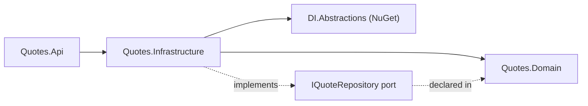
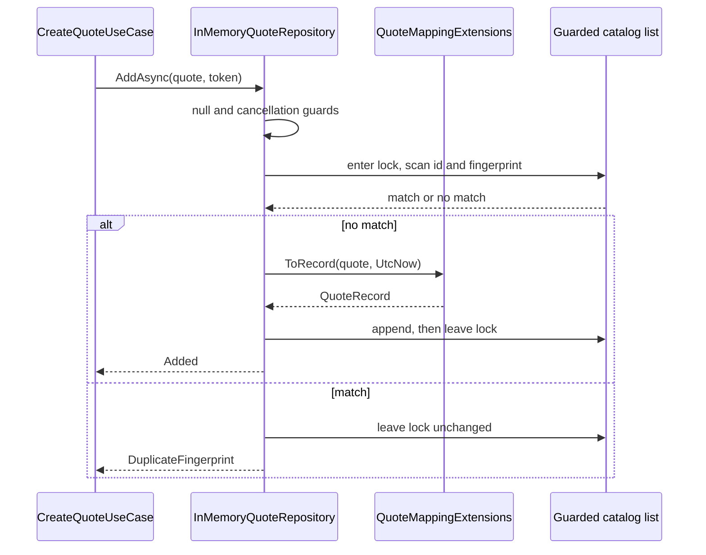

# Quotes.Infrastructure

## Purpose

`Quotes.Infrastructure` is the adapter side of the catalog. It implements the domain's
`IQuoteRepository` port with `InMemoryQuoteRepository`, owns the persistence model `QuoteRecord` and
the mapping between it and the `Quote` aggregate, provides the `IQuoteSelector` seam that decides
which quote a random read returns, and registers both adapters through
`AddQuotesInfrastructure()`. It is where storage concerns — record shape, ordering, concurrency
control, timestamps, duplicate detection — are allowed to exist, and the only place in the context
that knows the catalog currently lives in a `List<QuoteRecord>` behind a lock.

## Position in the architecture



Proof, from `Quotes.Infrastructure.csproj`:

```xml
  <ItemGroup>
    <PackageReference Include="Microsoft.Extensions.DependencyInjection.Abstractions" />
  </ItemGroup>
  <ItemGroup>
    <InternalsVisibleTo Include="Quotes.Infrastructure.Tests" />
  </ItemGroup>
  <ItemGroup>
    <ProjectReference Include="..\Quotes.Domain\Quotes.Domain.csproj" />
  </ItemGroup>
```

The reference list is one project: `Quotes.Domain`. The seed's dependency rule permits
Infrastructure to reference Application as well ([shape rule 3](../../../docs/architecture.md#bounded-context-shape-rules)),
and this project does not use that permission — the port it implements is the *domain's*, expressed
in domain types, so there is nothing in Application it needs. The `InternalsVisibleTo` exists so the
repository's internal test seam (a constructor taking a custom catalog) and the internal mapper are
reachable from `Quotes.Infrastructure.Tests` without widening them to the whole solution. The one
package is the DI abstractions, for `AddQuotesInfrastructure`.

## Why this layer exists

`QuoteRecord` and `Quote` describe the same thing and must not be the same type. The record is flat
primitives with `required init` setters, carries `NormalizedFingerprint` as a plain string, and has a
field the domain has never heard of: `CreatedAtUtc`. The aggregate has get-only properties, value
objects, a private constructor and no timestamp. Collapsing them means the aggregate grows a
parameterless constructor and settable properties so a materializer can populate it — and once those
exist, `Quote.Create` is no longer the only door in and the invariants are advisory.

The direction of the pressure matters. Storage always wants something from the model: a surrogate key,
a nullable column during a migration, a `[Timestamp]` for optimistic concurrency, a shadow property,
a discriminator. Each of those is reasonable *for storage* and none is a statement about quotes. With
a separate record they land in `QuoteRecord`, the mapper absorbs the difference, and the domain does
not move. Without it, every schema decision becomes a domain decision, and EF attributes end up on
`Quote` — which is exactly the case the root README calls out in its
[domain-terms table](../../../README.md#domain-terms).

`CreatedAtUtc` is the concrete example already present. The catalog records when a row was written,
because a store that cannot say when something arrived is hard to operate. No quote invariant reads
it, no use case returns it, and `ToDomain` drops it. It exists on exactly one side of the boundary,
which is what the boundary is for.

The second thing this layer buys is that "in-memory" is a swappable fact. The use cases name
`IQuoteRepository`; nothing above this project names `InMemoryQuoteRepository`, `QuoteRecord` or the
lock. The contract suite in `tests/Quotes/Quotes.Infrastructure.Tests/QuoteRepositoryContractTests.cs`
is an abstract class a future adapter's test project inherits, so the swap can be proven
behaviour-preserving rather than assumed to be.

## DDD concepts introduced here

| Concept | Why it matters | In this project | Relates to |
|---|---|---|---|
| Persistence model | Storage shape evolves on its own schedule and must not drag the aggregate along | `Persistence/QuoteRecord` — flat primitives plus `CreatedAtUtc` | [Domain terms](../../../README.md#domain-terms) |
| Anti-corruption boundary | Exactly one place converts between the two shapes, in both directions | `Mapping/QuoteMappingExtensions` (`internal`): `ToDomain`, `ToRecord`, `Seed` | `Quote.Reconstitute` |
| Adapter behind a port | The implementation is chosen at composition time, not by the caller | `InMemoryQuoteRepository : IQuoteRepository` | [`IQuoteRepository`](../Quotes.Domain/Abstractions/IQuoteRepository.cs) |
| Atomicity owned by the adapter | Callers must not be able to race a check against an insert | `AddAsync` does both inside one `lock (_gate)` | `QuoteAddOutcome` |
| Determinism seam | Non-determinism is injected so behaviour around it can be tested adversarially | `IQuoteSelector` / `RandomQuoteSelector` | `tests/Quotes/Quotes.Infrastructure.Tests` |
| Adapter lifetime | State that must outlive a request cannot be Scoped | both registrations are `AddSingleton` | [Shape rule 4](../../../docs/architecture.md#bounded-context-shape-rules) |

### The mapper is the whole boundary

```csharp
public static Quote ToDomain(this QuoteRecord record) =>
    Quote.Reconstitute(record.Id, record.Text, record.Author, record.NormalizedFingerprint);
```

Three things are worth reading closely. First, `ToDomain` routes through `Reconstitute`, not
`Create` — these rows were validated when they entered, and re-validating on every read would make a
tightened rule retroactively delete data (see [the domain README](../Quotes.Domain/README.md#creation-is-not-rehydration)).
Second, `CreatedAtUtc` is not passed: the mapper is where the extra column stops. Third, the class is
`internal`. Nothing outside this assembly can map a record into an aggregate, so the boundary cannot
be bypassed by a helper somewhere else.

`ToRecord(this Quote quote, DateTimeOffset createdAtUtc)` goes the other way and takes the timestamp
as a parameter rather than reading the clock itself, so the caller decides — `AddAsync` passes
`DateTimeOffset.UtcNow`, the seed passes a fixed date.

`Seed(id, text, author, createdAtUtc)` builds a record directly from raw strings, computing the
fingerprint with the domain's own `QuoteText.ComputeFingerprint(text)`. It is the one path that
creates catalog rows without an aggregate ever existing — acceptable because the fingerprint is still
computed by the domain's algorithm, so a seeded row and a created row are comparable.

### The selector seam

`IQuoteSelector` has one method, `int NextIndex(int exclusiveUpperBound)`, and the production
implementation is one line: `Random.Shared.Next(exclusiveUpperBound)`. Extracting it is not about
supporting alternative selection strategies. It is about being able to write the tests that matter
for an index-based read: that *every* index maps to a fully populated quote, that distinct indexes
yield distinct quotes, and — the reason the seam earns its place — that an index outside `0..Count-1`
is rejected with a diagnosable `InvalidOperationException` naming the offending index and the valid
range, instead of an `ArgumentOutOfRangeException` from the list. A hard-coded `Random.Shared` inside
the repository makes the first two flaky and the third unreachable.

### Atomicity, and the lock that provides it

`AddAsync` honours the port's documented atomicity clause with the simplest mechanism that can:

```csharp
lock (_gate)
{
    outcome = _quotes.Exists(q =>
            string.Equals(q.Id, quote.Id, StringComparison.Ordinal)
            || string.Equals(q.NormalizedFingerprint, quote.Fingerprint.Value, StringComparison.Ordinal))
        ? QuoteAddOutcome.DuplicateFingerprint
        : QuoteAddOutcome.Added;

    if (outcome is QuoteAddOutcome.Added)
    {
        _quotes.Add(quote.ToRecord(DateTimeOffset.UtcNow));
    }
}
```

The existence check and the insert are in one critical section, so two concurrent creates of the same
text cannot both observe "not present". If the check were exposed as a separate port method and the
use case called it before `AddAsync`, that window would exist and no amount of care in the use case
would close it — which is why the port's contract puts duplicate detection on the adapter and returns
it as `QuoteAddOutcome.DuplicateFingerprint` rather than exposing an `ExistsAsync`. A database adapter
implements the same clause differently: insert, catch the unique-index violation, return the same
enum value. The caller's code does not change.

Id collisions collapse into the same outcome deliberately. Ids come from `Guid.NewGuid()`, so a
collision means a broken caller rather than a business condition, and "conflicts with an existing
entry" is the honest answer for both.

Every other method takes the same lock: `GetRandomAsync`, `GetByIdAsync`, `ListAsync` and the `Count`
test surface all read inside `lock (_gate)`, and each returns already-materialized results
(`Task.FromResult`) so no lazy sequence escapes the critical section and enumerates the list
afterwards.

### Ordering and paging

`ListAsync` pages with `Skip(skip).Take(take)` over the backing list, which makes **insertion order**
the stable catalog order the port promises: the eight seeded rows first, then created quotes in the
order they were accepted. The guards are argument-level (`ThrowIfNegative(skip)`,
`ThrowIfNegativeOrZero(take)`) because a negative offset is a caller bug, not a user error — user-facing
range validation happened one layer up in `ListQuotesUseCase`. An offset past the end is not a bug: it
yields an empty `Items` with the true `Total`, exactly as the port documents.

The seed is eight quotes with ids `"1"` through `"8"`, all stamped `2024-01-01T00:00:00+00:00`, so the
catalog is deterministic across restarts and the API tests can assert against known content.

### Why Singleton

```csharp
services.AddSingleton<IQuoteSelector, RandomQuoteSelector>();
services.AddSingleton<IQuoteRepository, InMemoryQuoteRepository>();
```

This is the narrow exception to the seed's Scoped default. The repository *is* the store: its
`List<QuoteRecord>` holds the catalog, and a Scoped registration would give every request a fresh
copy of the seed, discarding created quotes the moment the response was written — the create/`Location`
round trip in the full-pipeline suite would fail on the follow-up GET. `RandomQuoteSelector` is
stateless and Singleton for the same reason a stateless service usually is: there is nothing to keep.

The contrast with `AddQuotesApplication`'s four `AddScoped` calls is the rule in practice: use cases
and their decorator chains are Scoped by default; Singleton is reserved for adapters that either own
process-lifetime state or are proven stateless. Note what the Singleton choice obliges in return —
the lock. A Singleton is shared by concurrent requests, so its state must be guarded; a Scoped service
gets that for free and gives up persistence in exchange.

## File inventory

| File | Type | Role | Key constants / signatures |
|---|---|---|---|
| [`InMemoryQuoteRepository.cs`](InMemoryQuoteRepository.cs) | `sealed class : IQuoteRepository` | The adapter: seeded catalog, lock-guarded reads and writes, atomic add | `private readonly object _gate`; `List<QuoteRecord> _quotes`; `internal InMemoryQuoteRepository(IQuoteSelector, List<QuoteRecord>)` test seam; `internal static List<QuoteRecord> DefaultSeed()` (ids `"1"`–`"8"`); `public int Count`; `_seedCreatedAt = 2024-01-01T00:00:00+00:00` |
| [`RandomQuoteSelector.cs`](RandomQuoteSelector.cs) | `sealed class : IQuoteSelector` | Production selection strategy | `int NextIndex(int exclusiveUpperBound) => Random.Shared.Next(exclusiveUpperBound)` |
| [`Abstractions/IQuoteSelector.cs`](Abstractions/IQuoteSelector.cs) | `interface` | Determinism seam for random reads | `int NextIndex(int exclusiveUpperBound)` |
| [`Persistence/QuoteRecord.cs`](Persistence/QuoteRecord.cs) | `sealed class` | Persistence model | `required` `Id`, `Text`, `Author`, `NormalizedFingerprint`, `CreatedAtUtc`; all `init` |
| [`Mapping/QuoteMappingExtensions.cs`](Mapping/QuoteMappingExtensions.cs) | `internal static class` | The anti-corruption boundary | `Quote ToDomain(this QuoteRecord)`; `QuoteRecord ToRecord(this Quote, DateTimeOffset)`; `QuoteRecord Seed(string, string, string, DateTimeOffset)` |
| [`DependencyInjection.cs`](DependencyInjection.cs) | `static class` | The layer's own registrations | `AddQuotesInfrastructure(this IServiceCollection)` — two `AddSingleton` |

## Walkthrough

The representative flow is `AddAsync`, where the atomicity clause, the mapper and the lock all meet.



1. `ArgumentNullException.ThrowIfNull(quote)` and `cancellationToken.ThrowIfCancellationRequested()`
   run before the lock — programmer errors and abandoned requests never contend for it.
2. Inside `lock (_gate)`, `_quotes.Exists` scans for an ordinal match on either the id or the
   normalized fingerprint. The fingerprint arrives already computed on the aggregate
   (`quote.Fingerprint.Value`); the adapter compares, it does not decide what "same" means.
3. On a match the outcome is `DuplicateFingerprint` and nothing is written. The lock is released with
   the list untouched, and `CreateQuoteUseCase` turns the enum into
   `QuoteErrors.DuplicateFingerprint`, which the edge renders as `409` with
   `errorCode: quote.duplicate_fingerprint`.
4. On no match, `ToRecord(quote, DateTimeOffset.UtcNow)` flattens the aggregate and stamps the
   creation time that only this side of the boundary models.
5. The record is appended, which is also what places it last in catalog order for `ListAsync`.
6. The lock is released and `Task.FromResult(outcome)` returns. The whole adapter is synchronous
   behind an async port — the port is async because real stores are, and the in-memory adapter
   satisfies the signature without pretending to await anything.

Reads follow the mirror image: take the lock, find the record (by selector index, by id, or by
`Skip`/`Take`), call `ToDomain` on each hit while still inside the lock, and hand back aggregates.
Callers never see a `QuoteRecord`.

## Rules enforced mechanically

| Rule | Pinned by | Fact |
|---|---|---|
| Infrastructure never references the Api host or the other context | [`tests/Architecture.Tests/LayeringTests.cs`](../../../tests/Architecture.Tests/LayeringTests.cs) | `Infrastructure_layers_depend_on_domain_and_application_only` |
| Both adapters resolve, and to these implementations | `tests/Quotes/Quotes.Infrastructure.Tests/DependencyInjectionTests.cs` | `AddQuotesInfrastructure_resolves_the_persistence_adapters` |
| The port contract any adapter must satisfy | `tests/Quotes/Quotes.Infrastructure.Tests/QuoteRepositoryContractTests.cs` (abstract; inherited by `InMemoryQuoteRepositoryTests`) | `GetRandomAsync_returns_null_on_an_empty_catalog`, `AddAsync_round_trips_through_GetByIdAsync`, `AddAsync_reports_a_duplicate_fingerprint_atomically`, `GetRandomAsync_returns_the_only_quote_in_the_catalog`, `GetByIdAsync_returns_null_for_an_unknown_id`, `ListAsync_pages_the_catalog_without_overlap_and_reports_the_total`, `ListAsync_returns_an_empty_page_beyond_the_end_instead_of_failing`, `ListAsync_is_stable_across_repeated_reads_of_the_same_page` |
| Index handling around the selector seam | `tests/Quotes/Quotes.Infrastructure.Tests/InMemoryQuoteRepositoryTests.cs` | `GetRandomAsync_asks_the_selector_for_an_index_inside_the_catalogue`, `Every_index_maps_to_a_fully_populated_quote`, `Distinct_indexes_yield_distinct_quotes`, `An_out_of_range_index_is_rejected_rather_than_throwing_an_index_error`, `The_production_selector_stays_within_bounds` |
| The seeded catalog is readable and additions join it | same file | `GetByIdAsync_resolves_a_seeded_quote`, `AddAsync_persists_a_quote_available_to_GetRandomAsync` |

## See also

- [Quotes bounded context overview](../README.md)
- [`Quotes.Domain`](../Quotes.Domain/README.md) — the port, its atomicity clause and `Reconstitute`
- [`Quotes.Api`](../Quotes.Api/README.md) — where `AddQuotesInfrastructure()` is called
- [Bounded context shape rules](../../../docs/architecture.md#bounded-context-shape-rules) — port placement and service lifetimes
- [Collections and pagination](../../../docs/architecture.md#collections-and-pagination) — the `ListAsync(skip, take)` contract
- [What is covered](../../../docs/testing.md#what-is-covered) — the reusable repository contract suite
