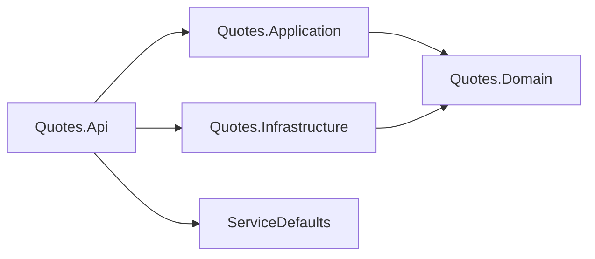

# Quotes bounded context

## Purpose

The Quotes context owns one thing: a catalog of attributed quotes, and the rules for what may enter
it. It decides what counts as a well-formed quote, when two quotes are the same quote, how the
catalog is paged, and how all of that is published over HTTP. It is the seed's worked example of the
four-project layering — small enough to read in one sitting, complete enough that a new service can be
copied from its shape rather than from a diagram.

Everything about identity lives in the Auth context and arrives here as a validated bearer token with
scope claims. The two contexts never reference each other; `LayeringTests` fails if they start to.

## Ubiquitous language

The words below mean these things everywhere in the context — in code, in error codes, in logs and in
the published API. For the generic DDD vocabulary (entity, value object, aggregate, persistence
model) see [Domain terms](../../README.md#domain-terms) in the root README.

| Term | Meaning in this context | Where it lives |
|---|---|---|
| **Quote** | An accepted text with an attribution and a stable id. The aggregate root; nothing enters the catalog except as one | `Quotes.Domain/Quote.cs` |
| **Text** | The quote body after whitespace normalization: 12–280 characters, at least 3 words, ending in `.`, `!` or `?` | `Quotes.Domain/QuoteText.cs` |
| **Author** | The attribution: 2–80 characters of letters (any alphabet), whitespace, `-`, `'`, `.`, `’` and combining marks — never digits, and never equal to the text | `Quotes.Domain/QuoteAuthor.cs` |
| **Fingerprint** | The identity of a quote's *meaning*: text lower-cased, with punctuation and whitespace collapsed to single word breaks. Two texts with the same fingerprint are the same quote | `Quotes.Domain/QuoteFingerprint.cs` |
| **Duplicate** | A candidate whose fingerprint already exists in the catalog. Answered as `409 quote.duplicate_fingerprint`, not as a validation failure | `QuoteErrors.DuplicateFingerprint` |
| **Catalog** | The whole collection of accepted quotes, behind `IQuoteRepository` | `Quotes.Infrastructure/InMemoryQuoteRepository.cs` |
| **Stable catalog order** | The order `ListAsync` promises: today insertion order — the eight seeded quotes first, then created ones as they were accepted | `InMemoryQuoteRepository.ListAsync` |
| **Page** | A 1-based slice of the catalog: `page` from 1, `pageSize` 1–100 (default 20), answered with `items`, `page`, `pageSize`, `totalItems`, `totalPages` | `Quotes.Application/ListQuotesUseCase.cs` |
| **Create vs Reconstitute** | Creation validates a new fact and can fail; reconstitution rebuilds an already-accepted fact and does not re-validate | `Quote.Create` / `Quote.Reconstitute` |
| **Outcome** | How an operation ended, as a value rather than an exception: `QuoteAddOutcome` at the port, an outcome tag on the metric at the edge | `Quotes.Domain/Abstractions`, `Quotes.Api/Telemetry` |
| **Error code** | The `quote.*` string a failure is known by, identical in the domain, the logs and the client's `errorCode` extension | `Quotes.Domain/QuoteErrors.cs` |
| **Selector** | Which entry a random read returns; injected so the choice is deterministic under test | `Quotes.Infrastructure/Abstractions/IQuoteSelector.cs` |
| **Version** | A published transport surface (`v0`, `v1`) with its own DTOs, routes and OpenAPI document — not a release stage | `Quotes.Api/V0`, `Quotes.Api/V1` |

## The four projects

| Project | Owns | README |
|---|---|---|
| `Quotes.Domain` | The aggregate, the value objects, the error catalog, the repository port. Zero project references | [Quotes.Domain/README.md](Quotes.Domain/README.md) |
| `Quotes.Application` | Four use cases behind four interfaces, the command/query/DTO types, `QuoteRules`, `AddQuotesApplication()` | [Quotes.Application/README.md](Quotes.Application/README.md) |
| `Quotes.Infrastructure` | `PostgresQuoteRepository` over EF Core: the `QuotesDbContext` schema, the migration-shipped seed, `QuoteRecord` and its mapper, `AddQuotesInfrastructure()` | [Quotes.Infrastructure/README.md](Quotes.Infrastructure/README.md) |
| `Quotes.Api` | Composition root, both transports, transport DTOs and mappers, telemetry decorators, OpenAPI narrative | [Quotes.Api/README.md](Quotes.Api/README.md) |

Two arrows are absent from the diagram on purpose. `Quotes.Api` does not reference `Quotes.Domain` —
it composes the layers and speaks in application DTOs. `Quotes.Infrastructure` does not reference
`Quotes.Application` either, although the seed's rules would allow it: the port it implements is the
domain's, so there is nothing in Application it needs. The dependency rule these follow is tabulated
in the root README's [layering table](../../README.md#layering-dependency-rule) and enforced by
[`tests/Architecture.Tests/LayeringTests.cs`](../../tests/Architecture.Tests/LayeringTests.cs).

## Why the context is bounded this way

A bounded context is a boundary around a language, and the test of one is whether a word means exactly
one thing inside it. "Quote" does: it is never a price quote, never a draft, never a rendered card in
the UI. Because the word is unambiguous here, `Quote` can be a single small type with no mode flags
and no optional halves, and its invariants can be checked in one place.

The boundary is drawn where the vocabulary changes. Identity is a different language — usernames,
credentials, tokens, scopes — so it is a different context (`src/Auth`), and the only thing that
crosses between them is a signed token validated locally by JwtBearer. Neither side can call the
other's types; `Bounded_contexts_never_reference_each_other` makes that mechanical rather than
cultural. The alternative, one shared "core" assembly holding both vocabularies, is exactly how the
word "user" ends up meaning three things.

Inside the boundary, the split into four projects is not ceremony either. Each project is defined by
what it is *not allowed* to know, and each restriction is doing work:

- The domain knows nothing about hosting, so its rules cannot quietly acquire a dependency on a
  request, a container or a schema — and the catalog rules stay stated once, for both API versions.
- The application layer knows nothing about HTTP, so the same use case serves an MVC controller and a
  minimal API without either style leaking into it.
- Infrastructure is reachable only through a port, so the storage engine is a fact one registration
  can change — the swap from an in-memory list to PostgreSQL replaced the adapter and nothing above
  it moved, and the contract suite that proved it was written before either engine existed.
- The host is the only thing that knows all of the above, which is why it is also the only thing that
  has to change when a version, a transport or an adapter is added.

The context is deliberately shallow in business terms — a real catalog would have submission
workflows, moderation and sources. The shape is the deliverable; the quotes are the example. The
[bounded context shape rules](../../docs/architecture.md#bounded-context-shape-rules) state the
structural questions every context in this repo must answer the same way.

## The two API versions

The same catalog is published twice: `/api/v0/quotes` by MVC controllers and `/api/v1/quotes` by
minimal APIs. `v0` is the older *style*, not an older release — the pair exists to show that transport
choice is a detail the layering keeps swappable, and both are held to byte-level response parity by
`VersionParityTests`. Everything below the handler is shared verbatim.

The code — route tables, route naming, group names, the duplicated DTOs, the literal `AddOpenApi`
requirement — is documented in [Quotes.Api/README.md](Quotes.Api/README.md#the-two-versions). The
policy — why two versions exist, what adding a third costs — is in
[docs/architecture.md](../../docs/architecture.md#api-versions-and-transport-styles).

## See also

- [Root README](../../README.md) — the seed's intent, the layering table and the domain-terms glossary
- [docs/architecture.md](../../docs/architecture.md) — bounded context shape rules, pagination pattern, error flow, telemetry, authentication
- [docs/api.md](../../docs/api.md) — OpenAPI conventions, the error contract and the published endpoint list
- [docs/testing.md](../../docs/testing.md#what-is-covered) — the test stack and what each layer's suite covers
- [docs/observability.md](../../docs/observability.md#metrics) — counters and outcome tag values
- [`src/Auth`](../Auth) — the other bounded context, same four-project shape
