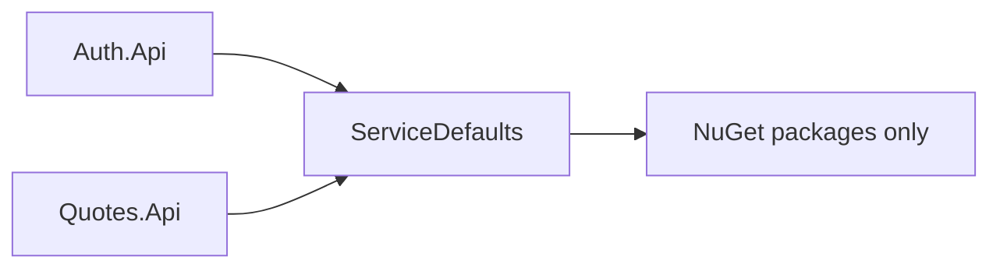
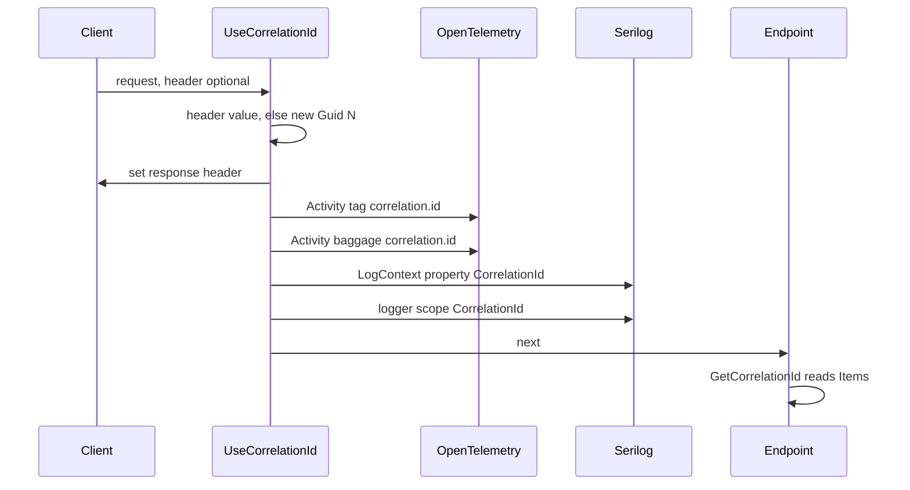

# ServiceDefaults

`AspireQuotesPoc.ServiceDefaults` is the **platform kit**, not a DDD layer. It is not Domain,
Application, Infrastructure or Api for anything, and it has no bounded context of its own. It is the
box of host wiring both API services open on startup: logging, telemetry, health, correlation,
authentication, error shaping and OpenAPI conventions.

Two mechanical rules keep it that way, both in
[`tests/Architecture.Tests/LayeringTests.cs`](../../tests/Architecture.Tests/LayeringTests.cs):
`ServiceDefaults_is_a_platform_kit_not_a_context` proves it references no bounded context, and
`Domain_layers_depend_on_no_project` proves the domains may not reach *into* it either. The
dependency runs one way, from the API hosts down.

## Purpose

Cross-cutting concerns are written once here and consumed by convention, so a new service inherits
them by calling three or four extension methods in `Program.cs` instead of reimplementing them.
Everything in this project is host-shaped: it takes an `IHostApplicationBuilder` or a
`WebApplication` and configures it.

Most extension methods sit in the `Microsoft.Extensions.Hosting` namespace deliberately — a host
already has that `using`, so `builder.AddServiceDefaults()` and `app.UseCorrelationId()` resolve
without importing anything. Types that are not extension methods live under
`AspireQuotesPoc.ServiceDefaults.*` (`Errors`, `Http`, `OpenApi`, `Telemetry`).

## Position in the architecture

[`AspireQuotesPoc.ServiceDefaults.csproj`](AspireQuotesPoc.ServiceDefaults.csproj) contains **zero
`<ProjectReference>` elements**. That is the whole point: nothing in the repository can be reached
from here, so the kit cannot grow a dependency on a domain by accident. What it does declare:

- `<IsAspireSharedProject>true</IsAspireSharedProject>`
- `<FrameworkReference Include="Microsoft.AspNetCore.App" />`
- `<InternalsVisibleTo Include="ServiceDefaults.Tests" />` — the `internal` factory and transformers
  are unit-tested directly
- `<PackageReference>`: `ErrorOr`, `Microsoft.AspNetCore.Authentication.JwtBearer`,
  `Microsoft.AspNetCore.OpenApi`, `Microsoft.OpenApi`, `Microsoft.Extensions.ServiceDiscovery`,
  `OpenTelemetry.Exporter.OpenTelemetryProtocol`, `OpenTelemetry.Extensions.Hosting`,
  `OpenTelemetry.Instrumentation.AspNetCore`, `OpenTelemetry.Instrumentation.Http`,
  `OpenTelemetry.Instrumentation.Runtime`, `Scalar.AspNetCore`, `Serilog.AspNetCore`,
  `Serilog.Enrichers.Environment`, `Serilog.Sinks.OpenTelemetry`

Versions are centralised in `Directory.Packages.props`.

## Why a platform kit and not a shared "Common" library

A "Common" project accumulates whatever two callers happen to share, and a business rule is exactly
the kind of thing two callers happen to share. Once one lands here, both contexts are coupled
through the platform and the layering tests cannot see it, because a rule about quote text looks
like any other class.

The dividing line this project holds:

| May live here | May never live here |
|---|---|
| Host wiring (`AddServiceDefaults`, `MapDefaultEndpoints`) | Business rules or invariants |
| Transport conventions (RFC 9457 shaping, OpenAPI transformers, correlation) | Entities, value objects, use cases |
| Integration patterns (JwtBearer setup, scope policy *names*, service discovery) | Anything naming `Quote`, `Credential`, or a context concept |
| Instrument declarations (`AppMetrics` counters, outcome vocabulary) | The decision of *when* to increment one — that is host code |

`AppMetrics` is the interesting case: the counters and the `outcome` tag are declared here because
they are a contract other teams read, but nothing in this project records a value. The telemetry
decorators in each API host do. The kit owns the vocabulary; the services own the behaviour.

## Host bootstrap

Files: [`Extensions.cs`](Extensions.cs).

`AddServiceDefaults` is the single call both hosts make first. It composes four things:

1. `AddSerilogDefaults()` — see [Structured logging](#structured-logging)
2. `ConfigureOpenTelemetry()` — see [Telemetry](#telemetry)
3. `AddDefaultHealthChecks()` — registers one check named `self` that always returns `Healthy`,
   tagged `live`
4. `AddServiceDiscovery()` plus `ConfigureHttpClientDefaults(http => http.AddServiceDiscovery())`

`MapDefaultEndpoints` maps two probes:

| Path | Contents |
|---|---|
| `/health` | every registered health check |
| `/alive` | only checks tagged `live` |

Both are mapped in **every** environment, not just Development. Compose and Kubernetes wire
readiness and liveness to these paths and have no way to know whether the host thinks it is in
Development; gating them on the environment flag would make a production container unprobeable.
`ServiceDefaultsWiringTests.Production_maps_the_health_endpoints_for_orchestrator_probes` pins that.

The global `HttpClient` defaults enable **service discovery only**. There is no global resilience
handler, and its absence is deliberate: an outbound client that needs Polly adds
`Microsoft.Extensions.Http.Resilience` explicitly for itself, so nothing is ever double-wrapped by a
default it did not ask for. See
[docs/architecture.md#resilience](../../docs/architecture.md#resilience).

Called by: both `Auth.Api/Program.cs` and `Quotes.Api/Program.cs` call `AddServiceDefaults()` and
`MapDefaultEndpoints()`.

## Correlation

Files: [`Extensions.cs`](Extensions.cs), [`Http/HttpHeaderNames.cs`](Http/HttpHeaderNames.cs).

The header is `X-Correlation-Id` (`HttpHeaderNames.CorrelationId`, re-exported as
`Extensions.CorrelationIdHeaderName`). `UseCorrelationId` is middleware; `GetCorrelationId` is an
`HttpContext` extension for reading the value back.

`GetCorrelationId` resolves in a fixed precedence order:

1. `HttpContext.Items["X-Correlation-Id"]` — what the middleware stashed (a non-string value is
   ignored)
2. the inbound `X-Correlation-Id` request header
3. a freshly generated `Guid.NewGuid().ToString("N")`

Steps 2 and 3 matter for callers that run without the middleware — unit tests, and the OpenAPI
sample builder, which fakes a context to keep generated documents deterministic.

The middleware's job is to make one id visible to both observability systems at the same time:

Concretely, one pass through the middleware sets: the response header, `HttpContext.Items`, an
activity tag `correlation.id`, activity **baggage** `correlation.id` (so the id survives an outbound
hop), a Serilog `LogContext` property `CorrelationId`, and an `ILogger` scope carrying the same
property. The `LogContext` push and the scope are both `using` blocks wrapped around `next()`, so
everything downstream — including code that logs through a plain `ILogger<T>` rather than Serilog
directly — carries the id. A blank inbound header is treated as absent and replaced.

Called by: both hosts (`app.UseCorrelationId()`); `GetCorrelationId` is read by
`ProblemDetailsFactory`, the JwtBearer `OnChallenge` handler, `Auth.Api/Endpoints/AuthEndpoints.cs`
and `Auth.Api/RateLimitingExtensions.cs`.

## Structured logging

Files: [`SerilogExtensions.cs`](SerilogExtensions.cs).

`AddSerilogDefaults` registers Serilog through `AddSerilog` with:

- minimum level `Information`, overridden to `Warning` for `Microsoft.AspNetCore`
- `Enrich.FromLogContext()` — this is what lets the correlation middleware's `LogContext` property
  reach every event
- `Enrich.WithEnvironmentName()`, `Enrich.WithMachineName()`
- `Enrich.WithProperty("Application", builder.Environment.ApplicationName)`
- `WriteTo.Console()`

A second sink, `WriteTo.OpenTelemetry`, is added **only** when `OTEL_EXPORTER_OTLP_ENDPOINT` is
non-blank, with `service.name` set to the application name. Under Aspire that variable is injected
into every resource, so logs land in the dashboard; a bare `dotnet run` gets console output and no
failing exporter.

`UseSerilogDefaults` adds `UseSerilogRequestLogging()` — one summary line per request instead of the
framework's multi-line default.

Called by: `AddSerilogDefaults` from `AddServiceDefaults`; `UseSerilogDefaults` explicitly by both
hosts, immediately after `UseExceptionHandler` and before `UseCorrelationId`.

## Telemetry

Files: [`Extensions.cs`](Extensions.cs), [`Telemetry/AppMetrics.cs`](Telemetry/AppMetrics.cs),
[`Telemetry/UseCaseTelemetry.cs`](Telemetry/UseCaseTelemetry.cs).

`ConfigureOpenTelemetry` registers:

| Signal | Instrumentation |
|---|---|
| Metrics | ASP.NET Core, `HttpClient`, .NET runtime, plus the `AspireQuotesPoc` meter |
| Traces | a source named after `Environment.ApplicationName`, ASP.NET Core, `HttpClient` |

The ASP.NET Core tracing instrumentation carries one filter: requests whose path starts with
`/health` or `/alive` produce no span. Orchestrator probes run continuously, and without the filter
they would be most of the trace volume in the dashboard.

Exporters follow the same rule as the Serilog sink — `UseOtlpExporter()` is added only when
`OTEL_EXPORTER_OTLP_ENDPOINT` is set.

`AppMetrics` declares the meter and its instruments:

- Meter name: **`AspireQuotesPoc`** (`AppMetrics.MeterName`, the same string passed to `AddMeter`)
- Six `Counter<long>` instruments: `auth.login.count`, `auth.validate.count`,
  `quotes.random.count`, `quotes.getbyid.count`, `quotes.list.count`, `quotes.create.count`
- `AppMetrics.Record(counter, outcome)` — adds `1` with exactly one tag, `outcome`. One tag keeps
  cardinality bounded and the dashboard queries trivial.

`UseCaseTelemetry.Outcome(ErrorType)` maps an `ErrorOr` failure onto the tag vocabulary:
`Validation → invalid`, `Conflict → conflict`, `NotFound → not_found`, everything else → `error`.
Auth counters keep plain `success`/`failure` instead.

The tag values each counter can actually emit are a published contract; the table lives in
[docs/observability.md#metrics](../../docs/observability.md#metrics) and is not repeated here.
Recording happens in the telemetry decorators under `Telemetry/` in each API host, never in this
project.

Called by: `ConfigureOpenTelemetry` from `AddServiceDefaults`; `AppMetrics.Record` and
`UseCaseTelemetry.Outcome` from the decorators in `Auth.Api/Telemetry/` and `Quotes.Api/Telemetry/`.

## Authentication

Files: [`JwtAuthExtensions.cs`](JwtAuthExtensions.cs).

`AddStandardJwtAuthentication` reads the `Jwt` configuration section and configures JwtBearer plus
the authorization policies. `UseStandardAuthentication` adds `UseAuthentication()` then
`UseAuthorization()` in the right order.

Constants (all `public const string`, so hosts and tests reference them instead of literals):

| Constant | Value |
|---|---|
| `JwtSectionName` | `Jwt` |
| `SigningKeyKey` | `Jwt:SigningKey` |
| `DefaultIssuer` | `auth-api` |
| `DefaultAudience` | `aspire-quotes-poc` |
| `DevelopmentSigningKey` | `AspireQuotesPoc-Dev-Signing-Key-32chars!` |
| `ScopeClaimType` | `scope` |
| `TokenMissingErrorCode` | `auth.token_missing` |
| `TokenInvalidErrorCode` | `auth.token_invalid` |
| `ReadQuotesPolicy` / `ReadQuotesScope` | `quotes:read` |
| `WriteQuotesPolicy` / `WriteQuotesScope` | `quotes:write` |

`Issuer` and `Audience` fall back to the defaults when unconfigured; the signing key has no
fallback. Two startup guards throw `InvalidOperationException` before the host is built:

1. **Missing key** — no `Jwt:SigningKey` in configuration at all.
2. **Public development key in Production** — `IsProduction()` and the configured key equals
   `DevelopmentSigningKey`. The dev key is printed in the repository README, so it is public by
   construction; failing at startup is cheaper than discovering it in a running deployment.

Both are pinned by `JwtAuthExtensionsTests`.

Token validation: issuer, audience, issuer signing key and lifetime are all validated, with
`ClockSkew` cut to one minute (the framework default is five). The key is a
`SymmetricSecurityKey` over the UTF-8 bytes of the configured string.

Two scope policies are registered, each a `RequireClaim(scope, ...)`: `quotes:read` and
`quotes:write`. A valid token on its own authorizes nothing — every protected endpoint names a
policy.

The `OnChallenge` event is replaced so that even the 401 is an RFC 9457 document. It calls
`HandleResponse()` to suppress the framework's empty 401 and writes:

- status `401`, content type `application/problem+json`
- `WWW-Authenticate: Bearer error="invalid_token"` when a token was presented and failed
  (`AuthenticateFailure is not null`), plain `Bearer` when none was presented at all
- a body with `title` `Unauthorized`, `detail` "A valid bearer token is required.", and the
  extensions `correlationId` (via `GetCorrelationId`) and `errorCode`
  (`auth.token_invalid` or `auth.token_missing`, matching the header)

This body is serialized inline with `JsonSerializerDefaults.Web` rather than through
`ProblemDetailsFactory`, because the challenge happens before any `ErrorOr` result exists.

Called by: `Quotes.Api/Program.cs` (`AddStandardJwtAuthentication` and `UseStandardAuthentication`).
`Auth.Api` does not authenticate requests — it issues tokens — but its `JwtTokenService` mirrors
`DefaultIssuer`/`DefaultAudience`, and both `Quotes.Api` transports reference the policy and error-code
constants.

## Error mapping

Files: [`ErrorOrHttpExtensions.cs`](ErrorOrHttpExtensions.cs),
[`ErrorOrMvcExtensions.cs`](ErrorOrMvcExtensions.cs), [`MvcApiExtensions.cs`](MvcApiExtensions.cs),
[`Errors/ProblemDetailsFactory.cs`](Errors/ProblemDetailsFactory.cs),
[`Errors/ProblemDetailsActionResult.cs`](Errors/ProblemDetailsActionResult.cs).

Two transports, one payload:

- `List<Error>.ToProblem(httpContext)` → `IResult`, for minimal APIs
- `List<Error>.ToActionResult(httpContext)` → `ActionResult`, for MVC controllers

Each has a single-`Error` convenience overload, and both build their body from the same
`internal static ProblemDetailsFactory.Create`. Nothing else in the repository constructs a problem
payload for an `ErrorOr` failure.

`Create` picks the **primary** error — `errors[0]`, or a synthesized
`Error.Unexpected("error.unknown", ...)` for an empty list — and always attaches two extensions:
`errorCode` (from the primary error) and, when an `HttpContext` was supplied, `correlationId`.

If *any* error in the list is `ErrorType.Validation`, the result is an
`HttpValidationProblemDetails` with status `400` and title
"One or more validation errors occurred.", regardless of what the primary error is. Otherwise the
status comes from the primary error's type:

| `ErrorType` | Status |
|---|---|
| `Validation` | 400 (validation problem, `errors` populated) |
| `NotFound` | 404 |
| `Conflict` | 409 |
| `Unauthorized` | 401 |
| `Forbidden` | 403 |
| `Unexpected` | 500 |
| anything else (`Failure`, custom types) | 400 |

`title` is the reason phrase for the status, `detail` is the primary error's description, and `type`
is set explicitly rather than left to either pipeline's defaulting:

| Status | `type` |
|---|---|
| 400 | `https://tools.ietf.org/html/rfc9110#section-15.5.1` |
| 401 | `https://tools.ietf.org/html/rfc9110#section-15.5.2` |
| 403 | `https://tools.ietf.org/html/rfc9110#section-15.5.4` |
| 404 | `https://tools.ietf.org/html/rfc9110#section-15.5.5` |
| 409 | `https://tools.ietf.org/html/rfc9110#section-15.5.10` |
| 500 | `https://tools.ietf.org/html/rfc9110#section-15.6.1` |

### Two subtleties worth knowing

**Validation errors are keyed by two different things depending on where they came from.** When the
failure is an `ErrorOr` validation error from Domain or Application, `Create` groups by
`Error.Code`, so the `errors` dictionary is keyed by **error code** (`quote.text_too_short`) and the
body still carries a top-level `errorCode`. When the failure is transport-level — a Data Annotation
on a request DTO rejected during model binding — the key is the **property name**, exactly as
ASP.NET produced it, and there is no `errorCode`, because no domain error was ever created. Both
shapes are valid RFC 9457; the difference tells a client whether it broke the schema or broke a
rule.

**`ProblemDetailsActionResult` exists so the MVC path cannot drift from the minimal-API body.** A
plain `ObjectResult` would serialize through MVC's output formatters: `application/json` instead of
`application/problem+json`, and without the `traceId` that `IProblemDetailsService` attaches. This
`ActionResult` writes through `IProblemDetailsService` — the same writer minimal APIs go through —
and only falls back to `WriteAsJsonAsync` with an explicit `application/problem+json` content type
when no such service is registered. That is what makes byte-level parity between `v0` and `v1`
achievable at all; see
[docs/architecture.md#api-versions-and-transport-styles](../../docs/architecture.md#api-versions-and-transport-styles).

### `AddStandardControllers`

`MvcApiExtensions.AddStandardControllers` registers controllers and replaces the automatic 400 that
`[ApiController]` produces for an invalid model. Left alone, MVC writes its own payload through its
own factory, decorated with a `traceId` the minimal-API validation filter never emits — so the same
malformed request would get two different bodies from the two versions. The replacement rebuilds it
as an `HttpValidationProblemDetails` (status 400, the shared title, the 400 `type` link) returned as
a `ProblemDetailsActionResult`.

It uses **`PostConfigure<ApiBehaviorOptions>`, not `Configure`**: MVC's own
`ApiBehaviorOptionsSetup` assigns `InvalidModelStateResponseFactory` and would overwrite anything
registered with `Configure`.

Called by: `ToProblem` from `Auth.Api/Endpoints/AuthEndpoints.cs` and
`Quotes.Api/V1/Endpoints/QuoteEndpoints.cs`; `ToActionResult` from
`Quotes.Api/V0/Controllers/QuotesController.cs`; `AddStandardControllers` from
`Quotes.Api/Program.cs`.

## OpenAPI conventions

Files: [`ApiServiceExtensions.cs`](ApiServiceExtensions.cs), everything under [`OpenApi/`](OpenApi).

Three entry points:

| Method | Does |
|---|---|
| `AddStandardApiServices(params string[] documentNames)` | registers `AddProblemDetails()` and records the document names Scalar should offer (default `v1`) |
| `ConfigureStandardOpenApi(this OpenApiOptions, string documentName)` | applies the transformers and the per-version endpoint filter to one document |
| `MapStandardApiDocumentation()` | `MapOpenApi()` plus `MapScalarApiReference(...)` for every recorded document |

`AddStandardApiServices` deliberately does **not** call `AddOpenApi`. The .NET 10 XML-comment source
generator only intercepts `AddOpenApi` calls whose document name is a string *literal*, so each host
must write `builder.Services.AddOpenApi("v1", o => o.ConfigureStandardOpenApi("v1"))` itself. A loop
or a constant would silently strip every `///` summary while wire tests stayed green.
`ConfigureStandardOpenApi` also sets `ShouldInclude` so an endpoint lands in a document when its
group name matches, or when it has no group name at all.

`MapStandardApiDocumentation` configures Scalar with the title `"{ApplicationName} API"`, the purple
theme, a C# `HttpClient` default snippet, the route pattern `/openapi/{documentName}.json`, and one
`AddDocument` call per name — which is what gives the Quotes host a version picker for `v0` and
`v1`.

### Transformers

**`DocumentInfoTransformer` + `OpenApiDocumentInfo`** — a host registers an `OpenApiDocumentInfo`
singleton (`Description`, `TagDescriptions`); the document transformer applies the description to
`document.Info` and fills in tag descriptions by name. It adds a tag when the generator has not
emitted one yet, and only fills a missing description on an existing tag (`??=`) rather than
overwriting. A host that registers no instance keeps the framework defaults — the transformer
resolves the service with `GetService` and returns early.

**`BearerSecuritySchemeTransformer`** — an *operation* transformer. It resolves
`IAuthenticationSchemeProvider` lazily so a host without authentication (Auth.Api) still generates a
document, checks that a scheme literally named `Bearer` exists, and only touches operations whose
endpoint metadata contains `IAuthorizeData`. It adds the HTTP bearer/JWT scheme to
`Components.SecuritySchemes` and sets `operation.Security`. The requirement is written as
`new OpenApiSecuritySchemeReference("Bearer", document)` — **the document anchor is required**:
without it the requirement serializes as an empty entry (`security: - {}`), which consumers read as
"authentication optional" rather than "bearer required".

**The problem-example trio** — colocated response samples, so the example lives next to the endpoint
that can produce it:

| Piece | Role |
|---|---|
| `OpenApiProblemExampleAttribute` | declares a sample on an MVC action or controller (repeatable, inherited); converts to metadata |
| `OpenApiRouteHandlerExtensions` | the minimal-API equivalent: `WithProblemExample` (three overloads, plus one on `RouteGroupBuilder`) and `WithValidationProblemExample` |
| `OpenApiProblemExampleMetadata` | the shared internal shape both paths produce |
| `OpenApiProblemExampleBuilder` | turns metadata into a JSON sample |
| `OpenApiProblemExampleTransformer` | attaches samples to matching responses |

`OpenApiProblemExampleBuilder.Build` has a **four-branch precedence**, checked in this order:

1. `ValidationProperty` set → the transport-validation shape: property-keyed `errors`, no
   `errorCode`.
2. status `403` with no `ErrorCode` → a plain `ProblemDetails` (title defaults to `Forbidden`, the
   403 `type` link) — a scope rejection never reaches the domain, so it has no error code.
3. status `429` with an `ErrorCode` → a rate-limit `ProblemDetails` carrying `correlationId` and
   `errorCode`.
4. otherwise → the supplied `Error`, or one synthesized from `ErrorCode` + `Detail`
   (400 → `Validation`, 401 → `Unauthorized`, 404 → `NotFound`, 409 → `Conflict`, anything else →
   `Validation`), rendered through `ProblemDetailsFactory`. If either `ErrorCode` or `Detail` is
   missing, no example is produced.

Branch 4 is what keeps documented samples honest: they go through the same factory that serves real
requests, so a change to the error envelope shows up in the generated documents. To make that
possible without a live request, the builder fakes a `DefaultHttpContext` whose `Items` already hold
a **fixed sample correlation id**, `5c1f4a0e9d2b7386a4c0b1e8d3f69a27`. A real `Guid` there would
change the document on every build and turn the contract-drift CI gate into noise.

`OpenApiProblemExampleTransformer` collects both metadata kinds from the endpoint metadata, then for
each response with a status `>= 400` and an `application/problem+json` content entry, assigns the
first matching sample with `??=` — an explicitly set example always wins.

For how to write the `///` comments these documents are built from, and how the frozen YAML under
`docs/openapi/` is refreshed, see [docs/api.md](../../docs/api.md).

Called by: both hosts call `AddStandardApiServices`, `ConfigureStandardOpenApi` and
`MapStandardApiDocumentation`; `WithProblemExample` / `WithValidationProblemExample` from
`Auth.Api/Endpoints/AuthEndpoints.cs` and `Quotes.Api/V1/Endpoints/QuoteEndpoints.cs`;
`[OpenApiProblemExample]` from `Quotes.Api/V0/Controllers/QuotesController.cs`.

## HTTP helpers

Files: [`Http/BearerToken.cs`](Http/BearerToken.cs),
[`Http/HttpHeaderNames.cs`](Http/HttpHeaderNames.cs).

`BearerToken.TryParse(authorizationHeader, out token)` is the one place the `Authorization` header is
picked apart by hand. It requires the `Bearer ` prefix (case-insensitive), trims the remainder, and
returns `false` with an empty `token` for null, blank, wrongly-prefixed or prefix-only headers.
Endpoints that *validate* a token never need it — JwtBearer does that — but Auth's introspection
endpoint accepts a token from either the body or the header, so it parses one explicitly.

`HttpHeaderNames.CorrelationId` is the single definition of `X-Correlation-Id`; `Extensions`
re-exports it as `CorrelationIdHeaderName` so host code has one obvious spelling.

Called by: `Auth.Api/Endpoints/AuthEndpoints.cs`.

## Extension-method index

The table to skim when wiring a *new* service. Entries marked † are plain static helpers rather than
extension methods.

| Method | File | What it does | Called by |
|---|---|---|---|
| `AddServiceDefaults` | `Extensions.cs` | Serilog + OTEL + health checks + service discovery in one call | both API hosts |
| `ConfigureOpenTelemetry` | `Extensions.cs` | metrics/tracing instrumentation, probe filter, conditional OTLP exporter | `AddServiceDefaults` |
| `AddDefaultHealthChecks` | `Extensions.cs` | registers the `self` check tagged `live` | `AddServiceDefaults` |
| `MapDefaultEndpoints` | `Extensions.cs` | maps `/health` and `/alive` in every environment | both API hosts |
| `UseCorrelationId` | `Extensions.cs` | accepts or mints `X-Correlation-Id`; publishes it to Serilog and OTEL | both API hosts |
| `GetCorrelationId` | `Extensions.cs` | reads the id back: Items → header → generated | `ProblemDetailsFactory`, JwtBearer `OnChallenge`, `AuthEndpoints`, `RateLimitingExtensions` |
| `AddSerilogDefaults` | `SerilogExtensions.cs` | console sink, enrichers, conditional OTLP sink | `AddServiceDefaults` |
| `UseSerilogDefaults` | `SerilogExtensions.cs` | one-line request logging | both API hosts |
| `AddStandardJwtAuthentication` | `JwtAuthExtensions.cs` | JwtBearer, scope policies, startup guards, RFC 9457 challenge | `Quotes.Api` |
| `UseStandardAuthentication` | `JwtAuthExtensions.cs` | `UseAuthentication` then `UseAuthorization` | `Quotes.Api` |
| `ToProblem` | `ErrorOrHttpExtensions.cs` | `List<Error>` / `Error` → `IResult` problem | `AuthEndpoints`, `QuoteEndpoints` (v1) |
| `ToActionResult` | `ErrorOrMvcExtensions.cs` | `List<Error>` / `Error` → `ActionResult` problem, same body | `QuotesController` (v0) |
| `AddStandardControllers` | `MvcApiExtensions.cs` | `AddControllers` + `PostConfigure` of the `[ApiController]` 400 | `Quotes.Api` |
| `AddStandardApiServices` | `ApiServiceExtensions.cs` | ProblemDetails services + the document names Scalar offers | both API hosts |
| `ConfigureStandardOpenApi` | `ApiServiceExtensions.cs` | applies all transformers + the per-version endpoint filter | both API hosts |
| `MapStandardApiDocumentation` | `ApiServiceExtensions.cs` | serves every document and the Scalar reference UI | both API hosts |
| `WithProblemExample` | `OpenApi/OpenApiRouteHandlerExtensions.cs` | colocates a problem sample on a route or route group | `AuthEndpoints`, `QuoteEndpoints` (v1) |
| `WithValidationProblemExample` | `OpenApi/OpenApiRouteHandlerExtensions.cs` | colocates a property-keyed validation sample | `AuthEndpoints`, `QuoteEndpoints` (v1) |
| `AppMetrics.Record` † | `Telemetry/AppMetrics.cs` | increments a counter by 1 with the single `outcome` tag | telemetry decorators in both hosts |
| `UseCaseTelemetry.Outcome` † | `Telemetry/UseCaseTelemetry.cs` | `ErrorType` → outcome tag value | `Quotes.Api/Telemetry/` decorators |
| `BearerToken.TryParse` † | `Http/BearerToken.cs` | parses a `Bearer` header into a token | `AuthEndpoints` |

## Rules enforced mechanically

| Rule | Test |
|---|---|
| ServiceDefaults references no bounded context | `LayeringTests.ServiceDefaults_is_a_platform_kit_not_a_context` |
| Domains do not reference ServiceDefaults either | `LayeringTests.Domain_layers_depend_on_no_project` |
| `/health` and `/alive` answer in Development **and** Production | `ServiceDefaultsWiringTests` |
| The `self` check is registered and tagged `live` | `ServiceDefaultsWiringTests` |
| Service discovery is registered for `HttpClient` | `ServiceDefaultsWiringTests` |
| An OTLP endpoint still produces a working host | `ServiceDefaultsWiringTests` |
| The OpenAPI document and the Scalar page are served | `ServiceDefaultsWiringTests` |
| Correlation precedence, echo, generation, blank replacement | `CorrelationIdTests` |
| A missing key, and the dev key in Production, fail startup | `JwtAuthExtensionsTests` |
| Each `ErrorType` maps to its status and envelope | `ErrorOrHttpExtensionsTests` |
| MVC and minimal APIs produce the same status and envelope | `ErrorOrMvcExtensionsTests` |
| Every counter is named and described; `Record` tags `outcome` | `AppMetricsTests` |
| `Outcome` matches the documented vocabulary | `UseCaseTelemetryTests` |
| `BearerToken.TryParse` accepts only well-formed headers | `BearerTokenTests` |

Suites live in [`tests/ServiceDefaults.Tests/`](../../tests/ServiceDefaults.Tests) and
[`tests/Architecture.Tests/`](../../tests/Architecture.Tests).

## See also

- [Repository README](../../README.md) — goals, the layering table, solution layout
- [docs/architecture.md](../../docs/architecture.md) — correlation, authentication, error flow,
  cross-cutting telemetry and resilience narratives; the `v0`/`v1` policy
- [docs/api.md](../../docs/api.md) — XML-comment authoring rules, the contract-refresh pipeline,
  the endpoint list
- [docs/observability.md](../../docs/observability.md) — metric tag values, dashboard walkthroughs
- [docs/testing.md](../../docs/testing.md) — the test stack
